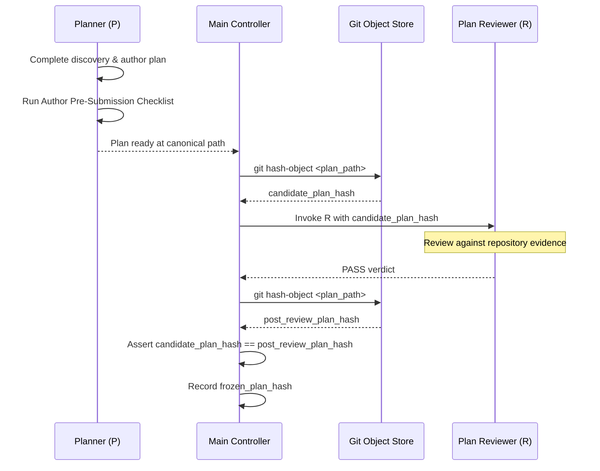

# Implementation Planning & Contract Freeze

This skill governs the methodology for substantive technical discovery, architecture design, invariant protection, dependency slicing, and cryptographic plan freezing prior to implementation in Cobbleverse Hell Mode.

---

## 1. Activation Scope & Responsibilities

Activate this skill when:
- Operating as Planner (`P`) in a Mode 3 Managed-Agent Workflow;
- Planning non-trivial features, refactors, or behavior bug fixes;
- Defining workstream specifications, dependency slices, or contract freeze milestones.

**Ownership Boundary:**
- **Owns:** Substantive discovery methodology, separating Facts vs. Assumptions vs. Conflicts, architecture invariant enforcement, dependency slicing across Hell's 6 layers, canonical workstream plan documents, author pre-submission self-checklists, and candidate cryptographic identity preparation (`git hash-object`).
- **Does NOT Own:** Subagent session orchestration (owned by `managed-agent-workflow`); defining authoritative review rubrics or issuing review verdicts (owned by `code-review-and-quality`); executing git staging and commits (owned by `git-checkpoint-workflow`); or executing test verification suites (owned by `test-and-verification-strategy`).

---

## 2. Resource Routing

Read bundled references strictly when their conditions match:

| Resource | Read Condition | Skip When |
| :--- | :--- | :--- |
| [`references/workstream-plan-template.md`](references/workstream-plan-template.md) | Read before drafting or restructuring any workstream plan document in `docs/workstreams/<id>/plan.md`. | Reviewing an existing frozen plan or performing initial discovery. |
| [`references/slicing-and-dependency-strategies.md`](references/slicing-and-dependency-strategies.md) | Read when breaking down complex multi-system tasks across Cobbleverse Hell Mode's architectural layers. | Task scope is strictly confined to a single file or isolated unit. |

---

## 3. Substantive Discovery & Evidence Grounding

### 3.1 Planner Discovery Mandate (Canary Lesson 1)
Main Controller performs only minimal classification preflight. **Substantive technical discovery belongs exclusively to Planner `P`.**
When activated, Planner must:
1. **Read Before Write:** Inspect real repository source files, decompiled dependencies (CFR/Vineflower), bytecode contracts, and datapack JSONs before proposing design decisions.
2. **Never Guess Signatures:** Never assume Minecraft, Fabric, or Cobblemon method signatures, bytecode offsets, or field names from memory. Verify them against repository artifacts or decompiler output.
3. **Trace Full Call Paths:** Follow call hierarchies from event listeners or Mixin injection points down to core calculation routines (e.g., from battle action selection down to damage estimation and weight calculation).

### 3.2 Concrete Facts vs. Assumptions vs. Conflicts
Every plan must explicitly categorize technical findings into a structured table:
- **Confirmed Facts:** Claims backed by cited file paths, exact line numbers, decompiled class descriptors, or existing test outputs.
- **Assumptions:** Working hypotheses regarding runtime behavior that require validation during implementation or testing.
- **Conflicts & Incompatibilities:** Contradictions between vanilla Cobblemon behavior, Fabric Mixin constraints, and Hell Mode balance requirements.
- **Open Questions:** Ambiguities requiring Owner input before architecture can be finalized.

---

## 4. Architectural Invariant Protection

Planner must explicitly evaluate and enforce all **repository-global invariants**, plus applicable **domain invariants** routed from matching domain skills:

### 4.1 Repository-Global Invariants
1. **Read Before Write:** Inspect real repository source files, decompiled dependencies, and contracts before proposing design decisions. Never guess signatures or behaviors.
2. **Surgical Scope & Simplicity First:** Deliver the minimal complete solution. Touch only files necessary for the task; zero opportunistic refactoring or speculative infrastructure.
3. **Claim Strength Discipline (Canary Lesson 7):** "Claim strength must not exceed evidence strength." Avoid hyperbolic claims; cite concrete lines and evidence.
4. **Public Contract & Backward Compatibility:** Preserve existing working trainer definitions, battle formats, and public APIs unless task explicitly dictates changes.

### 4.2 Domain Invariant Routing Table
Planner routes domain-specific invariant evaluation to the corresponding domain authority:

| Domain Scope | Governing Invariants & Authority | Key Boundary Checks |
| :--- | :--- | :--- |
| **Battle AI Decisions** | Run & Bun AI scoring rules & fair-play contract | **Fair-AI Information Boundary:** Zero inspection of hidden opponent information (unrevealed movesets, exact IVs/EVs, unrevealed held items, secret team slots). |
| **Fabric Companion Mod** | Fabric Mixin & Bytecode offline contract | **Companion Fabric Mixin Safety:** Target classes and descriptors match bytecode; stable injection anchors (`@At("HEAD")`, verified targets); Loom remapping compatibility. |
| **Trainer Datapacks** | Cobbleverse 1.7.42 Schema & Economy rules | **Datapack Format & Economy Integrity:** Schema compliance; zero bag healing items on NPC trainers; battle format integrity. |
| **Doubles Team Roster** | [`competitive-pokemon-doubles-team-design`](../competitive-pokemon-doubles-team-design/SKILL.md) | **Doubles Strategy & Gimmick Safety:** Weather/Trick Room/Tailwind coherence; Turn-1 gimmick safety for Run & Bun AI; held items and abilities. |

---

## 5. Scope Definition & Proportionality

### 5.1 Surgical Scope Boundaries
- **Strict In-Scope:** The minimal contiguous set of files, classes, and configurations necessary to achieve the stated goal.
- **Explicit Out-of-Scope:** Adjacent subsystems, cosmetic cleanups, opportunistic refactorings, or unrelated bug fixes that must NOT be touched.

### 5.2 Plan Proportionality
- **High-Risk / Multi-System Tasks:** Full workstream plan document located at `docs/workstreams/<workstream-id>/plan.md` following `references/workstream-plan-template.md`.
- **Bounded Mode 3 Tasks:** Lightweight focused plan specifying exact diff anchors, invariant constraints, and verification steps.

---

## 6. Cryptographic Plan Freeze Protocol

To guarantee that implementation matches reviewed design byte-for-byte (Canary Lesson 5):

1. **Author Pre-Submission Self-Checklist:** Planner must self-audit against the checklist in `references/workstream-plan-template.md` before signaling completion.
2. **Candidate Hashing:** Main Controller generates `candidate_plan_hash = git hash-object <plan_path>` before invoking Plan Reviewer `R`.
3. **Independent Review:** Plan Reviewer `R` reads the plan at canonical path using read-only inspection tools (`view_file`), evaluates content against repository evidence and the review rubric, and issues an explicit closed verdict (`PASS`, `BLOCKING_FINDINGS`, `BLOCKED`). Reviewer does not run terminal commands or compute git hashes.
4. **Post-Review Assertion:** Upon receiving `PASS`, Main re-evaluates `post_review_plan_hash = git hash-object <plan_path>`. Main asserts `candidate_plan_hash == post_review_plan_hash`. If hashes mismatch, the review is invalidated.
5. **Implementor Handshake:** Implementor verifies that the on-disk plan hash matches `frozen_plan_hash` before modifying any files.
