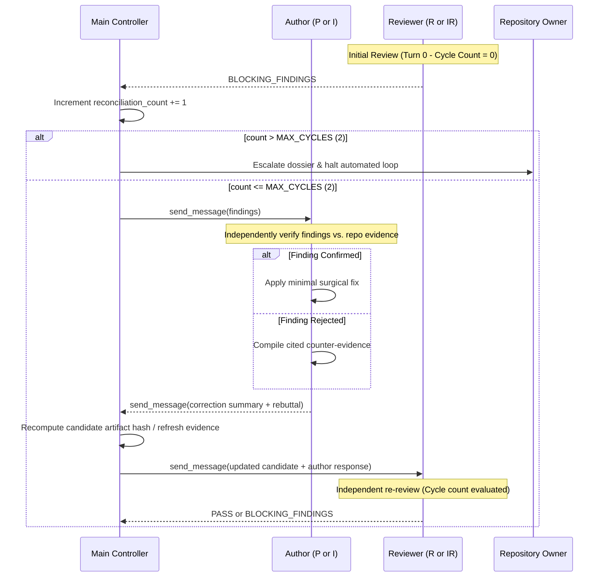

# Reconciliation Protocol & Finite Loop Governance

This reference defines the structured arbitration, finding verification, cycle tracking, and owner escalation protocol for the Managed-Agent Workflow.

---

## 1. The Reconciliation Lifecycle

When a Reviewer (`R` or `IR`) returns `BLOCKING_FINDINGS`, Main Controller coordinates a bounded reconciliation cycle.



---

## 2. Hard Cycle Limits & Cycle Counting Rules

- `MAX_PLAN_RECONCILIATION_CYCLES = 2`
- `MAX_IMPLEMENTATION_RECONCILIATION_CYCLES = 2`

### Cycle Counting Rules (Canary Lesson 4)
1. **Turn 0 Exclusion:** The initial review submission and subsequent review verdict is **Turn 0**. It establishes the baseline review state and does **not** consume a reconciliation cycle.
2. **Cycle Increment Trigger:** The cycle counter increments by 1 each time Main Controller dispatches blocking findings to the author for correction and submits the corrected candidate for re-review.
3. **Rebuttal Inclusion:** A cycle is consumed regardless of whether the author confirms findings with code fixes or rejects findings with counter-evidence. There are no "free" correction turns.
4. **Hard Stop at Cycle 2:** If blocking findings remain unresolved after completing 2 reconciliation cycles, the loop halts immediately.

---

## 3. Author Finding Verification Rules

Authors (Planner or Implementor) must **independently evaluate every finding** rather than blindly accepting reviewer feedback:

### Case A: Confirmed Finding
- **Condition:** The reviewer's cited evidence identifies a genuine defect, omission, or contract violation.
- **Author Action:**
  - Apply a minimal surgical fix strictly bounded to the identified issue.
  - Document the exact changes with line citations and rationale.
  - Do NOT expand scope into unrelated files or refactoring.

### Case B: Rejected Finding
- **Condition:** The reviewer's finding is based on an incorrect assumption, misinterpretation of an external mod/API, or hallucinated requirement.
- **Author Action:**
  - Authors must **NEVER** modify working code or valid architecture merely to appease a reviewer.
  - Compile concrete, verifiable repository evidence (bytecode signatures, decompiler output, existing unit tests, or architecture documentation) refuting the finding.
  - Formulate an objective rebuttal detailing why the existing design is correct and safe.

---

## 4. Owner Escalation Protocol upon Cycle Exhaustion

When reconciliation reaches the 2-cycle limit without reaching `PASS`:
1. **Automated Loop Halt:** Main Controller stops all automated correction cycles immediately.
2. **No Speculative Spawns:** Main Controller must NOT spawn new subagents to "retry" or bypass the impasse.
3. **No Unilateral Decisions:** Main Controller must NOT guess or arbitrarily pick a side between author and reviewer.
4. **Deliver Structured Escalation Dossier:** Main Controller compiles and presents an objective dossier to the Owner:

```markdown
# Escalation Dossier: Unresolved Blocking Findings

## Context & Workstream
- **Workstream ID:** `<workstream-id>`
- **Phase:** `PLAN_RECONCILING` | `IMPL_RECONCILING`
- **Completed Cycles:** 2 / 2 (Limit Reached)

## Unresolved Finding Summary

### Finding [<ID>]: <Title>
- **Reviewer Assertion:**
  - Severity: `Critical` | `Required`
  - Cited Evidence: `<path>:<lines>` / `<log excerpt>`
  - Reviewer Argument: <Core concern>
- **Author Rebuttal / Fix Attempt:**
  - Author Position: Confirmed (partial fix) | Rejected (counter-evidence)
  - Cited Counter-Evidence: `<path>:<lines>` / `<bytecode signature>`
  - Author Argument: <Why existing approach is intentional or proposed change is unsafe>
- **Root Cause of Impasse:**
  - [e.g., Ambiguous upstream Cobblemon contract, conflicting design goals, runtime limitation]

## Actionable Options for Owner Decision
1. **Option A:** Approve reviewer's recommendation (Author will apply requested change).
2. **Option B:** Overrule reviewer finding (Proceed with author's existing design).
3. **Option C:** Redefine task requirements or abort workstream.
```
