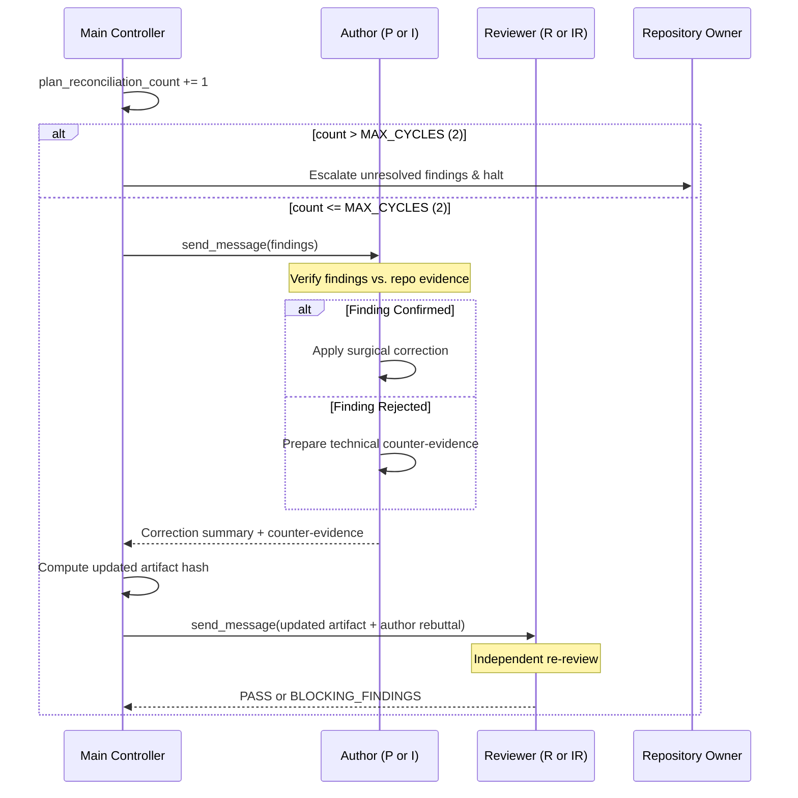

# Reconciliation Protocol & Finite Loop Governance

This reference defines the structured arbitration, finding verification, cycle tracking, and owner escalation protocol for the Managed-Agent Workflow.

---

## 1. The Core Reconciliation Loop

When a Reviewer (`R` or `IR`) returns `BLOCKING_FINDINGS`, Main Controller initiates a bounded reconciliation cycle.

---

## 2. Hard Cycle Limits

- `MAX_PLAN_RECONCILIATION_CYCLES = 2`
- `MAX_IMPLEMENTATION_RECONCILIATION_CYCLES = 2`

A reconciliation cycle is incremented whenever:
1. Reviewer issues blocking findings.
2. Main dispatches findings to the author.
3. Author responds with corrections or rebuttals.
4. Reviewer conducts a re-review.

**Rule:** A cycle counts regardless of whether the author accepts the finding or successfully rejects it. There are no "free" correction turns.

---

## 3. Author Finding Verification Rules

Authors (Planner or Implementor) must **verify each finding independently** rather than blindly accepting reviewer feedback:

### Case A: Confirmed Finding
- The reviewer's evidence is factual, reproduces an actual bug, or identifies a genuine omission.
- **Action:**
  - Author applies a minimal, surgical correction to the plan or code.
  - Author documents the fix with exact line numbers and logic changes.
  - Author explicitly avoids expanding scope beyond the finding.

### Case B: Rejected Finding
- The reviewer's finding is based on an incorrect assumption, misinterpretation of an external mod/API, or hallucinated requirement.
- **Action:**
  - Author MUST NOT modify working code or valid plans merely to appease the reviewer.
  - Author compiles concrete repository evidence (bytecode contracts, existing tests, class signatures, or architecture documentation) refuting the finding.
  - Author formulates a structured rebuttal explaining why the existing design is correct and safe.

---

## 4. Escalation Protocol upon Cycle Exhaustion

If blocking findings remain unresolved after 2 completed reconciliation cycles:
1. **HARD STOP:** Main Controller halts the automated loop immediately.
2. **DO NOT SPAWN:** Main must NOT spawn a fresh Planner, Reviewer, or Implementor to "try again".
3. **DO NOT GUESS:** Main must NOT unilaterally decide between conflicting technical opinions.
4. **OWNER ESCALATION:** Main Controller delivers an objective, structured dossier to the Owner containing:
   - List of unresolved Finding IDs.
   - Reviewer's claims and cited evidence.
   - Author's rebuttal, corrections, and cited evidence.
   - Root cause of the impasse (e.g., conflicting API interpretation, ambiguous design requirement, runtime limitation).
   - Concrete proposed options for the Owner to decide.
