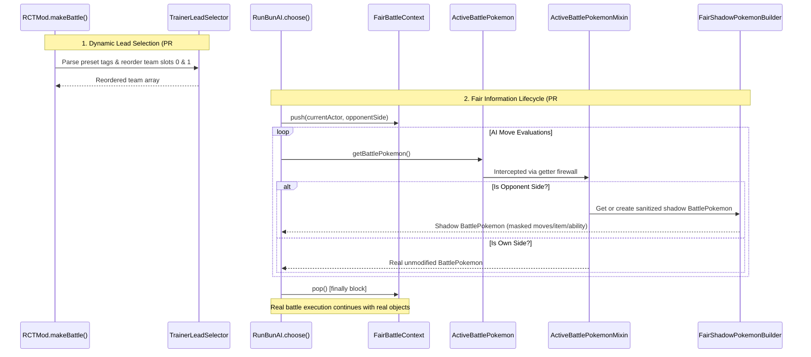

# Companion Mod Architecture

The Companion Mod (`rct_legendary_rule`) is a native Fabric mod written in Java 21 for Minecraft 1.21.1. It bridges Cobblemon, Radical Cobblemon Trainers (RCTMod/RCTAPI), and Run & Bun AI (`rbrctai`), implementing competitive Doubles battle mechanics, strategic AI layers, and anti-cheat information boundaries.

---

## Technical Specifications

- **Minecraft Version:** `1.21.1`
- **Java Version:** `21`
- **Toolchain:** Fabric Loom `1.7.4`, Yarn Mappings `1.21.1+build.3`, Fabric Loader `0.16.9+`
- **Dependencies:**
  - `Cobblemon` (`1.7.3+1.21.1`)
  - `rctmod` (`0.18.1-beta`)
  - `rctapi` (`0.15.2-beta`)
  - `rbrctai` (`0.15.4-beta`)
  - `MixinExtras` (`0.5.0`)

---

## Package Architecture

```text
com.cobbleverse.legendaryrule/
├── fair/                                  # Anti-cheat fair opponent information boundary
│   ├── FairBattleContext.java             # Scoped ThreadLocal lifecycle manager
│   └── FairShadowPokemonBuilder.java      # Sanitized shadow BattlePokemon generator
├── lead/                                  # Dynamic lead selection system
│   └── TrainerLeadSelector.java           # Preset tag parser and team array reordering
├── mixin/                                 # Bytecode injection hooks
│   ├── ActiveBattlePokemonMixin.java      # Firewall returning shadow BattlePokemon for opponents
│   ├── PokeMathMaxMixin.java              # Spread move valuation in damage calculations
│   ├── RCTModMakeBattleMixin.java         # Dynamic lead selection hook in makeBattle
│   ├── RunBunAIChooseMixin.java           # Spread move valuation, partner Tera target, recharge guard
│   ├── RunBunAIFairLifecycleMixin.java    # FairBattleContext lifecycle wrapper around choose()
│   └── TrainerMobMixin.java               # Entity-level hooks
└── strategy/                              # Strategy decorators and state tracking
    ├── StrategicBattleAIDecorator.java    # Priority move overrides (e.g., Throat Spray sound moves)
    ├── TeraTargetResolver.java            # Team-wide alive Tera target resolution
    ├── item/                              # Battle item tracking (CobblemonHeldItemManager)
    └── spread/                            # Spread move multi-target evaluation contracts
```

---

## Mixin Call-Graph & Injection Architecture



---

## Bytecode Contract Verification

Because companion mixins interact heavily with non-public methods and internal bytecode instructions in third-party mod JARs (`rbrctai`, `rctmod`), static compilation is not enough.

The repository maintains an offline runtime contract test:
```bash
python scripts/runtime-contract/test_rct_runtime_contract.py
```
This suite disassembles the exact runtime JARs using `javap` and verifies 78 individual bytecode invariants:
- Exact JVM descriptors for `makeBattle`, `PokeMathMax.damage`, and `RunBunAI.choose`.
- Local Variable Table (LVT) slots and variable names (`evaluations`, `move`, `percentChange`, `teraMatch`).
- Mixin refmap mappings and intermediary targets.
- Slice bounds and `@WrapOperation` target opcodes.
