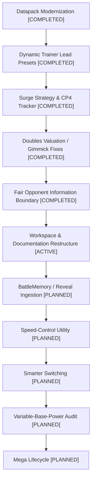

# Project Roadmap

This document outlines the strategic progression of engineering initiatives for `cobbleverse-hell-mode-modernized`. Detailed tactical implementation specifications reside in individual workstream plans (`docs/workstreams/`).

---

## Strategic Progression

---

## Workstreams & Engineering Sequence

### Workstream: Datapack Modernization (Completed)
- Environment setup, dependency verification, and immutability lock on baseline (`!Doctors HELL MODE DOUBLE BATTLE EVERYTHING/`).
- Complete compatibility audit across 1,663 legacy trainers against Cobbleverse 1.7.42-CF.
- Reconciliation between legacy JAR trainers and datapack overrides, producing canonical 1,714 trainer dataset and pruning 3 obsolete orphan IDs.
- Deterministic content normalization (held items, move typos, forms/aspects, bag healing removal).

### Workstream: Dynamic Trainer Lead Presets (Completed — PR #14)
- Companion Fabric mod (`rct_legendary_rule`) initialized with Loom 1.7.4.
- Injected `RCTMod.makeBattle` hook to read preset lead tags from trainer JSONs and dynamically place chosen anchors at slots 0 & 1 for Doubles.
- Comprehensive offline runtime bytecode contract test harness (`scripts/runtime-contract/test_rct_runtime_contract.py`).

### Workstream: Surge Strategy & CP4 Item Tracker (Completed — PR #15)
- Sound-move forcing under Throat Spray and `CobblemonHeldItemManager` battle-message hook for real-time item consumption tracking.

### Workstream: Doubles Valuation / Gimmick Fixes (Completed — PR #16, PR #17)
- Multi-target damage calculation hook in `PokeMathMax.damage`, spread move valuation in `RunBunAI.choose()`, and team-wide alive `teraTarget` resolution in Doubles.
- Guarded single-target Water/Electric damage evaluations against Storm Drain / Lightning Rod redirectors in Doubles.

### Workstream: Fair Opponent Information Boundary (Completed — PR #18)
- Introduced `FairBattleContext` scoped lifecycle around `RunBunAI.choose()`.
- Implemented `ActiveBattlePokemonMixin` getter firewall to substitute sanitized shadow `BattlePokemon` exclusively for opponents during AI choice calculations.
- Implemented `FairShadowPokemonBuilder`: opponent moveset is sanitized to empty (zero known moves = UNKNOWN), items/abilities/Tera targets sanitized, public metrics preserved.
- Note: There is currently no `BattleMemory` or turn persistence; player moves are not remembered on subsequent turns; no default move priors are injected.
- Guarded native `RunBunAI` line 1779 recharge check (`NoSuchElementException` on empty moveset) with tightly anchored `@Slice` wrap.

### Workstream: Workspace & Documentation Restructure (Active)
- Reorganize all independent datapacks into canonical `datapacks/` directory.
- Establish `docs/` documentation architecture with strict source-of-truth ownership.
- Standardize root `AGENTS.md` and retire redundant `.agents/rules/`.
- Document verified system architecture and operational testing reality.

### Workstream: BattleMemory / Reveal Ingestion (Planned)
- **Scope**: In-memory turn-by-turn tracking of confirmed revealed player moves, abilities, items, and Tera types per battle instance.
- **Re-materialization**: Feed observed battle knowledge from BattleMemory into `FairShadowPokemonBuilder` so the AI remembers confirmed revealed moves on following turns without omniscience.
- **Priors**: Optional species/role priors strictly when a Pokémon has not yet revealed any moves.

### Workstream: Speed-Control Utility (Planned)
- Formal evaluation models for Tailwind and Trick Room pacing in Doubles.

### Workstream: Smarter Switching (Planned)
- Context-aware switching logic for NPC trainers facing disadvantageous matchups.

### Workstream: Variable-Base-Power Audit (Planned)
- Accurate scoring for weight-dependent (e.g., Grass Knot, Heavy Slam) or HP-dependent moves.

### Workstream: Mega Lifecycle (Planned)
- Mega evolution mechanics and AI decision evaluation.

---

## Programmatic Exclusions & Guardrails

1. **No Omniscient Cheating**: Future AI layers must strictly consume either visible battlefield facts or persistent memory of revealed actions.
2. **Untouched Native Identity**: `ActiveBattlePokemon` instances and PNX indices must remain unmodified to preserve native battle engine mechanics.
3. **Immutable Baseline**: The legacy dataset `!Doctors HELL MODE DOUBLE BATTLE EVERYTHING/` is strictly preserved and never mutated.
4. **Authoritative Environment Distinction**: Local automated tests do not substitute for manual production host canary verification.
