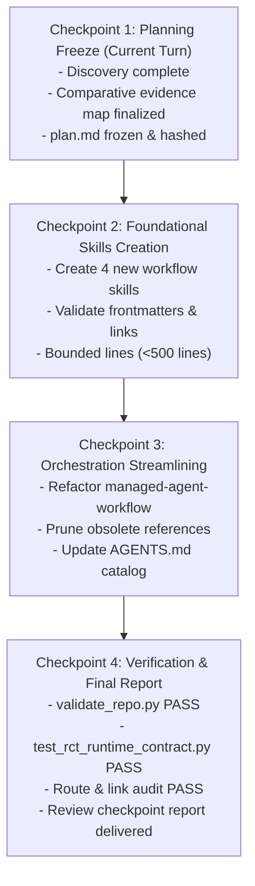

# Workstream Plan: Agent Architecture Redesign (Phase 2 — Modular Workflow Skills)

## Status & Ownership

| Field | Value |
| :--- | :--- |
| **Workstream ID** | `agent-architecture-redesign` |
| **Status** | Phase 1 Validated / Phase 2 Planning Reconciled (Awaiting Re-Review) |
| **Source of Truth** | This document (`docs/workstreams/agent-architecture-redesign/plan.md`) |
| **Baseline Commit** | `fe3091d` (`feat/agent-architecture-redesign`) |
| **Canary Lineage** | `2a329a5` (plan freeze), `8ee3d27` (implementation), `17c9e79` (canary verification) on `fix/weight-based-move-damage` |
| **Target Branch** | `feat/agent-architecture-redesign` |
| **Reconciliation Cycle** | Cycle 1 (Addressing 3 Blocking Findings from Plan Reviewer R) |

---

## 1. Context & Phase 1 Retrospective

In Phase 1 of this workstream, `cobbleverse-hell-mode-modernized` established:
1. `AGENTS.md` as the global Single Source of Truth (SSOT) with Core Principles and Universal Lightweight Preflight (Modes 0–4).
2. The initial `managed-agent-workflow` skill defining the 5-role topology (`Main Controller`, `Planner P`, `Plan Reviewer R`, `Implementor I`, `Implementation Reviewer IR`).
3. Progressive disclosure refactoring of `competitive-pokemon-doubles-team-design`.

### The Live Canary Test: `fix/weight-based-move-damage`
The Phase 1 architecture was subjected to a rigorous end-to-end canary implementation on branch `fix/weight-based-move-damage` to resolve dynamic base power for weight-dependent moves (`Grass Knot`, `Low Kick`, `Heavy Slam`, `Heat Crash`).
The canary successfully traversed the entire multi-agent lifecycle:
- Planner `P` performed substantive bytecode/decompilation discovery on Cobblemon and native `PokeMathMax`.
- Plan Reviewer `R` conducted independent plan review.
- Plan frozen cryptographically and committed as `2a329a5`.
- Implementor `I` implemented `WeightDependentMoveResolver`, `WeightDependentMoveSurrogate`, and 643 lines of JUnit unit and boundary tests.
- Implementation Reviewer `IR` reviewed working-tree diff and test logs, issuing `PASS`.
- Implementation committed as `8ee3d27`.
- Production canary evidence verified on dedicated host and recorded as `17c9e79`.

While the canary succeeded, it exposed critical architectural friction in Phase 1: `managed-agent-workflow` was overloaded, bundling orchestration, planning methodology, review rubrics, git mechanics, and test layer strategies into a single monolithic workflow.

---

## 2. 10 Canary Lessons Learned from `weight-dependent-moves`

Every lesson from the canary must be directly codified into the Phase 2 architecture:

1. **Preflight Boundary & Discovery Ownership:** Main Controller must perform only minimal classification preflight. Substantive discovery (decompilation, bytecode tracing, call-path exploration, formula reproduction) belongs exclusively to Planner `P`. Main must never "discover first, then decide Mode 3" when prompt signals already indicate Mode 3.
2. **Reviewer Independence vs. Evidence Guidance:** Reviewers (`R` and `IR`) are independent in **judgment** but **evidence-guided** in execution. Provided anchors and manifests are untrusted navigation hints; reviewers must independently verify material claims against actual repository files and contracts. Broad speculative discovery by reviewers is reserved only for missing or conflicting evidence.
3. **Separation of Invariants, Claims, and Rubric:** Main Controller must never convert unverified candidate claims into authoritative reviewer instructions. Review prompts must clearly separate immutable repository invariants, candidate assertions to be tested, and the evaluation rubric.
4. **Persistent Session Reconciliation & Single Author Verification:** Corrections must always route back to the **same** author session (`P` or `I`) via `send_message`, and re-reviews must route back to the **same** reviewer session (`R` or `IR`). The initial review is Turn 0 and does not consume reconciliation cycles; the cycle counter increments only on correction-and-re-review turns. The author must independently verify each finding (CONFIRM with surgical fix vs. REJECT with counter-evidence) rather than blindly agreeing.
5. **Exact Cryptographic Artifact Freeze:** Main must compute `candidate_plan_hash = git hash-object <plan_path>` before review, review the exact candidate identity, and recompute `post_review_plan_hash` after `PASS`. If hashes mismatch, the `PASS` is invalid. Implementor must verify that the on-disk plan matches `frozen_plan_hash` before modifying any files.
6. **Explicit Audit Trail Verdicts:** Every state transition must be preceded by an explicit recorded verdict (specifically `IR verdict: PASS` or `BLOCKING_FINDINGS` before killing subagents or creating local checkpoint commits).
7. **Reporting Discipline:** *"Claim strength must not exceed evidence strength."* Agents must strictly avoid hyperbolic or unverified absolute terms ("100%", "fully", "triệt để", "hoàn toàn"). Statements must be proportional to observable evidence.
8. **Context & Quota Discipline:** Progressive disclosure must match agent roles. Main Controller remains thin; Reviewers receive focused evidence packages and targeted navigation hints; Implementors receive exact frozen plans and bounded verification commands.
9. **Artifact Freshness over Rebuilds:** Prioritize verification by file timestamp, cryptographic hash, expected contents, and clean git state over redundant, speculative rebuilds. Rebuild only when inputs or dependencies change.
10. **Documentation Ownership & Lineage Immutability:** A frozen plan is an immutable historical reviewed contract; living architecture belongs in `docs/architecture/`. One fact = one owner. Audit commit lineage (`2a329a5`, `8ee3d27`, `17c9e79`) must be strictly preserved without rebase or history rewriting; prefer forward commits (`merge-forward`).

---

## 3. Phase 2 Objectives & VocaSpace Source Evaluation

The objective of Phase 2 is to adapt proven generic workflow skills from VocaSpace (`khangnhoang/VocaSpace`) into `cobbleverse-hell-mode-modernized`.
Crucially, **Hell will NOT mechanically copy VocaSpace**. Hell preserves its own runtime reality (Fabric modding, Cobblemon bytecode, 1,714 trainer JSONs, dedicated Minecraft production server) and documentation taxonomy (`docs/architecture/`, `docs/decisions/`, `docs/operations/`, `docs/workstreams/`).

### Explicit Exclusions (What Hell Will NOT Copy from VocaSpace)
- **NO** Next.js, React, Supabase, Tailwind, or Zod concepts.
- **NO** synthetic eval harnesses or token accounting systems.
- **NO** multi-agent background daemons or specialist swarms.
- **NO** GitHub PR / CI watcher swarms (Hell does not automate remote PR creation or CI sweeping; remote operations remain strictly gated).
- **NO** VocaSpace documentation taxonomy (`docs/adr/`, `docs/refactors/`, `docs/sop/`).

---

## 4. Comprehensive Comparative Evidence Map

| Source Concept | Source Path in VocaSpace | Hell Target Owner | Decision | Rationale |
| :--- | :--- | :--- | :--- | :--- |
| **Repository-Grounded Discovery** (read before write, inspect real code/types before planning) | `vocaspace/.agents/skills/implementation-planning-and-pr-breakdown/SKILL.md` | `implementation-planning-and-contract-freeze` | **PORT** | Universal engineering discipline. Crucial to avoid hallucinating Minecraft/Fabric/Cobblemon APIs or field names. |
| **Facts vs. Assumptions vs. Conflicts vs. Questions** | `vocaspace/.../SKILL.md` (Section 4) | `implementation-planning-and-contract-freeze` | **PORT** | Directly solves Canary Lesson 1 & 3; unverified assumptions must never masquerade as facts. |
| **Substantive Discovery by Planner** (decompilation, bytecode tracing, call-path exploration) | `AGENTS.md` + Canary Lesson 1 | `implementation-planning-and-contract-freeze` | **PORT (Canary Invariant)** | Enforces that Main does only classification preflight, leaving substantive technical exploration to Planner `P`. |
| **Explicit Scope & Out-of-Scope** | `vocaspace/.../SKILL.md` (Section 1, 7) | `implementation-planning-and-contract-freeze` | **PORT** | Essential for surgical scope across 1,714 trainer files and complex Mixin classes. |
| **Slicing Strategies & Dependency Ordering** | `vocaspace/.../SKILL.md` (Section 5-6) | `implementation-planning-and-contract-freeze` | **ADAPT** | Adapt VocaSpace's DB/API/Frontend slicing to Hell's layers: Markdown Governance → Trainer Datapack JSON → Java Logic → Fabric Mixin Bytecode / Shadow Boundaries → Headless Smoke → Production Canary. |
| **PR Breakdown & Multi-PR Swarms** | `vocaspace/.../SKILL.md` (Section 7-8) | N/A | **REJECT** | Hell uses atomic task branches with linear local checkpoints and audited merge-forward commits. Multi-PR breakdown introduces excessive ceremony. |
| **Cryptographic Plan Identity & Freeze** (`candidate_plan_hash == post_review_plan_hash`) | Hell Canary Lesson 5 | `implementation-planning-and-contract-freeze` + `managed-agent-workflow` | **PORT (Canary Invariant)** | Guarantees that what Implementor codes is byte-identical to what Plan Reviewer approved. |
| **Independent Adversarial Review Posture** (author never reviews own work, fresh reviewer session) | `vocaspace/.agents/skills/code-review-and-quality/SKILL.md` | `code-review-and-quality` | **PORT** | Core invariant of Mode 3; prevents confirmation bias. |
| **Reviewer Hard Read-Only Boundary** (`enable_write_tools: false`, no command execution) | Hell Canary Lesson 2, 4 | `code-review-and-quality` + `managed-agent-workflow` | **PORT (Hell Invariant)** | Reviewers must never modify files or run mutating commands. Main provides evidence manifests. |
| **Dual Review Scope** (Plan Review `R` and Implementation Review `IR`) | Hell Phase 1 architecture | `code-review-and-quality` | **PORT** | Consolidates review methodology, rubrics, and severities into a single specialized review skill. |
| **Review Findings as Verifiable Claims** (author verifies: CONFIRM vs REJECT with evidence) | `vocaspace/.../SKILL.md` + Hell Canary Lesson 4 | `code-review-and-quality` + `managed-agent-workflow` | **PORT (Canary Invariant)** | Review findings are claims backed by cited evidence. Author independently verifies; no blind acceptance. |
| **Finding Severity Taxonomy** (Critical, Required, Suggestion, Nit, FYI) | `vocaspace/.../SKILL.md` (Finding severity) | `code-review-and-quality` | **PORT** | Standardizes blockers (Critical, Required) vs. non-blockers (Suggestion, Nit, FYI). |
| **Structured Finding Schema** (Location, Problem, Impact, Evidence, Required change) | `vocaspace/.../SKILL.md` (Finding format) | `code-review-and-quality` | **PORT** | Eliminates vague review feedback; demands concrete repository evidence. |
| **Claim Strength Proportional to Evidence** | Hell Canary Lesson 7 | `code-review-and-quality` | **PORT (Canary Invariant)** | Prohibits unverified absolute claims ("100%", "fully", "triệt để"). |
| **Review Verdicts** (`PASS`, `BLOCKING_FINDINGS`, `BLOCKED`, `REJECTED_APPROACH`) | `vocaspace/.../SKILL.md` (Verdicts) | `code-review-and-quality` | **ADAPT** | Directly maps to Hell's controller state machine transitions. |
| **Baseline & Dirty Tree Inspection** (`git status --short`, `git diff --cached`) | `vocaspace/.agents/skills/git-checkpoint-workflow/SKILL.md` | `git-checkpoint-workflow` | **PORT** | Prevents staging unowned files or temporary artifacts. |
| **Surgical Staging Scope** (stage only prompt-owned files; avoid blind `git add .`) | `vocaspace/.../SKILL.md` | `git-checkpoint-workflow` | **PORT** | Vital when working with 1,714 JSONs and Loom build caches. |
| **Local Checkpoint Commit Lifecycle** (Plan Freeze, Verified Implementation, Correction) | Hell Canary Lineage (`2a329a5`, `8ee3d27`, `17c9e79`) | `git-checkpoint-workflow` | **ADAPT** | Codifies Hell's exact checkpoint types under Mode 3 authorization. |
| **Preservation of Audit Lineage & Frozen SHAs** (no rebase/rewrite on audit commits; merge-forward) | Hell Canary Lesson 10 | `git-checkpoint-workflow` | **PORT (Canary Invariant)** | Checkpoint commits are immutable audit evidence. Rebasing breaks auditability. |
| **Strict Gating: Commit != Push != PR != Merge** | `vocaspace/.../SKILL.md` + `AGENTS.md` | `git-checkpoint-workflow` | **PORT** | Strictly gates remote operations behind separate explicit Owner authorization. |
| **English Conventional Commit Format** (`type(scope): summary`) | `vocaspace/.../SKILL.md` + `AGENTS.md` | `git-checkpoint-workflow` | **PORT** | Consistent, readable git history across all agents. |
| **Proportional Verification Principle** | `vocaspace/.agents/skills/test-quality-strategy/SKILL.md` + `AGENTS.md` | `test-and-verification-strategy` | **PORT** | Scales verification rigor proportionally to the risk profile of the change. |
| **Observable Behavior over Mocks** & **False-Green Prevention** | `vocaspace/.../SKILL.md` | `test-and-verification-strategy` | **PORT** | Prohibits mocking away tested behavior; requires regression reproduction. |
| **Hell 6-Layer Authority Hierarchy** (Markdown → Datapack → Java → Bytecode → Headless → Canary) | Hell Operational Reality | `test-and-verification-strategy` | **PORT (Hell-native)** | Matches actual tools: `validate_repo.py`, JUnit, `test_rct_runtime_contract.py`, `runServer`, Canary Host. |
| **Invariant: Offline PASS != Production Semantic PASS** | Hell Canary Lesson 6, 7 + `AGENTS.md` | `test-and-verification-strategy` | **PORT (Hell-native)** | Passing automated checks does not prove live gameplay integration on dedicated server. |
| **Verification Evidence Manifest** (commands, exit codes, exact tested scenarios, raw logs) | Hell Canary Lesson 6 | `test-and-verification-strategy` | **PORT** | Prepares structured evidence for hard read-only reviewers. |
| **Artifact Freshness Discipline** (verify by timestamp, hash, expected contents, clean git state over speculative rebuilds) | Hell Canary Lesson 9 | `test-and-verification-strategy` | **PORT (Canary Invariant)** | Prevents redundant, expensive rebuilds while guaranteeing test authenticity. Rebuild only when inputs change. |
| **Code Commenting & Intent Clarity** | `vocaspace/.agents/skills/code-commenting-and-maintainability/SKILL.md` | `code-review-and-quality` + `AGENTS.md` | **ADAPT** | Integrated into code review rules and core principles rather than creating an extra skill. |
| **Skill Maintenance Discipline** (valid YAML, kebab-case names, line count bounds, link checks) | VocaSpace + Hell Progressive Disclosure | Repository Governance (`AGENTS.md`) | **PORT** | Keeps all `.agents/skills/` clean, discoverable, and bounded (< 500 lines per file). |

---

## 5. Target Architecture & Smallest Coherent Change Set

The Phase 2 architecture modularizes the monolithic Phase 1 structure into exactly **5 specialized workflow skills** and preserves existing domain skills:

```text
.agents/skills/
├── managed-agent-workflow/                       # [MODIFIED] Orchestration ONLY
│   ├── SKILL.md                                  # State machine, session lifecycle, finite cycle counters
│   └── references/
│       ├── controller-state-machine.md           # Ephemeral state transitions, kill boundaries, event matrix, reviewer prompt contract
│       └── reconciliation-protocol.md            # Cycle counting (max 2), author verify/rebuttal, escalation dossier
│
├── implementation-planning-and-contract-freeze/  # [NEW] Substantive Discovery & Planning
│   ├── SKILL.md                                  # Discovery methodology, facts vs assumptions, scope, invariants
│   └── references/
│       ├── workstream-plan-template.md           # Authoritative plan structure & author self-checklist (ownership: planning)
│       └── slicing-and-dependency-strategies.md  # Layer-aware slicing across Hell's architectural boundaries
│
├── code-review-and-quality/                      # [NEW] Independent Adversarial Review
│   ├── SKILL.md                                  # Review posture, read-only boundary, claim verification, severities
│   └── references/
│       ├── plan-review-rubric.md                 # Authoritative rubric for Plan Reviewer R (ownership: review)
│       └── implementation-review-rubric.md       # Authoritative rubric for Implementation Reviewer IR (ownership: review)
│
├── git-checkpoint-workflow/                      # [NEW] Checkpoints, Staging & Lineage
│   ├── SKILL.md                                  # Baseline/dirty tree, staging, checkpoint lifecycle, remote gates
│   └── references/
│       └── checkpoint-lifecycle-and-lineage.md   # Checkpoint types, conventional commits, audit SHA preservation
│
├── test-and-verification-strategy/               # [NEW] Proportional Verification & Evidence
│   ├── SKILL.md                                  # Authority hierarchy, offline != production, false-green prevention, freshness
│   └── references/
│       └── verification-layers-and-tooling.md    # Commands for Layers 0–5, evidence manifests, artifact freshness protocol
│
└── competitive-pokemon-doubles-team-design/      # [PRESERVED] Domain Skill (Untouched)
    ├── SKILL.md
    └── references/
        ├── doubles-archetypes-and-synergies.md
        ├── failure-modes-and-plan-b.md
        ├── gimmick-architecture-and-runtime-rules.md
        ├── historical-case-studies.md
        └── trainer-audit-checklist.md
```

### Files to Modify in Phase 2
1. `AGENTS.md`: Update Section 5 (Skill Routing Catalog) with complete routes for the 4 new skills; reinforce preflight and evidence boundaries.
2. `.agents/skills/managed-agent-workflow/SKILL.md`: Streamline to orchestration-only.
3. `.agents/skills/managed-agent-workflow/references/controller-state-machine.md`: Refine state transitions to reference externalized skills, and codify the 3-part Reviewer Invocation Prompt Contract (Invariants, Untrusted Anchors, Review Rubric).
4. `.agents/skills/managed-agent-workflow/references/reconciliation-protocol.md`: Refine cycle counting and arbitration.
5. **[PRUNE]** Delete obsolete `references/planning-and-plan-review.md` and `references/implementation-and-review.md` from `managed-agent-workflow/references/` (their contents are fully superseded by the dedicated skills).

### Files to Create in Phase 2
1. `.agents/skills/implementation-planning-and-contract-freeze/SKILL.md`
2. `.agents/skills/implementation-planning-and-contract-freeze/references/workstream-plan-template.md` (renamed from `plan-template-and-rubric.md` per FINDING-01)
3. `.agents/skills/implementation-planning-and-contract-freeze/references/slicing-and-dependency-strategies.md`
4. `.agents/skills/code-review-and-quality/SKILL.md`
5. `.agents/skills/code-review-and-quality/references/plan-review-rubric.md`
6. `.agents/skills/code-review-and-quality/references/implementation-review-rubric.md`
7. `.agents/skills/git-checkpoint-workflow/SKILL.md`
8. `.agents/skills/git-checkpoint-workflow/references/checkpoint-lifecycle-and-lineage.md`
9. `.agents/skills/test-and-verification-strategy/SKILL.md`
10. `.agents/skills/test-and-verification-strategy/references/verification-layers-and-tooling.md`

---

## 6. Exact Skill & Document Ownership Matrix

To prevent authority bleed, each skill and document has strictly bounded ownership:

| Document / Skill | Primary Owner Responsibility | Explicitly Forbidden / Non-Goals |
| :--- | :--- | :--- |
| **`AGENTS.md`** | Global SSOT: Core Principles, Universal Preflight (Modes 0–4), Tool Usage Policy, Verification Authority distinction, Global Remote Action Gating. | Detailed multi-agent session state machines; specific review rubrics; git staging commands. |
| **`managed-agent-workflow`** | Multi-agent orchestration ONLY: session lifecycle, ephemeral state machine, Reviewer Invocation Prompt Contract (3-part prompt partition), reconciliation counters (`MAX_CYCLES = 2`), cryptographic hash handshake between phases, subagent termination, Owner escalation dossiers. | Substantive discovery methodology; writing implementation plans; defining evaluation rubrics; executing git staging; running test suites. |
| **`implementation-planning-and-contract-freeze`** | Substantive discovery & planning ONLY: decompilation/bytecode discovery, separating Facts/Assumptions/Conflicts, scope & exclusions, invariant definitions, dependency slicing, canonical workstream plan templates, author pre-submission self-checklists, cryptographic candidate identity preparation (`git hash-object`). | Managing subagent lifecycles; defining authoritative review rubrics; code review verdicts; creating git commits; executing code implementation. |
| **`code-review-and-quality`** | Independent adversarial review ONLY: Plan Review (`R`) and Implementation Review (`IR`) evaluation rubrics, reviewer hard read-only contract, finding severity taxonomy (Critical, Required, Suggestion, Nit, FYI), structured finding format, finding claim verification contract, "claim strength <= evidence strength", verdict determination. | Orchestrating multi-agent state machines; editing repository files; executing bash/powershell commands; writing implementation code. |
| **`git-checkpoint-workflow`** | Git operations & audit lineage ONLY: baseline & dirty tree inspection, surgical staging (`git diff --cached`), local checkpoint commit types (Plan Freeze, Implementation, Correction), English Conventional Commit formatting, preservation of audit commit SHAs, strict local-vs-remote gating. | Designing application architecture; judging test adequacy; orchestrating subagent sessions. |
| **`test-and-verification-strategy`** | Verification strategy & evidence ONLY: Proportional verification principle, Hell 6-Layer Authority Hierarchy, offline PASS vs. production semantic PASS distinction, false-green prevention, regression test reproduction, assembling Verification Evidence Manifests for hard read-only reviewers, Artifact Freshness Protocol (evaluating timestamp, hash, and git state). | Subagent session orchestration; git commits; reviewing code quality; writing feature implementation. |
| **`competitive-pokemon-doubles-team-design`** | Pokémon Doubles domain ONLY: 6-mon team rosters, weather/Trick Room/Tailwind archetypes, held items, movesets, abilities, turn-1 gimmick safety for AI. | General workflow orchestration; git operations; bytecode contracts. |

---

## 7. Detailed Specifications for New & Adapted Workflow Skills

### 7.1 `managed-agent-workflow` (Streamlined Orchestration-Only)
- **Role:** Pure state machine orchestrator.
- **Session Topology:** Main Controller, Planner `P` (write-capable), Plan Reviewer `R` (read-only), Implementor `I` (write-capable), Implementation Reviewer `IR` (read-only).
- **Core Invariants:**
  1. Main performs zero substantive discovery during preflight or planning.
  2. Author context is persistent across corrections (`send_message`).
  3. Reviewer context is persistent across re-reviews (`send_message`).
  4. Hard Read-Only Reviewers (`enable_write_tools: false`, no `run_command`).
  5. Cryptographic hash verification (`candidate_plan_hash == post_review_plan_hash`).
  6. Finite reconciliation limit: `MAX_CYCLES = 2`. Initial review is Turn 0 (not counted).
  7. Explicit verdicts before transitions (`IR verdict: PASS` recorded before commit).
  8. Clean termination of subagent pairs at phase boundaries.
- **Reviewer Invocation Prompt Contract (Canary Lessons 2 & 3):**
  When spawning or messaging Plan Reviewer `R` or Implementation Reviewer `IR`, Main Controller must structure the prompt into 3 strictly separated partitions:
  1. *Partition 1: Immutable Invariants & Authority:* Non-negotiable repository invariants, safety boundaries, and authoritative ground truth that cannot be negotiated away.
  2. *Partition 2: Untrusted Candidate Anchors & Claims:* File paths, line ranges, and claims provided by the candidate author. Explicitly demarcated as UNTRUSTED navigation hints. Mandatory reviewer instruction: *"Anchors and candidate claims are untrusted hints. Independently verify material claims against real repository files; perform broad discovery only when evidence is missing or conflicting."*
  3. *Partition 3: Authoritative Evaluation Rubric:* Routed directly from `code-review-and-quality/references/plan-review-rubric.md` (for `R`) or `implementation-review-rubric.md` (for `IR`). Main Controller must never convert unverified candidate claims into authoritative reviewer criteria.
  *(This contract is formally codified in `references/controller-state-machine.md`)*.

### 7.2 `implementation-planning-and-contract-freeze`
- **Activation Scope:** Mode 3 planning tasks or complex refactors requiring discovery before coding.
- **Discovery Methodology:**
  * Read before plan.
  * Inspect real repository files, bytecode contracts, decompiled sources (CFR/Vineflower), and git history.
  * Explicitly separate Confirmed Facts (cited with file/line), Assumptions, Conflicts, and Open Questions.
- **Scope Definition:** Explicit In-Scope vs. Out-of-Scope boundaries.
- **Architecture Invariants:**
  * Fair-AI Information Boundary (no omniscient opponent inspection).
  * Companion Fabric Mixin safety (method descriptors, `@Slice` anchors, shadow fields).
  * Datapack format integrity (Cobbleverse 1.7.42 schemas, no bag healing items).
- **Plan Proportionality:**
  * High-risk/multi-system tasks: full workstream plan in `docs/workstreams/<id>/plan.md`.
  * Bounded tasks: concise plan focusing on exact diff, invariant safety, and verification.
- **Authoritative Plan Structure & Self-Checklist:**
  * Reference `references/workstream-plan-template.md`: Defines the canonical document structure for workstream plans and the author pre-submission self-checklist. (Authoritative evaluation rubrics belong strictly to `code-review-and-quality`).
- **Frozen Candidate Identity:**
  * Planner writes plan to canonical path.
  * Main computes `candidate_plan_hash = git hash-object <plan_path>`.
  * Candidate identity is fixed before Plan Reviewer `R` is invoked.

### 7.3 `code-review-and-quality`
- **Activation Scope:** Independent review of implementation plans (Phase 2) or code implementations (Phase 5).
- **Hard Read-Only Boundary:** Reviewers possess zero write tools and no shell command access. Evidence is provided via structured manifests and read-only inspection (`view_file`, `grep_search`, `find_by_name`).
- **Finding as a Verifiable Claim:**
  * A review finding is an assertion backed by evidence.
  * Author independently evaluates the finding:
    - **CONFIRM:** Author acknowledges defect and applies surgical fix.
    - **REJECT:** Author refutes finding with cited repository evidence; does not modify working code to appease reviewer.
- **Severity Taxonomy:**
  * `Critical`: Exploitable bug, crash, data corruption, broken Mixin injection, severe AI regression. (BLOCKING)
  * `Required`: Missing approved requirement, unhandled edge case, contract violation, insufficient test coverage, scope bleed. (BLOCKING)
  * `Suggestion`: Non-blocking maintainability, documentation clarity, minor optimization.
  * `Nit`: Minor formatting or wording issue.
  * `FYI`: Informational observation only.
- **Structured Finding Format:**
  ```markdown
  ### [Severity] Finding Title
  - **Location:** `<file-path>:<line-numbers>`
  - **Problem:** Concise explanation of the defect.
  - **Impact:** Architectural, runtime, or gameplay consequence.
  - **Evidence:** Concrete code snippet, contract test output, or decompiled signature.
  - **Required Change:** Minimal surgical resolution.
  ```
- **Discipline Rule:** *"Claim strength must not exceed evidence strength."* No speculative or hyperbolic claims.
- **Authoritative Evaluation Rubrics:**
  * `references/plan-review-rubric.md`: Evaluation criteria for Plan Reviewer `R` (identity match, evidence verification, invariants, test feasibility).
  * `references/implementation-review-rubric.md`: Evaluation criteria for Implementation Reviewer `IR` (frozen plan conformance, surgical scope, correctness, verification authenticity).
- **Verdicts:** `PASS` (zero blocking findings) vs. `BLOCKING_FINDINGS` (requires reconciliation) vs. `BLOCKED` / `REJECTED_APPROACH`.

### 7.4 `git-checkpoint-workflow`
- **Activation Scope:** Creating commits, staging changes, or inspecting git state.
- **Baseline & Working Tree Inspection:** Run `git status --short` and `git diff --cached` before every commit. Verify zero untracked noise or unowned modifications.
- **Surgical Staging:** Stage only files directly owned by the approved task (`git add <file1> <file2>`). Never use `git add .` indiscriminately.
- **Local Checkpoint Types (Mode 3):**
  1. *Plan Freeze Checkpoint:* `docs(plan): freeze implementation plan for <feature>` (SHA recorded as audit evidence).
  2. *Verified Implementation Checkpoint:* `feat(<scope>): <summary>` or `fix(<scope>): <summary>`.
  3. *Correction Checkpoint:* `fix(<scope>): address review finding <id>`.
- **Audit Lineage & SHA Preservation:**
  * Commits that serve as audit evidence (e.g., canary lineage `2a329a5`, `8ee3d27`, `17c9e79`) must **never** be rebased, squashed, or rewritten.
  * Prefer forward commits (`merge-forward`) over history rewriting.
- **Strict Remote Gating:**
  * `commit != push != PR != merge`.
  * Remote operations (`git push`, `gh pr create`, `git merge`) are strictly prohibited without separate, explicit Owner authorization.

### 7.5 `test-and-verification-strategy`
- **Activation Scope:** Designing test plans, verifying implementations, or auditing test adequacy.
- **Proportional Verification Principle:** Scale verification effort to the risk level:
  * Low risk (documentation, minor comments): Layer 0 (Markdown / schema validation).
  * Medium risk (datapack JSONs, trainer teams): Layer 1 (`validate_repo.py`).
  * High risk (Java logic, algorithms): Layer 2 (`./gradlew test`) + Layer 1.
  * Critical risk (Fabric Mixins, bytecode injection): Layer 3 (`test_rct_runtime_contract.py`) + Layer 2 + Layer 4 (`./gradlew runServer`).
  * Gameplay balance / progression: Layer 5 (Production Host Canary).
- **Hell 6-Layer Authority Hierarchy:**
  1. **Layer 0: Markdown & Governance Authority:** Relative link integrity, frontmatter schema validation.
  2. **Layer 1: Trainer & Datapack Data Validation:** `python scripts/ci/validate_repo.py`, `scripts/ci/check_legacy_baseline.py`. Enforces schema for 1,714 trainers.
  3. **Layer 2: Java Unit & Component Tests:** `./gradlew test`. Fast, isolated JUnit tests for pure algorithms and boundary math.
  4. **Layer 3: Bytecode & Shadow Runtime Contracts:** `python scripts/runtime-contract/test_rct_runtime_contract.py`. Verifies Mixin target classes, descriptors, and bytecode invariants offline.
  5. **Layer 4: Headless Server Bootstrap Smoke:** `./gradlew runServer`. Verifies Knot bootstrap, Mixin transform, and Cobblemon mod initialization.
  6. **Layer 5: Production Host Canary & Live Gameplay:** Dedicated canary server on live host. The **only** authoritative verification for multiplayer gameplay, player progression, and real-time battle AI decisions.
- **Core Invariant:** **Offline PASS != Production Semantic PASS.** Automated test passes locally or in CI are necessary but never sufficient to claim production gameplay is GREEN.
- **False-Green Prevention:**
  * For bug fixes, demonstrate the failure condition or explain why reproduction is infeasible.
  * Never mock away the actual guarantee being tested.
- **Artifact Freshness Protocol (Canary Lesson 9):**
  * *Freshness Criteria:* An artifact or test verification is considered fresh without re-execution ONLY when:
    1. Cryptographic hash of input sources (`git hash-object`) has not changed since the recorded test run.
    2. Working-tree status (`git status --short`) confirms zero uncommitted edits in the subsystem's dependency cone.
    3. Output artifact/test report timestamp is strictly newer than all constituent source files.
  * *Mandatory Re-Execution:* Fresh re-execution of verification suites is mandatory whenever:
    1. Any source code, Mixin class, trainer JSON, or test fixture in the dependency cone has been modified.
    2. Working-tree modifications invalidate prior verification evidence.
    3. An author applies review corrections during a Reconciliation Cycle.
  * Documented in `references/verification-layers-and-tooling.md`.
- **Verification Evidence Manifest Format:**
  Main Controller generates this manifest for hard read-only Implementation Reviewer:
  ```markdown
  ## Verification Evidence Manifest
  - **Baseline Commit:** `<SHA-1>`
  - **Working-Tree Status:** `git status --short` output
  - **Tracked Diff:** `git diff <baseline-commit>`
  - **Executed Commands & Results:**
    - `<command 1>`: Exit code 0, raw log excerpt
    - `<command 2>`: Exit code 0, raw log excerpt
  - **Explicitly Skipped / Unverified Items:** <items requiring production canary host>
  - **Artifact Freshness Evaluation:** Verified fresh by hash/timestamp or freshly executed
  ```

---

## 8. Migration & Implementation Checkpoints

Execution of Phase 2 will proceed across 4 strict checkpoints:



### Checkpoint 1: Planning Freeze (Current Turn)
- Planner `P` completes substantive discovery and comparative evidence map.
- Writes comprehensive Phase 2 plan to `docs/workstreams/agent-architecture-redesign/plan.md`.
- Reconciles any blocking findings from Plan Reviewer `R` within `MAX_PLAN_RECONCILIATION_CYCLES = 2`.
- Computes `candidate_plan_hash = git hash-object docs/workstreams/agent-architecture-redesign/plan.md`.
- Reports candidate plan path and hash to Main Controller for Plan Reviewer `R` re-review.

### Checkpoint 2: Foundational Workflow Skills Creation
- Implementor `I` creates the 4 specialized skills:
  * `.agents/skills/implementation-planning-and-contract-freeze/` (`SKILL.md` + 2 references: `workstream-plan-template.md`, `slicing-and-dependency-strategies.md`)
  * `.agents/skills/code-review-and-quality/` (`SKILL.md` + 2 references: `plan-review-rubric.md`, `implementation-review-rubric.md`)
  * `.agents/skills/git-checkpoint-workflow/` (`SKILL.md` + 1 reference: `checkpoint-lifecycle-and-lineage.md`)
  * `.agents/skills/test-and-verification-strategy/` (`SKILL.md` + 1 reference: `verification-layers-and-tooling.md`)
- Validates frontmatters (`name`, `description`), file line bounds (< 500 lines per file), and link integrity.

### Checkpoint 3: Orchestration Streamlining & Root Integration
- Refactors `.agents/skills/managed-agent-workflow/`:
  * Streamlines `SKILL.md` to orchestration-only.
  * Updates `references/controller-state-machine.md` (including the 3-part Reviewer Invocation Prompt Contract) and `references/reconciliation-protocol.md`.
  * Deletes obsolete `references/planning-and-plan-review.md` and `references/implementation-and-review.md`.
- Updates `AGENTS.md` Section 5 (Skill Routing Catalog) with complete routes to all 5 workflow skills + 1 domain skill.
- Updates `CLAUDE.md` compatibility pointer if required.

### Checkpoint 4: Verification & Structured Review Checkpoint Report
- Executes authoritative verification:
  * `python scripts/ci/validate_repo.py`
  * `python scripts/runtime-contract/test_rct_runtime_contract.py`
  * Automated script/check for markdown link and route integrity across all `.agents/skills/` and `AGENTS.md`.
- Audits git diff: verifies zero product code or datapack drift.
- Confirms canary lineage (`2a329a5`, `8ee3d27`, `17c9e79`) is preserved intact.
- Implementation Reviewer `IR` conducts review and issues explicit verdict (`IR verdict: PASS`).
- Main Controller delivers structured review checkpoint report to Owner.

---

## 9. Verification Strategy & Verification Matrix

| Layer | Verification Dimension | Concrete Check / Command | Expected Pass Criteria |
| :--- | :--- | :--- | :--- |
| **Layer 0** | **Route Integrity** | Direct path resolution from `AGENTS.md` to all `.agents/skills/*/SKILL.md` | All 6 skill paths resolve to existing files on disk |
| **Layer 0** | **Reference Link Integrity** | Automated relative link check across all `references/*.md` in all skills | Zero broken links; all relative links resolve within bundles |
| **Layer 0** | **Skill Frontmatter Schema** | Schema check (`name`, `description`) on all 6 `SKILL.md` files | Valid YAML, kebab-case names matching folder names |
| **Layer 0** | **File Line Bounds** | Line count check on all `.agents/` Markdown files | Every `SKILL.md` < 500 lines; concise progressive disclosure |
| **Layer 0** | **SSOT & Non-Duplication** | Audit vs. `docs/architecture/` and `docs/operations/` | Zero duplicated architecture facts; links route to existing docs |
| **Layer 0** | **Artifact Freshness Rules**| Audit of `references/verification-layers-and-tooling.md` | Clear conditions for hash/timestamp freshness vs. mandatory re-execution |
| **Layer 1** | **Datapack Integrity** | `python scripts/ci/validate_repo.py` | `PASS` (1,714 trainers, 10 audit reports verified, 0 errors) |
| **Layer 3** | **Bytecode Runtime Contracts**| `python scripts/runtime-contract/test_rct_runtime_contract.py` | `PASS` (41/41 bytecode checks verified, 0 regressions) |
| **Audit** | **Canary Lineage Immutability**| `git log -n 3 --oneline fix/weight-based-move-damage` | Commits `2a329a5`, `8ee3d27`, `17c9e79` intact and unchanged |
| **Audit** | **Scope Confinement** | `git status --short` and `git diff --stat` | Zero edits outside `.agents/`, `AGENTS.md`, `CLAUDE.md`, `docs/` |

---

## 10. Canary Lineage Preservation & Audit Trail Integrity

The Phase 2 redesign explicitly protects the canary lineage established during the weight-dependent moves implementation:
- **Branch:** `fix/weight-based-move-damage`
- **Commit 1:** `2a329a5` — `docs(plan): freeze implementation plan for weight-dependent move dynamic power resolution`
- **Commit 2:** `8ee3d27` — `feat(ai): resolve dynamic base power for weight-dependent moves in damage estimation`
- **Commit 3:** `17c9e79` — `docs(workstream): record observed production canary evidence for weight-dependent moves`

**Contract Invariants:**
1. Under no circumstances may an agent rebase, squash, or force-push over this canary lineage.
2. Any subsequent integration must be performed via merge-forward (`git merge`), preserving the historical commit SHAs as permanent cryptographic proof of multi-agent auditability.

---

## 11. Residual Risks & Escalation Boundaries

| Risk Category | Residual Risk Level | Mitigation Strategy |
| :--- | :--- | :--- |
| **Context Window Consumption** | Very Low | Modular skills ensure agents load only the exact skill and references needed for their specific role. Main Controller context remains extremely thin. |
| **Skill Route Drift** | Very Low | Layer 0 verification checks all routes and links automatically before delivery. |
| **Product Code Regressions** | Zero | Phase 2 modifies zero Java files, zero Mixin classes, and zero datapack JSONs. |
| **Reviewer Privilege Bleed** | Zero | Reviewers (`R` and `IR`) are strictly configured with `enable_write_tools: false`, preventing any unauthorized file modifications. |
| **Arbitration Deadlock** | Controlled | Strict `MAX_CYCLES = 2` hard limit prevents infinite author-reviewer debate. Impasses escalate directly to Owner with structured comparative dossiers. |

---

## 12. Conclusion & Reconciliation Status

Planner `P` has independently verified and confirmed all 3 blocking findings from Plan Reviewer `R`.
Surgical corrections have been applied in this Reconciliation Cycle 1:
1. **FINDING-01 Resolved:** Planning reference renamed to `workstream-plan-template.md`, restricted strictly to document structure and author self-checklist. Review evaluation rubrics belong exclusively to `code-review-and-quality`.
2. **FINDING-02 Resolved:** Codified the 3-part Reviewer Invocation Prompt Contract (Invariants, Untrusted Anchors, Authoritative Rubric) in `managed-agent-workflow` and `controller-state-machine.md`, with explicit instructions that candidate anchors are untrusted navigation hints.
3. **FINDING-03 Resolved:** Fully incorporated Canary Lesson 9 ("Artifact Freshness Discipline") across Comparative Evidence Map (Section 4), Ownership Matrix (Section 6), Skill Specifications (Section 7.5), and Verification Matrix (Section 8 & 9).

The plan is ready for cryptographic candidate re-hashing and re-review by Plan Reviewer `R`.
