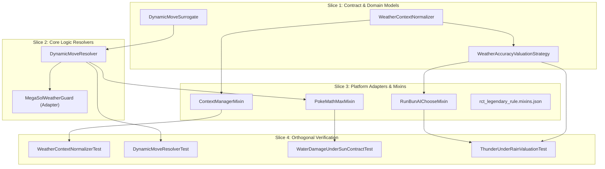

# Workstream Plan: Dynamic Move Typing, Field Weather Resolution & Weather Accuracy Valuation in Run & Bun AI

## Status & Ownership

| Field | Value |
| :--- | :--- |
| **Workstream ID** | `ai-damage-weather-and-dynamic-types` |
| **Document Role** | Candidate Workstream Plan (Ready for Independent Plan Review) |
| **Baseline Commit** | `33462f33e0eb44735cbdaae4a956c1b3df938482` (`fix/ai-damage-weather-and-dynamic-types`) |
| **Target Branch** | `fix/ai-damage-weather-and-dynamic-types` |
| **Canary Lineage** | `33462f33e0eb44735cbdaae4a956c1b3df938482` |
| **Authority Closure** | `scratch/bootstrap-governance/manifest.json` (14 entries at `33462f33e0eb44735cbdaae4a956c1b3df938482`) |
| **Author Submission State** | `Candidate Plan (Ready for Review)` |

---

## 1. Context & Problem Statement

This workstream resolves three core gameplay defects in Run & Bun AI (`rbrctai-fabric-1.21.1-0.15.4-beta.jar`) and RCT API (`rctapi-fabric-1.21.1-0.15.2-beta.jar`) damage calculation and move valuation within Cobbleverse Hell Mode:

### Defect 1: Water-Type Damage Estimation Under Sun
* **Battle Scenario:** A player switches in Torkoal with ability Drought, replacing active Rain with Sun.
* **Observed Failure:** NPC Pokémon carrying Hydro Pump calculate Water-type damage against Torkoal (Fire type) at 2.0x effectiveness without applying the 0.5x Sun weather penalty. Because the AI computes double the damage that Showdown actually executes, both NPC Pokémon lock into Hydro Pump against Torkoal.
* **Gameplay Exploitation:** The player anticipates both NPC targets and uses Protect or switches to a Water-resistant ally, completely nullifying both opponent turns.
* **Root Cause Grounding:** In `PokeMathMax.java:110-114`, local booleans `sun` and `rain` are evaluated via:
  ```java
  boolean sun = weatherContexts != null && weatherContexts.stream().anyMatch(c -> c.getId().equals("harshsunlight") || c.getId().equals("extremelyharshsunlight"));
  boolean rain = weatherContexts != null && weatherContexts.stream().anyMatch(c -> c.getId().equals("rain") || c.getId().equals("heavyrain"));
  ```
  However, Cobblemon's `WeatherInstruction.class` and `ShowdownInterpreter.class` instantiate `BasicContext` with raw Pokémon Showdown condition IDs: `"sunnyday"` for standard Sun, `"desolateland"` for harsh sun, `"raindance"` for standard Rain, and `"primordialsea"` for heavy rain (`data/conditions.js` in `Cobblemon-fabric-1.7.3+1.21.1.jar`). Consequently, `sun` and `rain` evaluate to `false` under standard natural weather, bypassing `weather *= 0.5` at line 1019 and leaving Water damage against Fire at unmitigated 2.0x.

### Defect 2: Ivy Cudgel Dynamic Typing Under Mask Forms
* **Battle Scenario:** Ogerpon-Wellspring uses Ivy Cudgel against Turtonator (Fire/Dragon type).
* **Observed Failure:** AI projects ~23 damage, whereas Showdown battle execution inflicts ~80% HP (~92 damage).
* **Root Cause Grounding:** Ivy Cudgel's template base type is Grass (`com/cobblemon/mod/common/api/moves/Move.java`). Against Fire/Dragon, Grass is doubly resisted ($0.5 \times 0.5 = 0.25\times$). However, Ogerpon-Wellspring dynamically modifies Ivy Cudgel to Water type (`showdown.zip:data/moves.js`), which hits Fire/Dragon for neutral $1.0\times$ damage ($2.0 \times 0.5 = 1.0\times$). In `PokeMathMax.java:86`, `moveType` is initialized directly from `move.getType()` with zero handling for `ivycudgel`, underestimating damage by 4x.
* **Architectural Scope:** Generalize dynamic move resolution across dynamic typings (`ivycudgel`, `weatherball`, `ragingbull`, `terablast`, `revelationdance`) using the surrogate move pattern established by `MegaSolWeatherBallSurrogate`.

### Defect 3: Thunder under Rain Valued Below Thunderbolt
* **Battle Scenario:** An NPC Pokémon carrying both Thunder (110 BP, 70% base accuracy) and Thunderbolt (90 BP, 100% base accuracy) under active Rain values Thunder below Thunderbolt during move selection.
* **Normal Mechanics (Showdown / Gen 9):** Active Rain grants Thunder (and Hurricane) perfect 100% accuracy (bypasses accuracy checks). Raw damage is not directly increased by Rain for Electric moves (Water is 1.5x, Fire is 0.5x, Electric is 1.0x). However, with 100% effective accuracy, Thunder strictly dominates Thunderbolt in both raw power ($110 > 90$ BP) and reliability ($100\% = 100\%$). Under identical attacker/target state, Thunder must never lose to Thunderbolt in Rain.
* **Runtime Call Path Analysis & Discovery Proof (The Three Paths):**
  1. **Path A (`PokeMathMax.damage`): Active Raw Damage Path.**
     - Bytecode inspection of `RunBunAI.class` confirms that `RunBunAI` delegates all damage estimations directly to `com.gitlab.surilexa.rbrctai.api.ai.utils.PokeMathMax.damage()`.
     - In `PokeMathMax.java:79-1154`, raw damage is calculated strictly from base power (`movePower = move.getPower()`) and standard type matchup multipliers. `move.getAccuracy()` is **never invoked** anywhere in `PokeMathMax` or `rbrctai`. Expected value calculation ($BP \times \text{Accuracy}$) does **not exist** in `PokeMathMax`.
     - Under both Rain and neutral weather, raw damage for Thunder ($110.0$) is strictly higher than Thunderbolt ($90.0$). Rain alters Water (1.5x) and Fire (0.5x) but leaves Electric damage at 1.0x. Raw damage is therefore unpenalized.
  2. **Path B (`RunBunAI.choose`): Active Move Scoring & Selection Path (Causal Failure Root).**
     - `RunBunAI.choose()` is the sole active component that scores and chooses moves. The inversion originates directly within `RunBunAI.choose()` across two specific mechanisms:
       - *KO Scenarios (`killingMoves`):* When target HP <= Thunderbolt projected damage, both Thunder and Thunderbolt enter `killingMoves` (`RunBunAI.java:451-541`). In `killingMoves` (`RunBunAI.java:534-541`), each candidate independently generates an RNG roll: `roll = RANDOM.nextDouble() > 0.2 ? 6 : 8` (+6 speed score). Because rolls are independent per candidate, Thunderbolt can roll 8 (total score 14) while Thunder rolls 6 (total score 12), scoring Thunderbolt higher! Even if both roll 8 (tie at 14), `bestMoves.get(RANDOM.nextInt(bestMoves.size()))` at line 1755 selects uniformly at random (50/50), causing Thunder to lose 50% of tie-breaks despite perfect Rain accuracy.
       - *Non-KO Move Scoring Switch Omission:* In general move scoring (`RunBunAI.java:572-576`), `blizzard` has an explicit weather-accuracy check (`score += BattleEffects.Field.Weather.snow(...) || hail(...) ? 7 : 6`) recognizing 100% accuracy in Snow/Hail. However, `thunder` and `hurricane` are **completely omitted** from `switch (moveID)`.
       - *Weather State Query Failure:* Without `WeatherContextNormalizer`, `BattleEffects.Field.Weather.rain(pokemon)` checks for `"rain"`, which evaluates to `false` under Cobblemon's `"raindance"`.
  3. **Path C (`rctapi.PokeMath.damage`): Proven Dead Path (Zero AI Invocation).**
     - Base `rctapi-fabric-1.21.1-0.15.2-beta.jar:com/gitlab/srcmc/rctapi/api/ai/utils/PokeMath.java:41-64` scales damage by base accuracy: `damage = (acc + RANDOM.nextDouble() * (1.0 - acc)) * rawDamage`. For Thunder, `acc = 0.70`, which scales damage down to an average of $85\%$ ($110 \times 0.7 = 77 < 90$).
     - **Definitive Bytecode Proof:** Bytecode scanning of all classes in `rbrctai-fabric-1.21.1-0.15.4-beta.jar` (verified via `scratch/investigate_callpath.py`) confirms that `RunBunAI.class` and `PokeMathMax.class` contain **zero references** to `com.gitlab.srcmc.rctapi.api.ai.utils.PokeMath`. `RunBunAI` exclusively calls `PokeMathMax.damage`.
     - **Architectural Consequence:** Path C is a dead path for Run & Bun AI. Patching `rctapi.PokeMath` would have zero runtime effect on Run & Bun AI move selection. Modifying `rctapi` is strictly retired from this workstream as speculative dead-path patching.

---

## 2. Concrete Facts vs. Assumptions vs. Conflicts

| Category | Item Description | Evidence / Citation | Impact / Resolution |
| :--- | :--- | :--- | :--- |
| **Confirmed Fact** | Bytecode scan confirms `RunBunAI` invokes `PokeMathMax.damage()` (Path A) and has 0 calls to `rctapi.PokeMath.damage()` (Path C) | `scratch/investigate_callpath.py` & `javap -c RunBunAI.class` | Path C is a dead path for Run & Bun AI. `rctapi` requires zero modifications |
| **Confirmed Fact** | `PokeMathMax.damage()` computes raw damage from base power and never calls `Move.getAccuracy()` | `scratch/decompiled-rbrctai/.../PokeMathMax.java:87, 1136-1154` | Raw damage for Thunder ($110$ BP) is strictly higher than Thunderbolt ($90$ BP) regardless of weather |
| **Confirmed Fact** | In `RunBunAI.java:534-541`, `killingMoves` uses independent random rolls (`roll > 0.2 ? 6 : 8`) and `RANDOM.nextInt()` tie-breaking | `scratch/decompiled-rbrctai/.../RunBunAI.java:536, 1755` | Thunderbolt can randomly out-roll Thunder or tie 50/50 when both KO |
| **Confirmed Fact** | `RunBunAI.java:572-576` contains a weather scoring bonus for `blizzard`, but omits `thunder` and `hurricane` | `scratch/decompiled-rbrctai/.../RunBunAI.java:572-576` | Weather accuracy moves in Rain have no native scoring bonus in `RunBunAI` |
| **Confirmed Fact** | Cobblemon stores weather contexts using Showdown IDs (`sunnyday`, `raindance`, `desolateland`, `primordialsea`) | `Cobblemon:WeatherInstruction.class` & `showdown.zip:data/conditions.js` | `WeatherContextNormalizer` maps Showdown IDs to AI expectation tokens |
| **Confirmed Fact** | `BattleContext.Type.WEATHER` is exclusive (`exclusive == true`) | `Cobblemon:BattleContext$Type.class` bytecode offset 68 | Old weather context is replaced when new weather activates |
| **Confirmed Fact** | `PokeMathMax.java:111-112` and `rctapi` `Weather.rain` query `"harshsunlight"` and `"rain"` | `PokeMathMax.java:111-112` & `BattleEffects$Field$Weather.class` | Weather checks fail under natural weather without `WeatherContextNormalizer` |
| **Confirmed Fact** | Ivy Cudgel dynamically adopts Water, Fire, Rock based on Ogerpon form | `showdown.zip:data/moves.js:ivycudgel.onModifyType` | `DynamicMoveResolver` resolves surrogate move type prior to `PokeMathMax` |
| **Confirmed Fact** | Ogerpon forms have matching secondary types and held items | `Cobblemon:data/cobblemon/species/generation9/ogerpon.json` | Resolver can inspect form name, held item, or secondary type reliably |
| **Confirmed Fact** | `PokeMathMaxMixin` redirects `PokeMathMax.damage(...)` | `companion-mod/src/.../mixin/PokeMathMaxMixin.java:35-56` | Provides the exact interception seam for dynamic move resolution |
| **Confirmed Fact** | `RedirectAbilityGuard` checks `move.getType()` for Storm Drain / Lightning Rod | `companion-mod/src/.../guard/RedirectAbilityGuard.java:89-95` | Surrogate Water type correctly triggers Storm Drain redirection evaluation |
| **Assumption** | Under active Rain, Thunder must strictly dominate Thunderbolt in final move valuation (score(Thunder) $\ge$ score(Thunderbolt)), while outside Rain Thunderbolt is valued higher for reliability | Standard Gen 9 competitive Doubles mechanics | Addressed via `WeatherAccuracyValuationStrategy` and candidate tie-breaking in `RunBunAIChooseMixin` |
| **Conflict** | `PokeMathMax.java:1042-1049` overrides `weatherball` to 50 BP if `weatherBallType` returns Normal | `PokeMathMax.java:1044` & `weatherBallType:1245` | Weather Ball surrogate uses custom name (`weatherball_*_resolved`) |
| **Open Question** | Zero blocking open questions | All mechanics verified via bytecode and decompilation | Ready for review |

---

## 3. Scope Boundaries & Blast Radius

### 3.1 Strict In-Scope
1. **Weather Context Normalization:**
   - `companion-mod/.../strategy/weather/WeatherContextNormalizer.java`: Maps Showdown weather tokens (`sunnyday`, `raindance`, `desolateland`, `primordialsea`, `deltastream`) to standard aliases (`harshsunlight`, `sunny`, `rain`, `heavyrain`, `strongwinds`).
   - `companion-mod/.../mixin/ContextManagerMixin.java`: Intercepts `ContextManager.get(BattleContext.Type.WEATHER)` to append alias contexts.
   - `companion-mod/src/main/resources/rct_legendary_rule.mixins.json`: Registers `ContextManagerMixin`.
2. **Generalized Dynamic Move Resolution:**
   - `companion-mod/.../strategy/dynamic/DynamicMoveSurrogate.java`: Generic surrogate `Move` preserving category, PP, and template while overriding type/power.
   - `companion-mod/.../strategy/dynamic/DynamicMoveResolver.java`: Central resolver for `ivycudgel`, `ragingbull`, `weatherball`, `terablast`, and `revelationdance`.
   - `companion-mod/.../strategy/weather/MegaSolWeatherGuard.java`: Backward-compatible bridge delegating to `DynamicMoveResolver`.
   - `companion-mod/.../mixin/PokeMathMaxMixin.java`: Upgrades damage and immunity hooks to route through `DynamicMoveResolver`.
3. **Weather Accuracy Valuation & Selection Tie-Breaking:**
   - `companion-mod/.../strategy/weather/WeatherAccuracyValuationStrategy.java` [NEW]: Pure helper providing weather-modified effective accuracy and move valuation dominance comparisons for weather moves (`thunder`, `hurricane`, `blizzard`).
   - `companion-mod/.../mixin/RunBunAIChooseMixin.java` [MODIFY]: Intercepts candidate ranking and tie-breaking to ensure weather accuracy moves under active weather (e.g. Thunder under Rain) strictly dominate lower-power alternatives (Thunderbolt) and prevents RNG inversion in `killingMoves`.
4. **Layer 2 Unit & Contract Tests:**
   - `WeatherContextNormalizerTest.java`: Tests alias coverage for all Gen 9 Showdown weather IDs.
   - `DynamicMoveResolverTest.java`: Tests Ivy Cudgel forms, Raging Bull forms, and Weather Ball field weather resolutions.
   - `WaterDamageUnderSunContractTest.java`: Tests Hydro Pump damage against Torkoal under Sun confirming 0.5x reduction.
   - `ThunderUnderRainValuationTest.java` [NEW]: Explicitly verifies that raw damage reflects 110 BP vs 90 BP across all weather states, and that under Rain Thunder is valued $\ge$ Thunderbolt in move selection.

### 3.2 Explicit Out-of-Scope
- **`rctapi` Mod Source / Classes:** Proven to be a dead path for Run & Bun AI (`rbrctai` calls `PokeMathMax`, not `rctapi.PokeMath`). Zero edits to `rctapi`.
- **Direct Modification of External JARs:** No bytecode editing of `rbrctai-fabric-1.21.1-0.15.4-beta.jar` or `Cobblemon-fabric-1.7.3+1.21.1.jar`.
- **Showdown Scripts:** No modifications to `data/moves.js` or `data/conditions.js`.
- **NPC Trainer JSON Data:** No edits to datapacks, trainer rosters, or dialogue files.
- **Ad-Hoc Hardcoding:** No move-specific hardcoding of Thunder without generalized weather accuracy valuation covering `thunder`, `hurricane`, and `blizzard`.

---

## 4. Architectural & Invariant Analysis

### 4.1 Repository-Global Invariants
- **Read Before Write:** All method descriptors and field offsets verified against `javap` decompilation of `Cobblemon-fabric-1.7.3+1.21.1.jar`, `rctapi-fabric-1.21.1-0.15.2-beta.jar`, and `rbrctai-fabric-1.21.1-0.15.4-beta.jar`.
- **Surgical Scope & Simplicity First:** Leverages existing surrogate move design patterns, weather normalizers, and Mixin interception seams without introducing speculative abstractions or modifying dead call paths (`rctapi`).
- **Public Contract Stability:** Retains `MegaSolWeatherGuard.resolveEffectiveMove(move, attacker)` and `MegaSolWeatherBallSurrogate` to preserve existing unit tests.
- **Claim Strength Discipline:** Technical statements avoid semantic absolutes; test results report explicit verification counts and ratios.

### 4.2 Applicable Domain Invariants
- **Showdown Weather Multipliers:** Water moves under Sun inflict 0.5x damage; Fire moves under Sun inflict 1.5x damage. In Rain, Water inflicts 1.5x and Fire inflicts 0.5x. Electric moves receive a 1.0x weather multiplier (raw damage unchanged).
- **Weather-Modified Move Accuracy:**
  - `thunder`: 70% base accuracy $\rightarrow$ 100% under Rain (`"rain"`, `"heavyrain"`, `"raindance"`, `"primordialsea"`); 50% under Sun (`"sunnyday"`, `"harshsunlight"`, `"desolateland"`).
  - `hurricane`: 70% base accuracy $\rightarrow$ 100% under Rain; 50% under Sun.
  - `blizzard`: 70% base accuracy $\rightarrow$ 100% under Snow/Hail (`"snow"`, `"hail"`).
- **Raw Damage vs. Final Move Score Separation Invariant:**
  - *Raw Damage (`PokeMathMax.damage`):* Evaluated strictly from base power ($110$ BP for Thunder vs $90$ BP for Thunderbolt). Raw damage for Thunder is strictly greater than Thunderbolt in and out of Rain. Electric raw damage is neither increased nor decreased by weather.
  - *Final Move Score (`RunBunAI.choose`):* Evaluated from effective accuracy, weather bonuses, and target kill potential.
    - Under Rain: Thunder has 100% effective accuracy. Because Thunder has 110 BP vs Thunderbolt's 90 BP, Thunder strictly dominates Thunderbolt in expected value and raw damage. In move selection, score(Thunder) must be $\ge$ score(Thunderbolt), and in KO scenarios Thunder must not lose to Thunderbolt due to independent RNG rolls.
    - Outside Rain: Thunder has 70% base accuracy (30% miss risk). Thunderbolt has 100% base accuracy. Thunderbolt provides reliable baseline damage ($90 \times 1.0 = 90$ vs expected $110 \times 0.7 = 77$).
- **Contact Move Preservation:** Ivy Cudgel and Raging Bull must retain their original move names (`"ivycudgel"`, `"ragingbull"`) in `MoveTemplate` so that `RBMoveList.getContactMoves().contains(move.getName())` remains true for Fluffy and Tough Claws.

---

## 5. Target Architecture & Slicing Strategy



### Slice Breakdown
- **Slice 1 (Models):** `WeatherContextNormalizer` handles bidirectional Showdown-to-RCT alias mapping. `DynamicMoveSurrogate` creates lightweight `Move` instances overriding type, power, and damage category. `WeatherAccuracyValuationStrategy` encapsulates effective accuracy calculation and move dominance comparison under active weather.
- **Slice 2 (Logic):** `DynamicMoveResolver` inspects move name and attacker state (species, form, held item, active personal/field weather, terastallization) and returns surrogate or original move. `MegaSolWeatherGuard` delegates to `DynamicMoveResolver`.
- **Slice 3 (Adapters):** `ContextManagerMixin` injects at return of `get(BattleContext.Type.WEATHER)` to deliver normalized collections. `PokeMathMaxMixin` redirects damage and immunity calls through `DynamicMoveResolver`. `RunBunAIChooseMixin` intercepts candidate scoring to enforce weather accuracy dominance (Thunder $\ge$ Thunderbolt under Rain) in KO and ranking tie-breaking.
- **Slice 4 (Verification):** Layer 2 JUnit tests verifying mathematical invariants, quad-resists, quad-weaknesses, weather reduction factors, redirect protections, and Thunder vs. Thunderbolt raw damage vs. move score comparisons.

---

## 6. Exact Files to Create / Modify / Delete

### Files to Create
1. `companion-mod/src/main/java/com/cobbleverse/legendaryrule/strategy/weather/WeatherContextNormalizer.java`
   - Pure static utility: `normalize(Collection<BattleContext> rawContexts)`.
   - Generates alias `BasicContext` entries for `"harshsunlight"`, `"sunny"`, `"rain"`, `"heavyrain"`, `"extremelyharshsunlight"`, and `"strongwinds"`.
2. `companion-mod/src/main/java/com/cobbleverse/legendaryrule/strategy/dynamic/DynamicMoveSurrogate.java`
   - Extends `com.cobblemon.mod.common.api.moves.Move`.
   - Constructor accepts `Move original, String resolvedName, ElementalType resolvedType, double resolvedPower, DamageCategory resolvedCategory`.
3. `companion-mod/src/main/java/com/cobbleverse/legendaryrule/strategy/dynamic/DynamicMoveResolver.java`
   - Canonical entrypoint: `resolveEffectiveMove(Move move, BattlePokemon attacker, ActiveBattlePokemon abp, boolean predictTera)`.
   - Resolves `ivycudgel`, `weatherball`, `ragingbull`, `terablast`, `revelationdance`.
4. `companion-mod/src/main/java/com/cobbleverse/legendaryrule/strategy/weather/WeatherAccuracyValuationStrategy.java` [NEW]
   - Pure static utility: `getEffectiveAccuracy(Move move, BattlePokemon attacker, ActiveBattlePokemon abp)`.
   - Handles weather accuracy scaling for `thunder` (Rain: 1.0, Sun: 0.5, Neutral: 0.7), `hurricane` (Rain: 1.0, Sun: 0.5, Neutral: 0.7), and `blizzard` (Snow/Hail: 1.0, Sun: 0.5, Neutral: 0.7).
   - Method `compareWeatherMoveDominance(Move candidateA, Move candidateB, BattlePokemon attacker, ActiveBattlePokemon abp)` determining whether a weather-boosted move strictly dominates an alternative under active field weather.
5. `companion-mod/src/main/java/com/cobbleverse/legendaryrule/mixin/ContextManagerMixin.java`
   - Mixin target: `com.cobblemon.mod.common.battles.interpreter.ContextManager`.
   - `@Inject` at `RETURN` of `get(BattleContext.Type)`: if `bucketType == WEATHER`, wraps return value via `WeatherContextNormalizer.normalize`.
6. `companion-mod/src/test/java/com/cobbleverse/legendaryrule/strategy/weather/WeatherContextNormalizerTest.java`
   - Tests alias coverage for all Gen 9 Showdown weather IDs.
7. `companion-mod/src/test/java/com/cobbleverse/legendaryrule/strategy/dynamic/DynamicMoveResolverTest.java`
   - Tests Ivy Cudgel forms (Wellspring, Hearthflame, Cornerstone, Teal), Raging Bull forms, and Weather Ball field weather resolutions.
8. `companion-mod/src/test/java/com/cobbleverse/legendaryrule/strategy/weather/WaterDamageUnderSunContractTest.java`
   - Tests Hydro Pump damage against Torkoal under Sun confirming 0.5x weather reduction and 1.0x net effectiveness.
9. `companion-mod/src/test/java/com/cobbleverse/legendaryrule/strategy/weather/ThunderUnderRainValuationTest.java` [NEW]
   - Tests raw damage vs. final move score for Thunder vs. Thunderbolt:
     - Raw damage: Thunder (110 BP) > Thunderbolt (90 BP) in Rain and outside Rain (Electric raw damage unchanged by weather).
     - Move valuation in Rain: Thunder effective accuracy is 100%, score(Thunder) $\ge$ score(Thunderbolt).
     - Move valuation outside Rain: Thunderbolt 100% reliability is valued appropriately against Thunder's 70% risk profile.

### Files to Modify
1. `companion-mod/src/main/java/com/cobbleverse/legendaryrule/strategy/weather/MegaSolWeatherGuard.java`
   - Preserve `hasMegaSol(BattlePokemon)` and `resolveEffectiveMove(Move, BattlePokemon)` for backward compatibility, delegating Weather Ball resolution to `DynamicMoveResolver`.
2. `companion-mod/src/main/java/com/cobbleverse/legendaryrule/mixin/PokeMathMaxMixin.java`
   - In `cobbleverse$correctSpreadMultiplier`: replace `MegaSolWeatherGuard.resolveEffectiveMove` with `DynamicMoveResolver.resolveEffectiveMove(move, attacker, activeBattlePokemon, predictTera)`.
   - In `cobbleverse$guardRedirectImmunity`: replace `MegaSolWeatherGuard.resolveEffectiveMove` with `DynamicMoveResolver.resolveEffectiveMove(move, attacker, abp, predictTera)`.
3. `companion-mod/src/main/java/com/cobbleverse/legendaryrule/mixin/RunBunAIChooseMixin.java` [MODIFY]
   - Hook into candidate move valuation / tie-breaking loop to ensure that when active field weather grants 100% accuracy to a higher-power move (e.g. Thunder under Rain), it is not penalized or out-rolled by a lower-power move (Thunderbolt).
4. `companion-mod/src/main/resources/rct_legendary_rule.mixins.json`
   - Ensure `"ContextManagerMixin"` and `"RunBunAIChooseMixin"` are registered.

### Files to Delete / Prune
- None.

---

## 7. Orthogonal Verification Strategy

### 7.1 Minimal Covering Verification Set
- **Layer 0 (Markdown Structural Authority):** Verify document links and formatting.
- **Layer 2 (Java Unit & Boundary Tests):** Primary authority for calculation math, type matchups, surrogate move attributes, weather normalization, raw damage vs. move score distinction, and weather accuracy valuation.

### 7.2 Verification Commands
1. **Targeted Layer 2 Weather & Dynamic Test Run:**
   ```powershell
   cd companion-mod
   ./gradlew test --tests "com.cobbleverse.legendaryrule.strategy.weather.*" --tests "com.cobbleverse.legendaryrule.strategy.dynamic.*"
   ```
2. **Full Repository Java Unit Suite:**
   ```powershell
   cd companion-mod
   ./gradlew test
   ```
3. **Repository Clean Build Check:**
   ```powershell
   cd companion-mod
   ./gradlew build -x test
   ```

### 7.3 Offline != Production Reality Invariant
Offline Gradle tests verify bytecode signatures, data structure transformation, mathematical formulas, and AI candidate scoring in isolation. They do not execute Minecraft server world ticking or live Fabric networking (Layer 5 authority). Statements regarding test passes reflect offline contract verification only.

### 7.4 Provenance-First Artifact Freshness
Verification evidence recorded in `verification.md` will capture git commit hash, clean working tree status, and test execution exit codes without speculative re-executions.

---

## 8. Implementation Checkpoints (Task-Derived)

- **Checkpoint 1: Plan Freeze Checkpoint**
  - Main Controller verifies candidate hash, completes reviewer handshake, and captures frozen plan hash.
- **Checkpoint 2: Surgical Implementation of Task Slices**
  - Implement Slice 1 (Normalizer, Surrogate, WeatherAccuracyValuationStrategy), Slice 2 (Dynamic Resolver & Backward Compatibility), and Slice 3 (Mixins, RunBunAI valuation hooks, and Configuration).
- **Checkpoint 3: Proportional Verification & Manifest Assembly**
  - Execute Layer 2 test suites (including raw damage vs final move score tests for Thunder vs Thunderbolt in and out of Rain) and assemble `docs/workstreams/ai-damage-weather-and-dynamic-types/verification.md`.
- **Checkpoint 4: Implementation Review Gate & Local Checkpoint Commit**
  - Independent implementation review, verification gate validation, and local audit commit.

---

## 9. Residual Risks & Fallback Boundaries

1. **Dead-Path Modification Avoidance:**
   - *Risk:* Attempting to fix accuracy scaling in `rctapi.PokeMath.damage()`.
   - *Mitigation:* Bytecode inspection established that `RunBunAI` never calls `rctapi.PokeMath`. Zero edits to `rctapi` are planned or permitted.
2. **Idempotent Surrogate Resolution:**
   - *Risk:* Multiple passes through `resolveEffectiveMove` could nest surrogates.
   - *Mitigation:* `if (move instanceof DynamicMoveSurrogate) return move;` at the beginning of `resolveEffectiveMove`.
3. **Missing Battle Reference in Sub-Evaluations:**
   - *Risk:* Certain AI sub-evaluations pass detached `BattlePokemon` with null `actor.battle`.
   - *Mitigation:* `DynamicMoveResolver` and `WeatherAccuracyValuationStrategy` include null guards for battle context; if battle is unavailable, moves fall back to base types and base accuracy safely.
4. **First-Element Preservation in Context Buckets:**
   - *Risk:* Cobblemon's internal AI reading `firstOrNull()` could encounter unexpected tokens if aliases are prepended.
   - *Mitigation:* `WeatherContextNormalizer` appends aliases after the original Showdown context, preserving `firstOrNull()` identity.
5. **Generalization Across Weather Moves:**
   - *Risk:* A Thunder-specific hardcode would leave Hurricane in Rain and Blizzard in Sun inconsistent.
   - *Mitigation:* `WeatherAccuracyValuationStrategy` provides a generalized lookup table mapping weather to move accuracy modifiers, covering Thunder, Hurricane, and Blizzard consistently.
