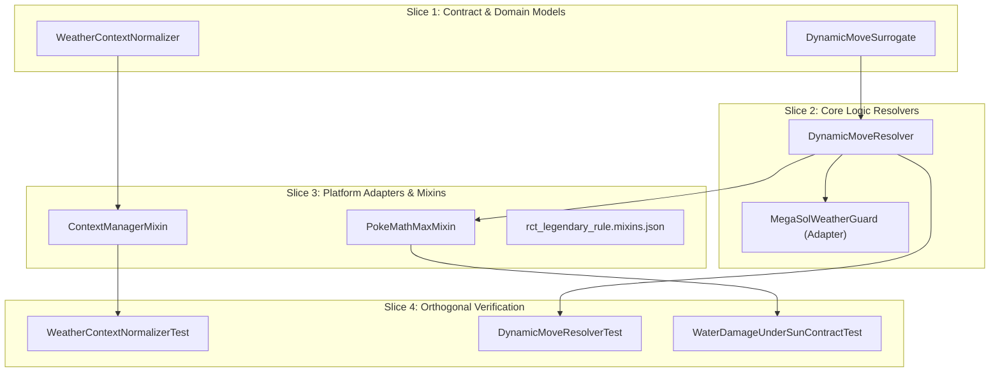

# Workstream Plan: Dynamic Move Typing & Field Weather Resolution in Run & Bun AI

## Status & Ownership

| Field | Value |
| :--- | :--- |
| **Workstream ID** | `ai-damage-weather-and-dynamic-types` |
| **Document Role** | Candidate Workstream Plan (Ready for Independent Plan Review) |
| **Baseline Commit** | `f4af48e9ef15ef25fd4535a2c94dd90cf674db05` (`fix/ai-damage-weather-and-dynamic-types`) |
| **Target Branch** | `fix/ai-damage-weather-and-dynamic-types` |
| **Canary Lineage** | `f4af48e9ef15ef25fd4535a2c94dd90cf674db05` |
| **Authority Closure** | `scratch/bootstrap-governance/manifest.json` (14 entries at `f4af48e9ef15ef25fd4535a2c94dd90cf674db05`) |
| **Author Submission State** | `Candidate Plan (Ready for Review)` |

---

## 1. Context & Problem Statement

This workstream resolves two production gameplay defects in Run & Bun AI (`rbrctai-fabric-1.21.1-0.15.4-beta.jar`) damage calculation within Cobbleverse Hell Mode:

### Defect 1: Water-Type Damage Estimation Under Sun
* **Battle Scenario:** A player switches in Torkoal with ability Drought, replacing active Rain with Sun.
* **Observed Failure:** NPC Pokémon carrying Hydro Pump calculate Water-type damage against Torkoal (Fire type) at 2.0x effectiveness without applying the 0.5x Sun weather penalty. Because the AI computes double the damage that Showdown actually executes, both NPC Pokémon lock into Hydro Pump against Torkoal.
* **Gameplay Exploitation:** The player anticipates both NPC targets and uses Protect or switches to a Water-resistant ally, completely nullifying both opponent turns.
* **Root Cause Grounding:** In `PokeMathMax.java:110-114`, local booleans `sun` and `rain` are evaluated via:
  ```java
  boolean sun = weatherContexts != null && weatherContexts.stream().anyMatch(c -> c.getId().equals("harshsunlight") || c.getId().equals("extremelyharshsunlight"));
  boolean rain = weatherContexts != null && weatherContexts.stream().anyMatch(c -> c.getId().equals("rain") || c.getId().equals("heavyrain"));
  ```
  However, Cobblemon's `WeatherInstruction.class` and `ShowdownInterpreter.class` instantiate `BasicContext` with raw Pokémon Showdown condition IDs: `"sunnyday"` for standard Sun, `"desolateland"` for harsh sun, `"raindance"` for standard Rain, and `"primordialsea"` for heavy rain (`data/conditions.js` in `Cobblemon-fabric-1.7.3+1.21.1.jar`). Consequently, `sun` and `rain` evaluate to `false` under standard natural weather, bypassing `weather *= 0.5` at line 1019 and leaving Water damage against Fire at unmitigated 2.0x.

### Defect 2: Ivy Cudgel Dynamic Typing Under Mask Forms
* **Battle Scenario:** Ogerpon-Wellspring uses Ivy Cudgel against Turtonator (Fire/Dragon type).
* **Observed Failure:** AI projects ~23 damage, whereas Showdown battle execution inflicts ~80% HP (~92 damage).
* **Root Cause Grounding:** Ivy Cudgel's template base type is Grass (`com/cobblemon/mod/common/api/moves/Move.java`). Against Fire/Dragon, Grass is doubly resisted ($0.5 \times 0.5 = 0.25\times$). However, Ogerpon-Wellspring dynamically modifies Ivy Cudgel to Water type (`showdown.zip:data/moves.js`), which hits Fire/Dragon for neutral $1.0\times$ damage ($2.0 \times 0.5 = 1.0\times$). In `PokeMathMax.java:86`, `moveType` is initialized directly from `move.getType()` with zero handling for `ivycudgel`, underestimating damage by 4x.
* **Architectural Scope:** Generalize dynamic move resolution across dynamic typings (`ivycudgel`, `weatherball`, `ragingbull`, `terablast`, `revelationdance`) using the surrogate move pattern established by `MegaSolWeatherBallSurrogate`.

---

## 2. Concrete Facts vs. Assumptions vs. Conflicts

| Category | Item Description | Evidence / Citation | Impact / Resolution |
| :--- | :--- | :--- | :--- |
| **Confirmed Fact** | Cobblemon stores weather contexts using Showdown IDs (`sunnyday`, `raindance`, `desolateland`, `primordialsea`) | `Cobblemon:WeatherInstruction.class` & `showdown.zip:data/conditions.js` | Normalizer must map Showdown IDs to AI expectation tokens |
| **Confirmed Fact** | `BattleContext.Type.WEATHER` is exclusive (`exclusive == true`) | `Cobblemon:BattleContext$Type.class` bytecode offset 68 | Old weather context is replaced when new weather activates |
| **Confirmed Fact** | `PokeMathMax.java:111-112` queries `"harshsunlight"` and `"rain"` | `scratch/decompiled-rbrctai/.../PokeMathMax.java:111-112` | `sun` and `rain` evaluate to `false` for `"sunnyday"` and `"raindance"` |
| **Confirmed Fact** | `rctapi` `BattleEffects.Field.Weather` queries `"harshsunlight"` and `"rain"` | `rctapi-fabric-1.21.1-0.15.2-beta.jar:BattleEffects$Field$Weather.class` | Ability checks (`chlorophyll`, `swiftswim`, `orichalcumpulse`) fail under natural weather |
| **Confirmed Fact** | Ivy Cudgel dynamically adopts Water, Fire, Rock based on Ogerpon form | `showdown.zip:data/moves.js:ivycudgel.onModifyType` | `DynamicMoveResolver` must resolve surrogate move type prior to `PokeMathMax` |
| **Confirmed Fact** | Ogerpon forms have matching secondary types and held items | `Cobblemon:data/cobblemon/species/generation9/ogerpon.json` | Resolver can inspect form name, held item, or secondary type reliably |
| **Confirmed Fact** | `PokeMathMaxMixin` redirects `PokeMathMax.damage(...)` | `companion-mod/src/.../mixin/PokeMathMaxMixin.java:35-56` | Provides the exact interception seam for dynamic move resolution |
| **Confirmed Fact** | `RedirectAbilityGuard` checks `move.getType()` for Storm Drain / Lightning Rod | `companion-mod/src/.../guard/RedirectAbilityGuard.java:89-95` | Surrogate Water type correctly triggers Storm Drain redirection evaluation |
| **Assumption** | Returning an aliased context collection from `ContextManager.get(WEATHER)` satisfies both Cobblemon AI and RCT AI | `ContextManager.class` bytecode inspection | First element remains canonical Showdown ID for Cobblemon; aliases follow |
| **Conflict** | `PokeMathMax.java:1042-1049` overrides `weatherball` to 50 BP if `weatherBallType` returns Normal | `PokeMathMax.java:1044` & `weatherBallType:1245` | Weather Ball surrogate must keep custom name (`weatherball_*_resolved`) |
| **Open Question** | Zero blocking open questions | All mechanics verified via bytecode and decompilation | Ready for implementation |

---

## 3. Scope Boundaries & Blast Radius

### 3.1 Strict In-Scope
1. **Weather Context Normalization:**
   - `companion-mod/.../strategy/weather/WeatherContextNormalizer.java` [NEW]: Pure helper mapping Showdown weather tokens to standard aliases.
   - `companion-mod/.../mixin/ContextManagerMixin.java` [NEW]: Intercepts `ContextManager.get(BattleContext.Type.WEATHER)` to append alias contexts.
   - `companion-mod/src/main/resources/rct_legendary_rule.mixins.json` [MODIFY]: Registers `ContextManagerMixin`.
2. **Generalized Dynamic Move Resolution:**
   - `companion-mod/.../strategy/dynamic/DynamicMoveSurrogate.java` [NEW]: Generic surrogate `Move` preserving category, PP, and template while overriding type/power.
   - `companion-mod/.../strategy/dynamic/DynamicMoveResolver.java` [NEW]: Central resolver for `ivycudgel`, `ragingbull`, `weatherball`, `terablast`, and `revelationdance`.
   - `companion-mod/.../strategy/weather/MegaSolWeatherGuard.java` [MODIFY]: Backward-compatible bridge delegating to `DynamicMoveResolver`.
   - `companion-mod/.../mixin/PokeMathMaxMixin.java` [MODIFY]: Upgrades damage and immunity hooks to route through `DynamicMoveResolver`.
3. **Layer 2 Unit & Contract Tests:**
   - `WeatherContextNormalizerTest.java` [NEW]
   - `DynamicMoveResolverTest.java` [NEW]
   - `WaterDamageUnderSunContractTest.java` [NEW]

### 3.2 Explicit Out-of-Scope
- No editing of external decompiled JARs directly (`rbrctai`, `rctapi`, `Cobblemon`).
- No modification of Showdown scripts (`data/moves.js`, `data/conditions.js`).
- No modification of NPC trainer JSON rosters or datapack assets.
- No modifications to unrelated status moves or non-dynamic physical/special formulas.

---

## 4. Architectural & Invariant Analysis

### 4.1 Repository-Global Invariants
- **Read Before Write:** All method descriptors and field offsets verified against `javap` decompilation of `Cobblemon-fabric-1.7.3+1.21.1.jar`, `rctapi-fabric-1.21.1-0.15.2-beta.jar`, and `rbrctai-fabric-1.21.1-0.15.4-beta.jar`.
- **Surgical Scope & Simplicity First:** Leverages existing surrogate move design patterns without introducing heavy external event pipelines or multi-threading abstractions.
- **Public Contract Stability:** Retains `MegaSolWeatherGuard.resolveEffectiveMove(move, attacker)` and `MegaSolWeatherBallSurrogate` to preserve existing unit tests.
- **Claim Strength Discipline:** Technical statements avoid semantic absolutes; test results report explicit verification counts and ratios.

### 4.2 Applicable Domain Invariants
- **Showdown Weather Multipliers:** Water moves under Sun inflict 0.5x damage; Fire moves under Sun inflict 1.5x damage. In Rain, Water inflicts 1.5x and Fire inflicts 0.5x.
- **Dynamic Typing Rules:**
  - `ivycudgel`: Wellspring -> Water; Hearthflame -> Fire; Cornerstone -> Rock; Teal/base -> Grass (100 BP, Physical).
  - `ragingbull`: Paldea-Combat -> Fighting; Paldea-Blaze -> Fire; Paldea-Aqua -> Water; Base -> Normal (90 BP, Physical).
  - `weatherball`: Sun -> Fire; Rain -> Water; Sandstorm -> Rock; Snow/Hail -> Ice (100 BP, Special); None -> Normal (50 BP).
- **Contact Move Preservation:** Ivy Cudgel and Raging Bull must retain their original move names (`"ivycudgel"`, `"ragingbull"`) in `MoveTemplate` so that `RBMoveList.getContactMoves().contains(move.getName())` remains true for Fluffy and Tough Claws.

---

## 5. Target Architecture & Slicing Strategy



### Slice Breakdown
- **Slice 1 (Models):** `WeatherContextNormalizer` handles bidirectional Showdown-to-RCT alias mapping. `DynamicMoveSurrogate` creates lightweight `Move` instances overriding type, power, and damage category while preserving PP and template metadata.
- **Slice 2 (Logic):** `DynamicMoveResolver` inspects move name and attacker state (species, form, held item, active personal/field weather, terastallization) and returns surrogate or original move. `MegaSolWeatherGuard` delegates to `DynamicMoveResolver`.
- **Slice 3 (Adapters):** `ContextManagerMixin` injects at return of `get(BattleContext.Type.WEATHER)` to deliver normalized collections. `PokeMathMaxMixin` redirects damage and immunity calls through `DynamicMoveResolver`.
- **Slice 4 (Verification):** Layer 2 JUnit tests verifying mathematical invariants, quad-resists, quad-weaknesses, weather reduction factors, and redirect protections.

---

## 6. Exact Files to Create / Modify / Delete

### Files to Create
1. `companion-mod/src/main/java/com/cobbleverse/legendaryrule/strategy/weather/WeatherContextNormalizer.java`
   - Pure static utility: `normalize(Collection<BattleContext> rawContexts)`.
   - Generates alias `BasicContext` entries for `"harshsunlight"`, `"sunny"`, `"rain"`, `"heavyrain"`, `"extremelyharshsunlight"`, and `"strongwinds"`.
2. `companion-mod/src/main/java/com/cobbleverse/legendaryrule/strategy/dynamic/DynamicMoveSurrogate.java`
   - Extends `com.cobblemon.mod.common.api.moves.Move`.
   - Constructor accepts `Move original, String resolvedName, ElementalType resolvedType, double resolvedPower, DamageCategory resolvedCategory`.
3. `companion-mod/src/main/java/com/cobbleverse/legendaryrule/strategy/dynamic/DynamicMoveResolver.java`
   - Canonical entrypoint: `resolveEffectiveMove(Move move, BattlePokemon attacker, ActiveBattlePokemon abp, boolean predictTera)`.
   - Resolves `ivycudgel`, `weatherball`, `ragingbull`, `terablast`, `revelationdance`.
4. `companion-mod/src/main/java/com/cobbleverse/legendaryrule/mixin/ContextManagerMixin.java`
   - Mixin target: `com.cobblemon.mod.common.battles.interpreter.ContextManager`.
   - `@Inject` at `RETURN` of `get(BattleContext.Type)`: if `bucketType == WEATHER`, wraps return value via `WeatherContextNormalizer.normalize`.
5. `companion-mod/src/test/java/com/cobbleverse/legendaryrule/strategy/weather/WeatherContextNormalizerTest.java`
   - Tests alias coverage for all Gen 9 Showdown weather IDs.
6. `companion-mod/src/test/java/com/cobbleverse/legendaryrule/strategy/dynamic/DynamicMoveResolverTest.java`
   - Tests Ivy Cudgel forms (Wellspring, Hearthflame, Cornerstone, Teal), Raging Bull forms, and Weather Ball field weather resolutions.
7. `companion-mod/src/test/java/com/cobbleverse/legendaryrule/strategy/weather/WaterDamageUnderSunContractTest.java`
   - Tests Hydro Pump damage against Torkoal under Sun confirming 0.5x weather reduction and 1.0x net effectiveness.

### Files to Modify
1. `companion-mod/src/main/java/com/cobbleverse/legendaryrule/strategy/weather/MegaSolWeatherGuard.java`
   - Preserve `hasMegaSol(BattlePokemon)` and `resolveEffectiveMove(Move, BattlePokemon)` for backward compatibility, delegating Weather Ball resolution to `DynamicMoveResolver`.
2. `companion-mod/src/main/java/com/cobbleverse/legendaryrule/mixin/PokeMathMaxMixin.java`
   - In `cobbleverse$correctSpreadMultiplier`: replace `MegaSolWeatherGuard.resolveEffectiveMove` with `DynamicMoveResolver.resolveEffectiveMove(move, attacker, activeBattlePokemon, predictTera)`.
   - In `cobbleverse$guardRedirectImmunity`: replace `MegaSolWeatherGuard.resolveEffectiveMove` with `DynamicMoveResolver.resolveEffectiveMove(move, attacker, abp, predictTera)`.
3. `companion-mod/src/main/resources/rct_legendary_rule.mixins.json`
   - Add `"ContextManagerMixin"` to `mixins` list.

### Files to Delete / Prune
- None.

---

## 7. Orthogonal Verification Strategy

### 7.1 Minimal Covering Verification Set
- **Layer 0 (Markdown Structural Authority):** Verify document links and formatting.
- **Layer 2 (Java Unit & Boundary Tests):** Primary authority for calculation math, type matchups, surrogate move attributes, and weather normalization.

### 7.2 Verification Commands
1. **Isolated Layer 2 Test Run:**
   ```powershell
   cd companion-mod
   ./gradlew test --tests "com.cobbleverse.legendaryrule.strategy.dynamic.*" --tests "com.cobbleverse.legendaryrule.strategy.weather.*"
   ```
2. **Full Repository Java Unit Suite:**
   ```powershell
   cd companion-mod
   ./gradlew test
   ```
3. **Repository Clean Build Check:**
   ```powershell
   cd companion-mod
   ./gradlew build -x test
   ```

### 7.3 Offline != Production Reality Invariant
Offline Gradle tests verify bytecode signatures, data structure transformation, and mathematical formulas in isolation. They do not execute Minecraft server world ticking or live Fabric networking (Layer 5 authority). Statements regarding test passes reflect offline contract verification only.

### 7.4 Provenance-First Artifact Freshness
Verification evidence recorded in `verification.md` will capture git commit hash, clean working tree status, and test execution exit codes without speculative re-executions.

---

## 8. Implementation Checkpoints (Task-Derived)

- **Checkpoint 1: Plan Freeze Checkpoint**
  - Main Controller verifies candidate hash, completes reviewer handshake, and captures frozen plan hash.
- **Checkpoint 2: Surgical Implementation of Task Slices**
  - Implement Slice 1 (Normalizer & Surrogate), Slice 2 (Dynamic Resolver & Backward Compatibility), and Slice 3 (Mixins & Configuration).
- **Checkpoint 3: Proportional Verification & Manifest Assembly**
  - Execute Layer 2 test suites and assemble `docs/workstreams/ai-damage-weather-and-dynamic-types/verification.md`.
- **Checkpoint 4: Implementation Review Gate & Local Checkpoint Commit**
  - Independent implementation review, verification gate validation, and local audit commit.

---

## 9. Residual Risks & Fallback Boundaries

1. **Idempotent Surrogate Resolution:**
   - *Risk:* Multiple passes through `resolveEffectiveMove` could nest surrogates.
   - *Mitigation:* `if (move instanceof DynamicMoveSurrogate) return move;` at the beginning of `resolveEffectiveMove`.
2. **Missing Battle Reference in Sub-Evaluations:**
   - *Risk:* Certain AI sub-evaluations pass detached `BattlePokemon` with null `actor.battle`.
   - *Mitigation:* `DynamicMoveResolver` includes null guards for battle context; if battle is unavailable, moves fall back to base types safely.
3. **First-Element Preservation in Context Buckets:**
   - *Risk:* Cobblemon's internal AI reading `firstOrNull()` could encounter unexpected tokens if aliases are prepended.
   - *Mitigation:* `WeatherContextNormalizer` appends aliases after the original Showdown context, preserving `firstOrNull()` identity.
