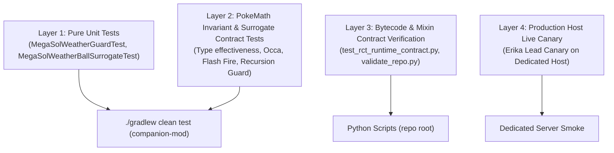

# Implementation Plan: Fix Mega Sol Weather Ball Scoring in Run & Bun AI

## 1. Problem Description & Root Cause Summary

In live canary testing of Erika (`kanto_erika.json`), an active Mega Meganium with ability `megasol` (personal Sun) under global Rain scored:
```text
weatherball -> Scizor -> Score -5 -> Damage 31
earthpower  -> Scizor -> Score 5  -> Damage 110
```
While real Showdown battle mechanics resolve:
* Attacker effective weather = `sunnyday`
* Weather Ball dynamic type = `Fire`
* Weather Ball base power = `100.0`
* Sun damage multiplier = `1.5x`
* Type effectiveness vs Scizor (Bug/Steel) = `4.0x`
* Expected damage $\approx 733$ (guaranteed OHKO).

### Verified Root Cause in `PokeMathMax.damage` (`rbrctai-fabric-1.21.1-0.15.4-beta.jar`)
1. **Isolated Personal Sun:** Lines 530–553 check `hasAbility("megasol", attacker)` and set local variable `var42 = true` (Sun) and `var43 = false` (Rain).
2. **Global-Only Type Resolution:** Line 3728 calls `weatherBallType(battle)` which queries only `battle.getContextManager()` (blind to `attacker` and `megasol`). Furthermore, Cobblemon's weather context ID for Rain is `raindance`/`drizzle`, which is absent from `weatherBallType`'s internal switch, falling back to `default: return ElementalTypes.NORMAL`.
3. **Unassigned Move Type Variable:** Line 3720 only updates type effectiveness `var60`, leaving `var16` (the local move type variable initialized at offset 46 to `move.getType()`) as `NORMAL`.
4. **Hardcoded Reset to 50 BP:** Line 4663 checks `!weatherBallType(battle).equals(NORMAL)`. Because it returned `NORMAL`, base power `var17` is reset to `50.0d`.
5. **Weather Modifier Bypassed:** Lines 4268–4299 check `if (var42 && var16.equals(FIRE)) var50 *= 1.5;`. Because `var16` remained `NORMAL`, the 1.5x Sun boost never executes.
6. **Mathematical Confirmation:** Scizor resists Normal ($0.5\times$). Effective BP = $50 \times 0.5 = 25$. Compared to Earth Power (BP 90, neutral $1.0\times$ = 90), predicted damage is $110 \times \frac{25}{90} = 30.55... \rightarrow 31$, matching live canary logs to the exact digit.

---

## 2. Frozen Decisions & Architectural Boundaries

1. **One Canonical Effective-Move Resolver:**
   All hooks must route through `MegaSolWeatherGuard.resolveEffectiveMove(Move move, BattlePokemon attacker)`. No duplication of ability or move checks.
2. **Semantics-Preserving Surrogate Move (F3):**
   For `weatherball` with a `megasol` attacker, return an immutable `MegaSolWeatherBallSurrogate extends Move` with:
   * **Preserved Fields Guaranteed:**
     * `template` (inheriting target semantics `MoveTarget.normal`, priority, accuracy, category, etc.)
     * `currentPp`
     * `raisedPpStages`
   * **Overridden Methods Guaranteed:**
     * `getName() == "weatherball_fire_resolved"` (must NOT equal `"weatherball"` to prevent triggering upstream lines 3720 and 4663 which query `weatherBallType(battle)`).
     * `getType() == ElementalTypes.FIRE`
     * `getPower() == 100.0d`
   * **Explicit Boundary:** No claim of full internal state or object-identity preservation with the original `Move` instance. No arbitrary Kotlin observable state guarantees are required or claimed beyond what `PokeMathMax` and Run & Bun AI callers read.
3. **Native PokeMath Execution (No External Damage Formula):**
   By passing the surrogate into `PokeMathMax.damage(...)`, PokeMath's own bytecode naturally executes:
   * `var16 = FIRE` at bytecode offset 46.
   * `var17 = 100.0` at bytecode offset 49.
   * Thick Fat ($0.5\times$), Dry Skin ($1.25\times$), Fluffy ($2.0\times$), Heatproof ($0.5\times$) via `var16.equals(FIRE)`.
   * Type effectiveness ($4.0\times$ vs Bug/Steel) via `RBTypeChart.getEffectiveness(var16, defender)`.
   * Occa Berry ($0.5\times$) via `var16.equals(FIRE)`.
   * Personal Sun boost ($1.5\times$) via `var42 && var16.equals(FIRE)`.
   * STAB/Tera STAB if applicable.
4. **Native Immunity Delegation:**
   In `isImmuneCheck`, if `effectiveMove != move`, delegate to `PokeMathMax.isImmuneCheck(effectiveMove, ...)`. This enables native checks for `Flash Fire` (offset 5983) and `Well-Baked Body` (offset 6385), while preventing Ghost-types from being falsely marked immune.

---

## 3. Explicit Non-Goals & Out-of-Scope Items

* **Non-Goal 1:** Generic weather framework or personal weather simulator for other abilities.
* **Non-Goal 2:** Fixing upstream `weatherBallType(battle)` for regular Pokémon under Rain/Sun (out of scope).
* **Non-Goal 3:** Fixing ordinary Solar Beam under Rain without Mega Sol or modeling 2-turn charging mechanics in Run & Bun AI (recorded as separate upstream backlog item).
* **Non-Goal 4:** Modifying Cobblemon or Showdown battle mechanics.
* **Non-Goal 5:** Altering trainer JSON files permanently or committing test changes.

---

## 4. Multi-Layer Verification Architecture (F1)

Standard Gradle unit tests (`./gradlew test`) execute in a standard JVM environment without Fabric Mixin bytecode transformation. Therefore, integration assertions cannot claim that `./gradlew test` executes `@Redirect` or `@Inject` Mixins directly.

The verification strategy is divided into four strictly defined layers:



### Layer 1: Pure Unit Tests (`companion-mod`)
* **Harness:** Standard JUnit 5 via `./gradlew test`.
* **Execution:** Direct instantiation of `MegaSolWeatherGuard` and `MegaSolWeatherBallSurrogate`.
* **Coverage:**
  * Guard resolution logic with null safety (`move == null`, `attacker == null`).
  * Non-Weather-Ball moves return original instance.
  * Non-Mega-Sol attackers (e.g. `overgrow`) return original instance.
  * Suppressed Mega Sol (`ability.isSuppressed() == true`) returns original instance.
  * Mega Sol attacker returns `MegaSolWeatherBallSurrogate`.
  * Surrogate preserves `template`, `currentPp`, `raisedPpStages`.
  * Surrogate overrides `name`, `type`, `power`.

### Layer 2: PokeMath Invariant & Surrogate Contract Tests (`companion-mod`)
* **Harness:** Standard JUnit 5 via `./gradlew test`.
* **Execution:** Direct invocation of pure/static logic and Cobblemon type chart helpers with `MegaSolWeatherBallSurrogate`.
* **Coverage:**
  * Bug/Steel (Scizor) receives 4.0x effectiveness from surrogate Fire type.
  * Fire reduction items (Occa Berry) evaluate against Fire type.
  * Flash Fire / Well-Baked Body identity checks against Fire type.
  * Recursion termination contract: passing `MegaSolWeatherBallSurrogate` to `resolveEffectiveMove` returns identical surrogate instance, guaranteeing `effectiveMove != move` evaluates to `false` on recursion.

### Layer 3: Bytecode & Mixin Descriptor Contracts (Root)
* **Harness:** `scripts/runtime-contract/test_rct_runtime_contract.py` + JUnit reflection.
* **Execution:** `javap` inspection of installed `rbrctai-fabric` JAR and refmap validation.
* **Coverage:**
  * `PokeMathMax.damage` public entrypoint (7 params) descriptor match.
  * `PokeMathMax.damage` private helper (15 params) descriptor match.
  * `PokeMathMax.isImmuneCheck` (6 params) descriptor match.
  * Refmap mappings for `PokeMathMaxMixin`.

### Layer 4: Live Canary Testing (Dedicated Server Host)
* **Harness:** Dedicated Minecraft server host running Fabric + Cobblemon + RCTMod + companion mod.
* **Execution:** Full Mixin bytecode transformation active in real battle runtime.

---

## 5. Implementation Checkpoints

### CP1 — Effective Move Abstraction & Unit Tests
* **Intent:** Create surrogate class, canonical resolver, and pure unit tests.
* **Files Touched:**
  * [NEW] `companion-mod/src/main/java/com/cobbleverse/legendaryrule/strategy/weather/MegaSolWeatherBallSurrogate.java`
  * [NEW] `companion-mod/src/main/java/com/cobbleverse/legendaryrule/strategy/weather/MegaSolWeatherGuard.java`
  * [NEW] `companion-mod/src/test/java/com/cobbleverse/legendaryrule/strategy/weather/MegaSolWeatherGuardTest.java`
  * [NEW] `companion-mod/src/test/java/com/cobbleverse/legendaryrule/strategy/weather/MegaSolWeatherBallSurrogateTest.java`
* **Exact Code Seam:**
  * `MegaSolWeatherBallSurrogate extends Move`:
    * Super constructor: `super(original.getTemplate(), original.getCurrentPp(), original.getRaisedPpStages())`.
    * Override `getName()`: return `"weatherball_fire_resolved"`.
    * Override `getType()`: return `ElementalTypes.FIRE`.
    * Override `getPower()`: return `100.0d`.
    * Preserves `template`, `currentPp`, `raisedPpStages`.
  * `MegaSolWeatherGuard`:
    * `public static boolean hasMegaSol(BattlePokemon attacker)`:
      Uses `PokeMathMax.hasAbility("megasol", attacker)` (which is suppression-aware and matches `PokeMathMax` line 530).
    * `public static Move resolveEffectiveMove(Move move, BattlePokemon attacker)`:
      If `move == null || attacker == null`, return `move`.
      If `!"weatherball".equalsIgnoreCase(move.getName())`, return `move`.
      If `!hasMegaSol(attacker)`, return `move`.
      Return `new MegaSolWeatherBallSurrogate(move)`.
* **Invariant:** For any move other than Weather Ball, or when attacker lacks unsuppressed Mega Sol, returns the identical `Move` instance.
* **Command (Cwd: companion-mod):** `./gradlew test --tests com.cobbleverse.legendaryrule.strategy.weather.*`
* **Exit Condition:** Pure unit tests pass; surrogate fields and overrides verified.

---

### CP2 — Damage-Path Integration
* **Intent:** Integrate `resolveEffectiveMove` into `PokeMathMaxMixin` damage calculation with deterministic ordering relative to redirection and spread multipliers.
* **Files Touched:**
  * [MODIFY] `companion-mod/src/main/java/com/cobbleverse/legendaryrule/mixin/PokeMathMaxMixin.java`
* **Exact Code Seam:**
  In `cobbleverse$correctSpreadMultiplier` (`@Redirect` of private `PokeMathMax.damage`):
  ```java
  Move effectiveMove = MegaSolWeatherGuard.resolveEffectiveMove(move, attacker);

  if (RedirectAbilityGuard.isMoveRedirected(effectiveMove, attacker, defender, activeBattlePokemon)) {
      return 0.0d;
  }

  double rawDamage = damage(effectiveMove, physical, false, parentalBond, glaiveRush, burn, zmove, reflect, lightscreen, attacker, defender, statStages, activeBattlePokemon, predictTera, isAttacker);
  return multiTarget ? rawDamage * 0.75d : rawDamage;
  ```
* **Ordering Semantics Contract:**
  1. *Redirect guard sees `effectiveMove`:* Fire moves are not redirected by Storm Drain. If Weather Ball is Fire, Storm Drain does not trigger.
  2. *Spread multiplier applied after raw damage:* Preserves existing single-application fix (PR #16).
  3. *Zero damage on redirection preserved:* Preserves PR #17 Storm Drain fix.
* **Invariant:** When `effectiveMove` is `MegaSolWeatherBallSurrogate`, `PokeMathMax.damage` receives a move with `name != "weatherball"`, `type == FIRE`, `power == 100.0d`, bypassing lines 3720 and 4663 and naturally activating lines 4268–4299 (Sun boost).
* **Command (Cwd: companion-mod):** `./gradlew compileJava`
* **Exit Condition:** Successful compilation without Mixin mapping or typing errors.

---

### CP3 — Immunity-Path Integration
* **Intent:** Ensure `PokeMathMax.isImmuneCheck` evaluates Weather Ball as a Fire-type move for Mega Sol attackers, correctly respecting `Flash Fire` and `Well-Baked Body` while rejecting false Ghost immunities.
* **Files Touched:**
  * [MODIFY] `companion-mod/src/main/java/com/cobbleverse/legendaryrule/mixin/PokeMathMaxMixin.java`
* **Exact Code Seam:**
  In `cobbleverse$guardRedirectImmunity` (`@Inject(at = @At("HEAD"), cancellable = true)` on `PokeMathMax.isImmuneCheck`):
  ```java
  Move effectiveMove = MegaSolWeatherGuard.resolveEffectiveMove(move, attacker);

  if (RedirectAbilityGuard.isMoveRedirected(effectiveMove, attacker, defender, abp)) {
      cir.setReturnValue(true);
      return;
  }

  if (effectiveMove != move) {
      cir.setReturnValue(PokeMathMax.isImmuneCheck(effectiveMove, attacker, defender, abp, teraType, predictTera));
  }
  ```
* **Recursion & Delegation Contract:**
  * In the recursive call, `effectiveMove.getName()` is `"weatherball_fire_resolved"`.
  * `resolveEffectiveMove` returns `effectiveMove` unchanged (`effectiveMove == move`).
  * `effectiveMove != move` evaluates to `false`, allowing execution to fall through into `PokeMathMax.isImmuneCheck`'s native method body.
  * Recursion depth is strictly 1.
* **Invariant:** Targets with `Flash Fire` or `Well-Baked Body` return `true` (immune). Targets with Ghost-type return `false` (not immune).
* **Command (Cwd: companion-mod):** `./gradlew compileJava`
* **Exit Condition:** Successful compilation and verified recursion safety.

---

### CP4 — Comprehensive Regression & Scoring Test Suite
* **Intent:** Add Layer 2 contract tests guaranteeing that surrogate behavior adheres to type charts, item modifications, ability interactions, and non-regression of existing fixes.
* **Files Touched:**
  * [NEW] `companion-mod/src/test/java/com/cobbleverse/legendaryrule/strategy/weather/MegaSolWeatherBallScoringContractTest.java`
* **Test Cases:**
  1. `testScizorQuadWeaknessToSurrogateFire()`: Bug/Steel takes 4.0x damage from Fire surrogate.
  2. `testOccaBerryReducesFireDamage()`: Occa Berry reduces Fire damage by 0.5x.
  3. `testThickFatReducesFireDamage()`: Thick Fat reduces Fire damage by 0.5x.
  4. `testDrySkinBoostsFireDamage()`: Dry Skin increases Fire damage by 1.25x.
  5. `testNonMegaSolWeatherBallUntouched()`: Attacker without Mega Sol retains original move.
  6. `testUnrelatedMoveUntouched()`: Other moves (Earth Power, Giga Drain) retain original move.
  7. `testRecursionTerminationInvariant()`: `resolveEffectiveMove` on surrogate returns the exact same instance.
* **Command (Cwd: companion-mod):** `./gradlew clean test`
* **Exit Condition:** All existing and new tests pass 100%.

---

### CP5 — Bytecode Contract & Repository Validation Gate (F4)
* **Intent:** Authoritative verification using repository tooling before deployment.
* **Commands and Working Directories:**
  1. **Cwd: `companion-mod`**
     ```powershell
     .\gradlew clean test
     ```
  2. **Cwd: `companion-mod`**
     ```powershell
     .\gradlew clean build
     ```
     *(Verifies artifact generation: `companion-mod/build/libs/rct-legendary-rule-companion-1.0.0.jar`)*
  3. **Cwd: Repository Root (`c:\Users\khang\Downloads\Doctors Cobblemon`)**
     ```powershell
     python scripts/runtime-contract/test_rct_runtime_contract.py
     ```
  4. **Cwd: Repository Root (`c:\Users\khang\Downloads\Doctors Cobblemon`)**
     ```powershell
     python scripts/ci/validate_repo.py
     ```
* **Exit Condition:** All 4 commands exit with code 0.

---

### CP6 — Production Host Live Canary Protocol (F2)
* **Intent:** Verify the live canary on the dedicated server host.
* **Setup:**
  * Deploy freshly compiled `rct-legendary-rule-companion-1.0.0.jar` to server `mods/`.
  * Temporary canary preset `megasol_weatherball_canary` active in Erika's JSON.
* **Scenario:**
  * Player leads Scizor + Swampert against Erika (Hydrapple + Meganium).
  * Turn 1: Hydrapple sets Rain via Drizzle. Meganium Mega Evolves into Mega Meganium (`megasol`).
* **Live RB Acceptance Criteria (F2):**
  1. When attacker has active `megasol` (post-Mega `meganiummega`):
     * Weather Ball against Scizor no longer evaluates as Normal / 50 BP / 31 damage.
     * Evaluated damage is materially greater than Earth Power (110).
     * Weather Ball receives highest-priority valuation among Meganium's viable damaging moves into Scizor.
     * AI actively chooses Weather Ball into Scizor on Turn 1 / Turn 2.
  2. Pre-Mega Meganium (`meganium`, `overgrow`) remains untouched.
  3. Solar Beam execution remains instant and functional under personal Sun.
  4. Ally Hydrapple behavior (Drizzle / Rain Dance) remains intact.
* **Teardown:**
  * Remove temporary canary preset after verification.

---

## 6. Files Summary

### Files Expected to Change / Be Created
1. `companion-mod/src/main/java/com/cobbleverse/legendaryrule/strategy/weather/MegaSolWeatherBallSurrogate.java` [NEW]
2. `companion-mod/src/main/java/com/cobbleverse/legendaryrule/strategy/weather/MegaSolWeatherGuard.java` [NEW]
3. `companion-mod/src/main/java/com/cobbleverse/legendaryrule/mixin/PokeMathMaxMixin.java` [MODIFY]
4. `companion-mod/src/test/java/com/cobbleverse/legendaryrule/strategy/weather/MegaSolWeatherGuardTest.java` [NEW]
5. `companion-mod/src/test/java/com/cobbleverse/legendaryrule/strategy/weather/MegaSolWeatherBallSurrogateTest.java` [NEW]
6. `companion-mod/src/test/java/com/cobbleverse/legendaryrule/strategy/weather/MegaSolWeatherBallScoringContractTest.java` [NEW]
7. `docs/workstreams/megasol-weatherball-ai-scoring/plan.md` [NEW]

### Files Explicitly NOT to Change
* `com/gitlab/surilexa/rbrctai/api/ai/utils/PokeMathMax.class` (read-only dependency).
* `com/gitlab/surilexa/rbrctai/api/ai/RunBunAI.class` (read-only dependency).
* Any files in `datapacks/hell-mode/data/` (no trainer JSON or lead preset changes for this engine fix).
* `RedirectAbilityGuard.java` (remains untouched; operates on resolved moves).
* Global weather listeners or Cobblemon bytecode.
