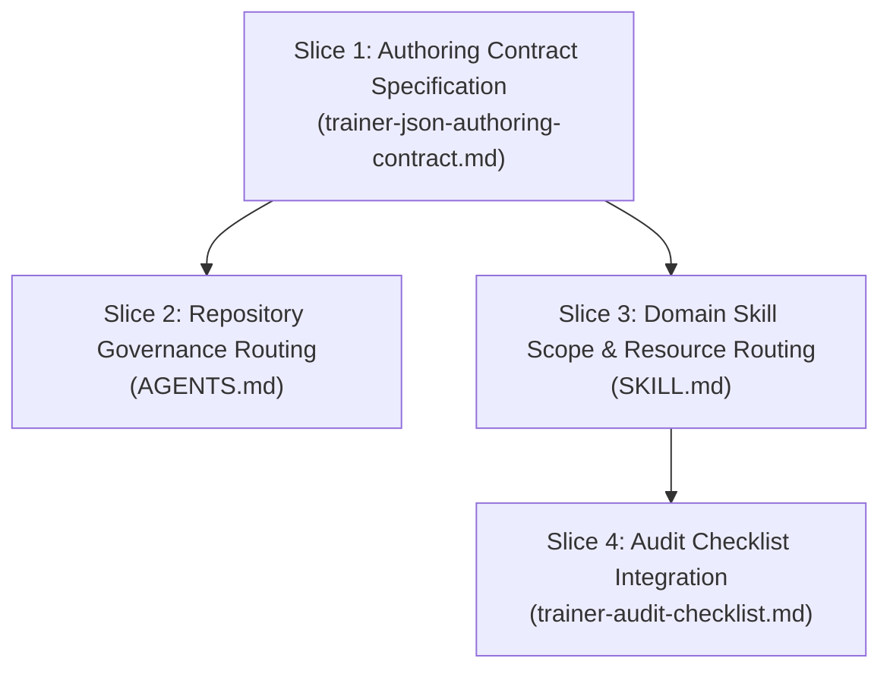

# Workstream Plan: Trainer JSON Authoring Contract (Phase 1 — Contract Specification & Governance Integration)

## Status & Ownership

| Field | Value |
| :--- | :--- |
| **Workstream ID** | `trainer-json-authoring-contract` |
| **Document Role** | Candidate Workstream Plan (Ready for Independent Plan Review) |
| **Baseline Commit** | `13136f83f58fe33f0d7e2a33234fb1d07cb269f1` (`docs/trainer-json-authoring-contract`) |
| **Target Branch** | `docs/trainer-json-authoring-contract` |
| **Canary Lineage** | `N/A` (Governance and documentation workstream; no prior binary canary artifact) |
| **Authority Closure** | Dynamic closure from `bootstrap_governance_manifest.entries` (governance task) |
| **Author Submission State** | `Candidate Plan (Ready for Review)` |

---

## 1. Context & Problem Statement

In `khangnhoang/cobbleverse-hell-mode-modernized`, NPC trainer definitions are maintained as JSON files under `datapacks/hell-mode/data/rctmod/trainers/`. Following the delivery of dynamic trainer lead selection (PR #14, `dynamic-trainer-lead-presets`), boss trainers can evaluate opposing player leads pre-battle via companion-mod's `LeadSelectionEngine` and select optimal counter-lead pairs configured via `leadPresets`.

However, the repository currently lacks a centralized, authoritative authoring contract defining trainer JSON syntax, field typing, scoring heuristics, tie-breaking precedence, dynamic speed threshold derivation, and critical authoring constraints. This absence creates several concrete failure modes:
1. **Conjunction vs. Independent Condition Fallacy:** Authors may assume that multiple condition fields (such as `favoredAgainst: ["water"]` and `minFastOpponents: 1`) act as a conjoined filter targeting a single opposing Pokémon (i.e., "fast water Pokémon"), whereas the engine evaluates and scores each condition independently across all opposing leads.
2. **Speculative Syntax Contamination:** Authors may invent un-implemented fields (such as speculative `opponentMatch` structures) that companion-mod does not parse and repository validators reject.
3. **Governance Gap in Routine Edits:** Agents performing Mode 2 edits on trainer JSONs (e.g., tweaking movesets or items) may bypass competitive team design principles and authoring rules because the task appears small.

### Workstream Goal
Establish an authoritative authoring contract at `.agents/skills/competitive-pokemon-doubles-team-design/references/trainer-json-authoring-contract.md` covering Sections A through H, and integrate mandatory skill and contract routing into root `AGENTS.md`, `competitive-pokemon-doubles-team-design/SKILL.md`, and `trainer-audit-checklist.md`.

This is strictly a governance and documentation task: zero runtime Java code changes, zero schema validator code modifications, and zero new gameplay behaviors.

---

## 2. Concrete Facts vs. Assumptions vs. Conflicts

| Category | Item Description | Evidence / Citation | Impact / Resolution |
| :--- | :--- | :--- | :--- |
| **Confirmed Fact** | Parsing logic for `leadPresets` fields (`id`, `leadSlots`, `baseWeight`, `expectedLeadMembers`, `description`, `favoredAgainst`, `favoredAgainstSpecies`, `minFastOpponents`, `fastSpeedThreshold`, `default`) is strictly implemented in companion mod. | `companion-mod/src/main/java/com/cobbleverse/legendaryrule/lead/LeadSelectionConfig.java:162-279` | Authoring contract must document these exact fields and types. |
| **Confirmed Fact** | Multiple presets declaring `default: true` on a single trainer are rejected during config parsing with `IllegalArgumentException`. | `companion-mod/src/main/java/com/cobbleverse/legendaryrule/lead/LeadSelectionConfig.java:127-131` | Contract must enforce at most one default preset per trainer. |
| **Confirmed Fact** | `expectedLeadMembers` validates `species`, `form`, and `requiredAspects` against actual Pokémon at `leadSlots` as a semantic drift guard. | `companion-mod/src/main/java/com/cobbleverse/legendaryrule/lead/ExpectedLeadMember.java:11-62` | Contract must document drift guard structure and CI enforcement. |
| **Confirmed Fact** | `typeFavoredBonus` (+2 per matching player lead, max +4) and `speciesFavoredBonus` (+2 per matching player lead, max +4) score independently. A single dual-type matching multiple favored types grants +2 only once. | `companion-mod/src/main/java/com/cobbleverse/legendaryrule/lead/LeadSelectionEngine.java:70-93` | Contract Section C & D must explain per-lead scoring and multi-type match caps. |
| **Confirmed Fact** | `fastBonus` awards a flat +4 if count of opposing leads meeting threshold is $\ge$ `minFastOpponents`. When `fastSpeedThreshold <= 0` and `dynamicThreatSpeed > 0`, threshold is `dynamicThreatSpeed` and evaluation requires `speed > dynamicThreatSpeed`. When `fastSpeedThreshold > 0`, evaluation requires `speed >= fastSpeedThreshold`. | `companion-mod/src/main/java/com/cobbleverse/legendaryrule/lead/LeadSelectionEngine.java:95-109` | Contract Section C must document dynamic vs. static speed threshold semantics. |
| **Confirmed Fact** | `dynamicThreatSpeed` is derived as $\max(\text{speed}_A, \text{speed}_B)$ of the two Pokémon in the resolved default lead preset. | `companion-mod/src/main/java/com/cobbleverse/legendaryrule/lead/LeadSelectionEngine.java:37-47` | Contract Section C must document dynamic speed derivation. |
| **Confirmed Fact** | Tie-breaking order is deterministic: `totalScore` descending $\rightarrow$ `baseWeight` descending $\rightarrow$ `declarationIndex` ascending. | `companion-mod/src/main/java/com/cobbleverse/legendaryrule/lead/LeadSelectionEngine.java:118-122` | Contract Section C must document exact tie-breaking precedence. |
| **Confirmed Fact** | Default attempt resolution checks: (1) `isDefault == true`, (2) first attempt with no conditions (`minFastOpponents == 0` and empty favored lists), (3) first declared attempt. | `companion-mod/src/main/java/com/cobbleverse/legendaryrule/lead/LeadSelectionEngine.java:128-142` | Contract Section C must document default resolution sequence. |
| **Confirmed Fact** | Datapack loader reads `leadPresets` directly from trainer JSON files under `datapacks/hell-mode/data/rctmod/trainers/*.json`. | `companion-mod/src/main/java/com/cobbleverse/legendaryrule/lead/DynamicLeadResourceListener.java:54-60` | Dynamic presets reside embedded in trainer JSONs. |
| **Confirmed Fact** | CI validator validates `leadPresets` against `team` size, slot index bounds, valid types, valid species, single default, and `expectedLeadMembers` matching. | `scripts/ci/validate_repo.py:318-412` | Contract Section H must cite `validate_repo.py` as authoritative Layer 1 validator. |
| **Confirmed Fact** | `AGENTS.md:184-186` currently routes `competitive-pokemon-doubles-team-design` only for team rosters/synergies, lacking mandatory routing for general trainer JSON edits. | `AGENTS.md:184-186` | Must update `AGENTS.md` to mandate skill activation and contract reading. |
| **Confirmed Fact** | `SKILL.md:14-20` activation scope omits general JSON configuration and syntax compliance. | `.agents/skills/competitive-pokemon-doubles-team-design/SKILL.md:14-20` | Must expand scope and add resource routing row. |
| **Confirmed Fact** | `trainer-audit-checklist.md:38-44` lacks an explicit checklist item pointing to the authoring contract. | `.agents/skills/competitive-pokemon-doubles-team-design/references/trainer-audit-checklist.md:38-44` | Must add checklist item in Section 6. |
| **Assumption** | Publishing the authoring contract and embedding it into preflight routing will eliminate invalid trainer JSON configurations. | Agent operational experience | Enforced via preflight routing, review rubrics, and CI validation. |
| **Conflict** | Authors may expect `favoredAgainst` and `minFastOpponents` to conjoin on a single Pokémon. | `companion-mod/src/main/java/com/cobbleverse/legendaryrule/lead/LeadSelectionEngine.java:70-109` | Addressed in Section D with explicit anti-pattern examples and cookbook guidance. |
| **Open Question** | None. All syntax rules, scoring formulas, and validator checks are fully observable in the repository. | N/A | Proceed directly with canonical documentation. |

---

## 3. Scope Boundaries & Blast Radius

### 3.1 Strict In-Scope
1. **New File:** `.agents/skills/competitive-pokemon-doubles-team-design/references/trainer-json-authoring-contract.md`
   - Complete documentation of Sections A through H.
2. **Modify File:** `AGENTS.md` (root)
   - Update Section 2.4 (Applicable Skill Routing), Section 2.5 (Mode 2 Bounded Execution), and Section 5 (Skill Routing Catalog) to mandate activating `competitive-pokemon-doubles-team-design` and reading `references/trainer-json-authoring-contract.md` before planning or editing any file under `datapacks/hell-mode/data/rctmod/trainers/`. Explicitly forbid nested `AGENTS.md` in trainer folders.
3. **Modify File:** `.agents/skills/competitive-pokemon-doubles-team-design/SKILL.md`
   - Expand Section 1 Activation Scope to cover all trainer definition modifications under `datapacks/hell-mode/data/rctmod/trainers/`.
   - Add a row in Section 2 Resource Routing for `trainer-json-authoring-contract.md` marked as MANDATORY for trainer JSON tasks.
4. **Modify File:** `.agents/skills/competitive-pokemon-doubles-team-design/references/trainer-audit-checklist.md`
   - Add a checklist item and link in Section 6 requiring trainer configurations to conform with `trainer-json-authoring-contract.md`.

### 3.2 Explicit Out-of-Scope
- Zero modifications to runtime Java classes in `companion-mod/src/`.
- Zero modifications to CI validator logic in `scripts/ci/validate_repo.py`.
- Zero modifications to existing trainer JSON files in `datapacks/hell-mode/data/rctmod/trainers/`.
- Zero modifications to unrelated skills, decision records, or architectural plans.
- Zero nested `AGENTS.md` files created in trainer directories.

---

## 4. Architectural & Invariant Analysis

### 4.1 Repository-Global Invariants
1. **Read Before Write:** All documented fields, types, scoring formulas, and validation rules are grounded in verified repository code (`LeadSelectionConfig.java`, `LeadSelectionEngine.java`, `validate_repo.py`).
2. **Surgical Scope & Simplicity First:** Deliver exactly 1 new reference file and 3 focused documentation/governance edits. Zero speculative infrastructure or helper scripts.
3. **Claim Strength Discipline (Canary Lesson 7):** Prose in the authoring contract and modified governance files strictly avoids unmeasured semantic absolutes (`"hoàn toàn"`, `"triệt để"`, `"guarantees"`, `"flawless"`, `"không có rủi ro"`, `"zero risk"`, `"tuyệt đối"`, `"completely closes"`, or unsupported `"100% tuân thủ"`).
4. **Public Contract Stability:** Existing datapack JSONs and companion mod runtime contracts remain untouched and fully compatible.

### 4.2 Applicable Domain Invariants (`competitive-pokemon-doubles-team-design`)
1. **Separation of Roster Design vs. Config Authoring:** Gameplay roster design (team synergy, archetypes, movesets, itemization, Turn-1 Gimmick Axiom) is distinct from trainer JSON configuration authoring (syntactic correctness, lead preset vocabulary, slot indexing, drift guards). Both must be satisfied.
2. **Independent Scoring Condition Invariant:** Scoring bonuses in `leadPresets` sum additively across opposing leads and do not imply that an individual opposing Pokémon satisfies multiple independent conditions.
3. **Single Default Lead Invariant:** A trainer definition may declare at most one default lead preset (`default: true`).
4. **Semantic Drift Guard Invariant:** `expectedLeadMembers` if present must match the actual Pokémon at the referenced `leadSlots` (`species`, `form`, and `requiredAspects`).

---

## 5. Target Architecture & Slicing Strategy

The implementation is partitioned into four decoupled, sequentially reviewable slices:



### Slice 1: Authoring Contract Specification
Create `.agents/skills/competitive-pokemon-doubles-team-design/references/trainer-json-authoring-contract.md` with Sections A through H:
- **Section A: Authority & Scope:**
  - Governed path: `datapacks/hell-mode/data/rctmod/trainers/`.
  - Mandatory reading requirement before planning or editing any trainer definition.
  - Architectural boundary: Distinguish between gameplay roster design (governed by `SKILL.md` and related references) and JSON configuration authoring (governed by this contract).
- **Section B: Trainer JSON Mental Model:**
  - Root structure and top-level fields: `name`, `battleRules`, `ai`, `bag`, `team`, `battleFormat`, `leadPresets`.
  - Field-by-field typing, constraints, and conventions (e.g., `battleRules.maxItemUses: 0`, `ai.type: "rb"`, `battleFormat: "GEN_9_DOUBLES"`).
  - Team member object structure: `species`, `gender`, `level`, `nature`, `ability`, `heldItem` (array), `moveset` (4 moves), `ivs`, `evs`, `aspects`, gimmicks.
- **Section C: Current Dynamic Lead-Selection Vocabulary:**
  - Full vocabulary specification: `leadSlots`, `baseWeight`, `expectedLeadMembers`, `favoredAgainst`, `favoredAgainstSpecies`, `minFastOpponents`, `fastSpeedThreshold`, `default`, `description`.
  - Scoring formula: $\text{totalScore} = \text{offScore} + \text{defScore} + \text{baseWeight} + \text{typeFavoredBonus} + \text{speciesFavoredBonus} + \text{fastBonus}$.
  - Detailed scoring mechanics: offensive and defensive type chart mapping ($\pm 4, \pm 2, \pm 1, 0$), type favored bonus (+2 per matching player lead, max +4), species favored bonus (+2 per matching player lead, max +4), fast bonus (+4 flat).
  - Default lead resolution sequence and dynamic speed threshold derivation ($\max(\text{speed}_A, \text{speed}_B)$ of default lead members; strict $>$ in dynamic mode, $\ge$ in static mode).
  - Tie-breaking precedence: `totalScore` descending $\rightarrow$ `baseWeight` descending $\rightarrow$ `declarationIndex` ascending.
- **Section D: Critical Authoring Rule: Conjunction vs. Independent Conditions:**
  - Explicit rule: *"Independent conditions/bonuses do NOT imply that the same opposing Pokémon satisfies all of them."*
  - Concrete walkthrough of failure mode (e.g., Slowpoke + Jolteon triggering water type bonus and fast bonus independently).
  - Design guidance for authors wishing to target specific threat profiles.
- **Section E: Extension Guidance:**
  - Composable generic primitives over one-off trainer hacks.
  - Smallest-data-path principle: exhaust existing primitives (`baseWeight`, `favoredAgainst`, `favoredAgainstSpecies`, `minFastOpponents`) before requesting code extensions.
  - Zero trainer-specific Java behaviors in companion mod.
- **Section F: Current vs. Future Syntax Discipline:**
  - Current syntax: strictly what is parsed by `LeadSelectionConfig.java` and evaluated by `LeadSelectionEngine.java`.
  - Future syntax rules: never document un-implemented fields as active. Clearly label hypothetical proposals (such as `opponentMatch`) as `[PROPOSED / UNIMPLEMENTED]`.
- **Section G: Cookbook:**
  - Pattern 1: Type-favored preset (anti-ground/rock).
  - Pattern 2: Species-favored preset (anti-rain core).
  - Pattern 3: Speed control preset (anti-fast threats).
  - Pattern 4: Default lead preset (bread-and-butter synergy).
  - Anti-pattern: Attempting conjunction via independent fields.
  - Fallback guidance when schema cannot express complex combinations.
- **Section H: Verification Expectations:**
  - Pure JSON changes: Layer 1 validation via `python scripts/ci/validate_repo.py`.
  - Lead engine changes: Layer 2 Java unit tests via `./gradlew :companion-mod:test --tests "com.cobbleverse.legendaryrule.lead.*"`.
  - Schema extension changes: synchronous updates across parser, validator, and tests.

### Slice 2: Repository Governance Routing Integration
Modify `AGENTS.md` (root):
- **Section 2.4 (Applicable Skill Routing):** Add explicit mandate that any task creating, modifying, reviewing, or validating files in `datapacks/hell-mode/data/rctmod/trainers/` must activate `competitive-pokemon-doubles-team-design`.
- **Section 2.5 (Mode 2 Bounded Execution):** Add explicit rule that even routine Mode 2 trainer config edits cannot skip activating `competitive-pokemon-doubles-team-design` and reading `references/trainer-json-authoring-contract.md`.
- **Section 5 (Skill Routing Catalog):** Update `Competitive Pokémon Doubles Team Design` entry to state:
  - Activation is MANDATORY for creating, modernizing, reviewing, balancing, or modifying any trainer definition under `datapacks/hell-mode/data/rctmod/trainers/` (including roster design, lead presets, AI parameters, or item fixes).
  - Reading `references/trainer-json-authoring-contract.md` is MANDATORY before planning or editing.
  - Applies even to routine Mode 2 edits (cannot be skipped due to small task size).
  - Explicit rule: Nested `AGENTS.md` files in trainer directories are strictly forbidden.

### Slice 3: Domain Skill Scope & Resource Routing Integration
Modify `.agents/skills/competitive-pokemon-doubles-team-design/SKILL.md`:
- **Section 1 (Activation Scope & Ownership):** Expand scope to explicitly include all modifications to trainer JSON files under `datapacks/hell-mode/data/rctmod/trainers/` (including syntax, lead selection config, AI parameters, and schema compliance).
- **Section 2 (Resource Routing):** Add a row for `references/trainer-json-authoring-contract.md`:
  - *Resource:* [`references/trainer-json-authoring-contract.md`](references/trainer-json-authoring-contract.md)
  - *Read Condition:* Mandatory read before creating, modifying, reviewing, or validating any trainer JSON file under `datapacks/hell-mode/data/rctmod/trainers/`. Applies across all modes (Mode 1, Mode 2, Mode 3).
  - *Skip When:* Task strictly does not touch trainer JSON definitions.

### Slice 4: Audit Checklist & Quality Assurance Integration
Modify `.agents/skills/competitive-pokemon-doubles-team-design/references/trainer-audit-checklist.md`:
- **Section 6 (Schema & Cobblemon Runtime Legality):** Add a checklist item:
  - `- [ ] Trainer configuration conforms to [`references/trainer-json-authoring-contract.md`](trainer-json-authoring-contract.md) (valid leadPresets schema, slot indices within team bounds, expectedLeadMembers drift guards, at most one default preset, and conjunction independence awareness)?`

---

## 6. Exact Files to Create / Modify / Delete

### Files to Create
1. `.agents/skills/competitive-pokemon-doubles-team-design/references/trainer-json-authoring-contract.md`
   - Complete reference document containing Sections A through H (< 500 lines).

### Files to Modify
1. `AGENTS.md`:
   - Section 2.4: Add mandatory trainer directory routing rule.
   - Section 2.5 (Mode 2): Add mandatory skill and contract reading requirement for routine trainer config edits.
   - Section 5: Expand `Competitive Pokémon Doubles Team Design` catalog entry with mandatory routing, contract reading mandate, and nested AGENTS.md prohibition.
2. `.agents/skills/competitive-pokemon-doubles-team-design/SKILL.md`:
   - Section 1: Expand activation scope to cover all trainer definition edits under `datapacks/hell-mode/data/rctmod/trainers/`.
   - Section 2: Add table row for `trainer-json-authoring-contract.md`.
3. `.agents/skills/competitive-pokemon-doubles-team-design/references/trainer-audit-checklist.md`:
   - Section 6: Add authoring contract compliance checklist item.

### Files to Delete / Prune
None.

---

## 7. Orthogonal Verification Strategy (Finding E)

### 7.1 Minimal Covering Verification Set
The affected files are pure Markdown documentation, skill manifests, and governance contracts. The minimal covering orthogonal verification set consists of:
- **Layer 0 (Markdown & Governance Structural Authority):** Verifies relative link integrity, YAML frontmatter schemas, and file line bounds (< 500 lines per file). Authoritative for structural syntax.
- **Layer 1 (Datapack & Trainer Schema Validation):** Verifies that existing datapack trainer JSON files and audit reports remain valid and untouched.
- **Layer 2 (Java Unit & Boundary Tests):** Verifies that offline Java lead unit tests continue to pass with zero regressions.

### 7.2 Verification Commands
1. **Layer 0 (Structural Markdown Verification):**
   - Relative link verification across modified files:
     - Check links in `AGENTS.md`, `SKILL.md`, `trainer-audit-checklist.md`, and `trainer-json-authoring-contract.md`.
   - Line count verification:
     - Ensure `trainer-json-authoring-contract.md` meets repository line bounds (< 500 lines).
2. **Layer 1 (Datapack Schema Validation):**
   ```powershell
   python scripts/ci/validate_repo.py
   ```
   - Expected Output: `RESULT: ALL REPOSITORY & DATA VALIDATIONS PASSED` (exit code 0).
3. **Layer 2 (Offline Lead Selection Tests):**
   ```powershell
   ./gradlew :companion-mod:test --tests "com.cobbleverse.legendaryrule.lead.*"
   ```
   - Expected Output: All 7 lead selection test suites pass (exit code 0).

### 7.3 Offline != Production Invariant
Automated test passes locally (Layers 0–2) verify documentation syntax, datapack schema validity, and Java unit boundaries. They do not constitute live gameplay verification (Layer 5), which is unnecessary for this pure governance and documentation task as zero runtime binary or datapack changes are introduced.

### 7.4 Provenance-First Artifact Freshness (Finding F)
All verification steps inspect source files directly in the repository working tree at `HEAD` (`13136f83f58fe33f0d7e2a33234fb1d07cb269f1`). No stale build caches or unverified binaries are referenced.

---

## 8. Implementation Checkpoints (Task-Derived)

- **Checkpoint 1: Plan Freeze Checkpoint**
  - Planner P signals completion with semantic message `{ candidate_path: "docs/workstreams/trainer-json-authoring-contract/plan.md", ready: true }`.
  - Main Controller executes candidate hashing, performs Two-Phase Reviewer Boot Handshake with Plan Reviewer R, and receives review verdict.
  - Acceptance predicate: `audit_review_gate.py` exit 0, visible provenance block emission, and verdict `PASS`.
  - Main Controller commits frozen plan checkpoint.

- **Checkpoint 2: Surgical Implementation of Task Slices**
  - Implementor I creates `trainer-json-authoring-contract.md` (Slice 1).
  - Implementor I updates `AGENTS.md` (Slice 2).
  - Implementor I updates `SKILL.md` (Slice 3).
  - Implementor I updates `trainer-audit-checklist.md` (Slice 4).

- **Checkpoint 3: Proportional Verification & Manifest Assembly**
  - Execute Layer 0 markdown link and line length checks.
  - Execute Layer 1: `python scripts/ci/validate_repo.py`.
  - Execute Layer 2: `./gradlew :companion-mod:test --tests "com.cobbleverse.legendaryrule.lead.*"`.
  - Assemble Verification Evidence Manifest in `docs/workstreams/trainer-json-authoring-contract/verification.md`.

- **Checkpoint 4: Implementation Review Gate & Verified Implementation Checkpoint**
  - Main Controller invokes Implementation Reviewer IR with candidate implementation diff.
  - Acceptance predicate: Two-Phase Handshake, `audit_review_gate.py` exit 0, visible provenance block emission, and independent review verdict `PASS`.
  - Main Controller executes local checkpoint commit.

---

## 9. Residual Risks & Fallback Boundaries

| Risk | Likelihood | Impact | Mitigation / Fallback Boundary |
| :--- | :--- | :--- | :--- |
| **Documentation Desynchronization:** Future updates to companion mod lead selection engine may alter scoring or add fields not reflected in this contract. | Low | Medium | Section H explicitly specifies that companion mod parser extensions require synchronous updates to this authoring contract and `validate_repo.py`. |
| **Conjunction Misinterpretation:** Authors may still attempt to write conjoined conditions despite warnings. | Low | Low | Section D and G provide prominent warnings, mathematical explanations, and concrete cookbook examples showing why independent bonuses sum additively. |
| **Link Breakage Across Skills:** Relative paths between skills and references could break if reorganized. | Low | Low | Verified in Layer 0 checks; all links follow established `.agents/skills/<skill>/references/<doc>` conventions. |

---

## 10. Author Pre-Submission Self-Checklist

Before signaling handoff to Main Controller, Planner P has audited this candidate plan against the authoritative checklist in `references/workstream-plan-template.md`:

1. **Grounded Signatures & Contracts:**
   - [x] Every class name, method signature, descriptor, or schema path cited has been verified via repository files (`LeadSelectionConfig.java`, `LeadSelectionEngine.java`, `validate_repo.py`, etc.).
   - [x] No methods, APIs, or behaviors have been assumed from memory.
2. **Fact vs. Assumption Discipline:**
   - [x] Every substantive assertion has an accompanying file path, line number, or contract test reference in the Section 2 table.
   - [x] Unverified hypotheses are explicitly labeled as `Assumption` or `Open Question`.
3. **Surgical Scope & Non-Goals:**
   - [x] Out-of-Scope boundaries clearly isolate runtime Java, validator code, trainer JSON modifications, and speculative abstractions.
   - [x] No unrelated files, bulk reformatting, or speculative infrastructure are included.
4. **Invariant Protections Addressed:**
   - [x] Repository-global invariants evaluated (read before write, surgical scope, simplicity first, claim strength discipline, backward compatibility).
   - [x] Domain invariants addressed (`competitive-pokemon-doubles-team-design` separation of roster vs. config, independent scoring condition invariant, single default lead invariant, semantic drift guard invariant).
5. **Concrete Orthogonal Verification Commands:**
   - [x] Minimal orthogonal verification set selected covering affected contracts directly (Layer 0, Layer 1, Layer 2).
   - [x] Exact, runnable verification commands specified for each selected layer.
   - [x] Expected pass criteria clearly stated without hyperbolic sufficiency claims.
6. **Line Count & Proportionality:**
   - [x] Document is structured, concise, and avoids repetitive narration.
   - [x] Fits comfortably within repository line bounds (< 500 lines).
