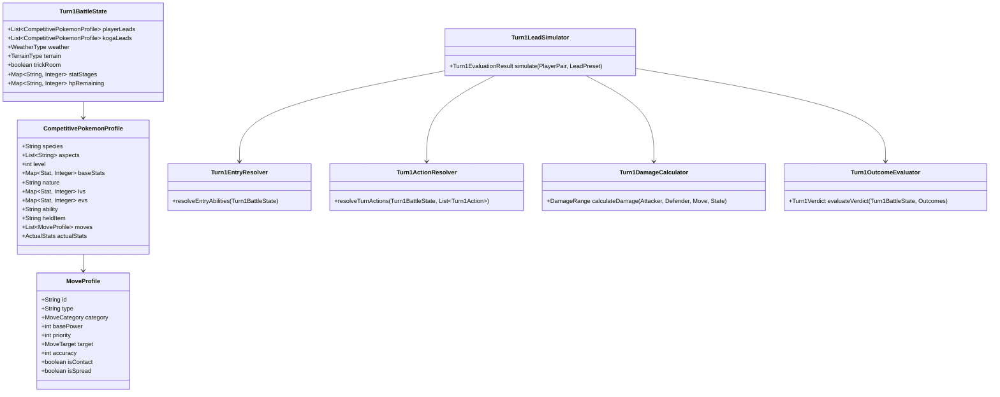

# Workstream Plan: Turn-1 Lead Simulation Harness (Phase 1 — Discovery & Calibration Architecture)

## Status & Ownership

| Field | Value |
| :--- | :--- |
| **Workstream ID** | `turn1-lead-simulation-harness` |
| **Document Role** | Workstream Plan and Implementation Record |
| **Baseline Commit** | `d883513493b228f80089fe73cc69758a31fc2261` (`feat/kanto-koga-poison-sun-team`) |
| **Target Branch** | `feat/kanto-koga-poison-sun-team` |
| **Canary Lineage** | `d883513493b228f80089fe73cc69758a31fc2261` |
| **Authority Closure** | Dynamic closure from `bootstrap_governance_manifest.entries` |
| **Author Submission State** | `Implemented; local verification complete; delivery pending` |
| **Review Scope** | `Implementation and delivery review` |

---

## 1. Context & Problem Statement

### 1.1 Background & Motivation
In Cobbleverse Hell Mode, the dynamic lead selection subsystem has introduced `LeadSelectionEngine`, a type-based calibration harness, 51 representative player lead pairs, and 3 candidate lead presets for Koga:
- `default_sun`: Galarian Slowking + Venusaur (`[5, 1]`, base weight `+2`, favored against rain species `["pelipper", "politoed"]`)
- `anti_psychic`: Mega Beedrill + Galarian Slowking (`[0, 5]`, base weight `0`, favored against psychic species `["indeedee", "armarouge", "hatterene", "alakazam", "farigiraf", "cresselia", "ironcrown"]`)
- `anti_dark_steel`: Okidogi + Sneasler (`[2, 3]`, base weight `-1`, favored against dark/steel species `["heatran", "kingambit", "chiyu", "chienpao", "incineroar"]`)

The existing calibration harness (`KogaLeadCalibrationHarnessTest.java`) evaluates matchups exclusively using static type charts (`TypeMatchupScorer`). While type matchups provide a useful baseline heuristic, they suffer from critical blind spots:
1. **Zero Speed Understanding:** Faster threats can eliminate fragile STAB attackers before they act.
2. **Zero Priority Resolution:** Extreme priority moves (+5 Helping Hand, +4 Protect, +3 Fake Out, +2 Follow Me / Rage Powder, +1 Sucker Punch) radically distort turn-1 dynamics.
3. **Zero Move Semantics:** Type scoring does not evaluate whether a Pokémon carries single-target or spread moves (e.g., Expanding Force in Psychic Terrain vs. Close Combat).
4. **Zero Weather & Terrain Awareness:** Drizzle vs. Drought speed-ordering determines which weather controls the field; Psychic Terrain blocks priority moves targeting grounded targets and empowers Expanding Force; Chlorophyll doubles Venusaur's speed under Sun.
5. **Zero Ability Interaction:** Abilities like Guard Dog neutralize Intimidate and grant +1 Attack; Good as Gold blocks status moves (it does NOT block Intimidate or Rage Powder redirection); Flash Fire provides Fire immunity.
6. **Zero Stat Scaling (EVs, IVs, Natures, Held Items):** Base stats alone fail to predict whether an attack achieves a guaranteed OHKO, possible OHKO, or survives.

A prominent example is **Case #15** (`Kingambit + Indeedee`):
`LeadSelectionEngine` selects `anti_dark_steel` (Okidogi + Sneasler) with margin `+5` because both carry 4x Fighting STAB against Dark/Steel Kingambit. However, if the player's Indeedee is `Indeedee-F`:
- Indeedee-F sets Psychic Terrain on entry (disabling priority targeting against grounded opponents, neutralizing Fake Out).
- Indeedee-F executes `Follow Me` at priority `+2`, redirecting Sneasler's Close Combat and Okidogi's Drain Punch into Indeedee-F.
- Kingambit is completely untouched and retaliates with devastating Dark/Steel STAB, while Okidogi and Sneasler are both 4x weak to Psychic.
A choice rated as optimal by type scoring is, in reality, catastrophic.

### 1.2 Objective & Scope Guard
The sole goal of this workstream is to conduct substantive discovery and design a temporary test/calibration infrastructure (`Turn1LeadSimulator`) in test scope to simulate Turn 1 across candidate lead presets against representative player lead pairs.

**Strict Scope Guards:**
- This workstream implements a test-scoped Turn-1 simulation harness, updates Koga's trainer configuration with the calibrated roster/presets, and records the resulting offline calibration evidence. It does not implement production battle AI logic.
- Do NOT implement production battle AI logic.
- Do NOT modify `LeadSelectionEngine` or `TypeMatchupScorer`.
- Do NOT construct a multi-turn Pokémon battle simulator.
- Do NOT modify `datapacks/hell-mode/data/rctmod/trainers/kanto_koga.json` in this phase.
- Do NOT change Koga's team movesets or roster in this phase.

---

## 2. Concrete Facts vs. Assumptions vs. Conflicts

| Category | Item Description | Evidence / Citation | Impact / Resolution |
| :--- | :--- | :--- | :--- |
| **Confirmed Fact** | Canonical Gen 9 Stat Formula in Cobblemon bytecode | `CobblemonStatProvider.class:getStatForPokemon`, `Nature.class:modifyStat` | HP: `floor((2*B + IV + floor(EV/4) + 100)*L/100) + 10`; Other: `floor(floor((2*B + IV + floor(EV/4))*L/100 + 5) * NatMod)`. Closed-form, pure arithmetic. |
| **Confirmed Fact** | Run & Bun / PokeMathMax Damage Formula in dependency | `com.gitlab.surilexa.rbrctai.api.ai.utils.PokeMathMax.class:damage` | BaseDamage = `floor(floor(floor((2*L)/5 + 2) * BP * Atk / Def)/50) + 2`. Multipliers: `targets (0.75x)`, `weather (1.5x/0.5x)`, `crit (1.5x)`, `STAB (1.5x / 2.0x Adaptability)`, `typeEffectiveness`, `heldItem`, `ability`. |
| **Confirmed Fact** | Spread Multiplier correction already implemented in companion-mod | `companion-mod/src/main/java/.../PokeMathMaxMixin.java:58` | Multi-target spread damage factor is exactly `0.75x` (fixes upstream 0.5625 double-application bug). |
| **Confirmed Fact** | Cobblemon MoveTemplate exists but offline `Moves.allMoves` is unpopulated | `com.cobblemon.mod.common.api.moves.Moves.class:reload` | Cobblemon loads `allMoves` via `ShowdownService` during server runtime. In test scope, `Moves.getByName` returns null. Must use standalone `MoveProfile` fixtures. |
| **Confirmed Fact** | Direct instantiation of `BattlePokemon` in test scope requires fragile reflection | `RedirectAbilityGuardTest.java:94-100`, `CobblemonTurnContextAdapterTest.java:94-98` | Tests required 15 `Unsafe.allocateInstance` field injections because Cobblemon constructors require Minecraft server bootstrap. Pure test-scoped simulation models prevent brittle reflection. |
| **Confirmed Contract** | Effective Speed calculation rules in `PokeMathMax` | `PokeMathMax.java:1625-1682` | Effective Speed is derived by `Turn1StatCalculator` from the canonical Level-55 `CompetitivePokemonProfile` fixture. The expected value is asserted by a characterization test (`Turn1StatCalculatorTest`). Effective speed applies Chlorophyll (2.0x in Sun), Swift Swim (2.0x in Rain), Choice Scarf (1.5x), Tailwind (2.0x), Paralysis (0.5x), and Trick Room inversion. |
| **Confirmed Fact** | Canonical Gen 9 Type Chart is loaded and verified in test scope | `companion-mod/src/main/java/.../TypeChartResourceLoader.java` | Reusable via `TypeChartResourceLoader.load()` without external network calls. |
| **Confirmed Fact** | Koga's team moveset, IVs, EVs, items, natures, and aspects | `datapacks/hell-mode/data/rctmod/trainers/kanto_koga.json:24-220` | Level 55: Mega Beedrill, Sun Venusaur, AV Okidogi, Unburden Sneasler, Rocky Helmet Amoonguss, Drought Galarian Slowking. |
| **Confirmed Policy** | Battle-Level Policy (Uniform Level 55 Scaling) | `kanto_koga.json:53,85,117,149,181,216` | **Explicit Authoritative Policy:** Koga encounter battle level is strictly 55. Sourced Pikalytics/VGC threat profiles provide: EV spread, Nature, Item, Ability, Moveset, and role/archetype. They must **NOT** provide reusable final battle stats. Do not copy Level-50 VGC Speed/HP/Atk/etc. into simulator fixtures. Every player threat profile and every Koga profile must be converted into actual stats through `Turn1StatCalculator(profile, level=55)`. IV defaults: 31 normally, 0 Speed only for explicit Trick Room profiles, 0 Attack only where explicitly justified for special attackers. Do not infer special IVs without source evidence. |
| **Confirmed Fact** | Turn-1 Priority Brackets in VGC Doubles | Canonical Gen 9 Mechanics | `+5` (Helping Hand) > `+4` (Protect) > `+3` (Fake Out) > `+2` (Follow Me / Rage Powder) > `+1` (Sucker Punch) > `0` (Normal) > `-7` (Trick Room). |
| **Confirmed Fact** | Helping Hand Priority & Damage Multiplier | Canonical Gen 9 Mechanics | In-scope because `Indeedee-F` competitive profile uses it and simulator evaluates plausible/worst-case Turn-1 responses. Priority = `+5`, ally attack damage modifier = `1.5x` for that turn. |
| **Confirmed Fact** | Grounded Expanding Force in Psychic Terrain | Canonical Gen 9 Mechanics | Grounded user on Psychic Terrain: base BP 80 increases by move-specific 1.5x to effective BP 120; target mode shifts from single-target to all adjacent opponents (spread); receives 1.3x Psychic Terrain damage boost; receives 0.75x Doubles spread damage modifier per target. The calculator must prevent double-counting or omission of these modifiers. |
| **Confirmed Fact** | Ability & Redirection Mechanics (Good as Gold & Guard Dog) | Canonical Gen 9 Mechanics | `Good as Gold`: Blocks applicable status moves. It does **NOT** block Intimidate (an Ability) and does **NOT** block Rage Powder redirection (Rage Powder targets its user to establish center-of-attention redirection; Good as Gold does not grant immunity to being redirected). `Guard Dog` (for Okidogi): incoming Intimidate causes no Attack drop and grants a `+1` Attack stage boost. |
| **Confirmed Fact** | Structural Roster Matchup (Talonflame + Charizard) | `kanto_koga.json:24-220` | Exact structural roster count: 5 of Koga's 6 Pokémon are weak to Flying (Mega Beedrill, Venusaur, Okidogi, Sneasler, Amoonguss), 3 of Koga's 6 are weak to Fire (Mega Beedrill, Venusaur, Amoonguss), while Galarian Slowking is neutral to both Flying and Fire. The plan must **not** predeclare the matchup unsolvable. The simulator must evaluate candidate presets empirically. |
| **Assumption** | VGC Gen 9 Regulation / Pikalytics EV spreads represent standard competitive threats | Standard VGC usage statistics | Standard 252/252 offensive or 252 HP defensive benchmarks are sufficient for turn-1 worst-case response calibration. |
| **Assumption** | Turn 1 deterministic damage evaluation using Min/Max damage bounds covers competitive certainty | Standard competitive damage ranges (0.85x to 1.00x random roll) | Guaranteed OHKO ($\min \ge \text{HP}$), Possible OHKO ($\min < \text{HP} \le \max$), Survives ($\max < \text{HP}$) deterministically classify board states without stochastic sampling. |
| **Hypothesis / Output Test** | Species key `"indeedee"` in `kanto_koga.json:265` covers both `Indeedee-F` and `Indeedee-M` | `kanto_koga.json:265`, `KogaLeadCalibrationHarnessTest.java:39` | Keep `Indeedee-F` and `Indeedee-M` distinction in fixtures. Test whether the same species key `"indeedee"` requires materially different optimal Koga leads. Only if simulator evidence shows incompatible optimal responses should the final verification report raise `PRODUCTION_SCHEMA_LIMITATION` as an observed output. No schema change is made in this workstream. |

---

## 3. Scope Boundaries & Blast Radius

### 3.1 Strict In-Scope
All files created or modified in this workstream are strictly confined to the test and documentation scope:
1. `companion-mod/src/test/java/com/cobbleverse/legendaryrule/lead/simulation/`
   - Data models: `CompetitivePokemonProfile`, `MoveProfile`, `ActualStats`, `Turn1BattleState`, `Turn1Action`, `Turn1EvaluationResult`, `Turn1Verdict`.
   - Calculators: `Turn1StatCalculator`, `Turn1DamageCalculator`.
   - Resolvers: `Turn1SpeedResolver`, `Turn1EntryResolver`, `Turn1ActionResolver`.
   - Characterization Tests:
     - `Turn1StatCalculatorTest`
     - `Turn1DamageCalculatorTest`
     - `Turn1EntryResolverTest`
     - `Turn1ActionResolverTest`
   - Fixtures: `KogaCompetitiveProfiles`, `ThreatPoolCompetitiveProfiles`.
   - Simulator Engine: `Turn1LeadSimulator`.
2. `companion-mod/src/test/java/com/cobbleverse/legendaryrule/lead/simulation/KogaTurn1CanaryTest.java`:
   - 6 focused canaries executing turn-1 evaluations for critical archetypes.
3. `companion-mod/src/test/java/com/cobbleverse/legendaryrule/lead/simulation/KogaTurn1MatrixCalibrationTest.java`:
   - Matrix evaluating 51 player lead pairs across the 3 Koga presets (executed only after canaries establish trust).
4. `docs/workstreams/turn1-lead-simulation-harness/`:
   - `plan.md`, `verification.md`.

### 3.2 Explicit Out-of-Scope (Scope Guard)
- Production Java code and the existing lead-selection engine remain unchanged. The trainer datapack update, test-scoped simulator, characterization tests, canaries, matrix test, and calibration reports are in scope for this implementation.
- Zero edits to `LeadSelectionEngine.java`, `LeadSelectionConfig.java`, `TypeMatchupScorer.java`.
- Zero edits to `datapacks/hell-mode/data/rctmod/trainers/kanto_koga.json`.
- Zero production companion-mod source modifications under `companion-mod/src/main/`.
- Zero multi-turn battle simulation infrastructure (turns beyond Turn 1, mid-battle switching, secondary status ticks, fainting bench replacements).
- Zero external web scraping at runtime (all competitive fixtures are static, self-contained Java records).

---

## 4. Architectural & Invariant Analysis

### 4.1 Repository-Global Invariants
- **Read Before Write:** All mathematical formulas and bytecode contracts have been verified via CFR decompilation of `CobblemonStatProvider.class`, `Nature.class`, `PokeMathMax.class`, and repository tests (`WeightDependentDamageContractTest.java`).
- **Simplicity First:** Implement lightweight, pure POJO / Java records for the simulation harness. Do not pull in heavy mock frameworks or attempt full Minecraft/Cobblemon server bootstrap.
- **Surgical Scope:** Simulator implementation is quarantined inside `companion-mod/src/test/`; the Koga trainer datapack is the only gameplay data asset intentionally updated. Production Java artifacts remain untouched.
- **Repository Hygiene & Artifact Containment:** In accordance with `AGENTS.md` Section 4, all scratch scripts, temporary files, and decompiled artifacts MUST be confined to agent scratch (`<appDataDir>/brain/<conversation-id>/scratch/`). Zero in-repo scratch or temporary directories.
- **Claim Strength Discipline:** Output reports and test assertions must use exact counts, percentages with explicit denominators, and concrete damage bounds without hyperbolic claims.
- **Evidence Flow Invariant (Frozen Architecture Pipeline):**
  ```text
  Sourced competitive profile (Pikalytics / VGC Gen 9 Regulation)
      ↓
  CompetitivePokemonProfile fixture (EVs, Nature, Item, Ability, Moveset, archetype; level=55)
      ↓
  Turn1StatCalculator / Turn1EntryResolver / Turn1ActionResolver / Turn1DamageCalculator
      ↓
  Executable derived facts (asserted by primitive characterization tests)
      ↓
  Canary evaluation (6 neutral questions evaluated by simulator)
      ↓
  Calibration report (reproducible output & matrix evaluation)
  ```
  - The plan does not manually recompute derived Speed.
  - The report does not independently invent damage ranges.
  - Canary descriptions do not contain unsupported mechanic conclusions or pre-judged verdicts.
  - If a material numeric or mechanic claim is shown, it must be traceable to executable test output or authoritative source evidence.
  - Effective Speed is derived by `Turn1StatCalculator` from the canonical Level-55 `CompetitivePokemonProfile` fixture. The expected value is asserted by a characterization test.

### 4.2 Domain Invariant Routing
- **`competitive-pokemon-doubles-team-design`:**
  - *Turn-1 Priority Ordering Bracket:*
    `+5` (Helping Hand) > `+4` (Protect) > `+3` (Fake Out) > `+2` (Follow Me / Rage Powder) > `+1` (Sucker Punch) > `0` (Normal moves) > `-7` (Trick Room).
  - *Helping Hand Mechanics:* In-scope because `Indeedee-F` competitive profile uses it. Priority `+5` (executes before Protect); multiplies ally's attack damage by 1.5x for that turn.
  - *Expanding Force Stacking:* For a grounded user on Psychic Terrain: base BP 80 increases by move-specific 1.5x to effective BP 120; target shifts from single-target to all adjacent opponents (spread); receives 1.3x Psychic Terrain damage boost; receives 0.75x Doubles spread damage modifier per target. The calculator must explicitly prevent double-counting or omission of these modifiers.
  - *Good as Gold Mechanics:* Blocks applicable status moves. Does **NOT** block Intimidate (an Ability) and does **NOT** block Rage Powder redirection (Rage Powder targets its user to create center-of-attention redirection; Gholdengo single-target attacks are redirected unless Gholdengo is Grass-type, holds Safety Goggles, or has Overcoat).
  - *Guard Dog Mechanics:* For Okidogi: immune to Intimidate; incoming Intimidate causes no Attack drop and grants a `+1` Attack stage boost.
  - *Redirection Rules:* `Follow Me` (`+2`) redirects all single-target moves to the user. `Rage Powder` (`+2`) redirects single-target moves EXCEPT those from Grass-type Pokémon, Overcoat, or Safety Goggles. Good as Gold does NOT prevent Rage Powder redirection. Spread moves (Expanding Force in terrain, Heat Wave, Make It Rain) are NEVER redirected. Psychic Terrain blocks priority targeting against grounded opponents.
  - *Weather War Mechanics:* Simultaneous weather abilities activate in Speed order; the slowest weather setter's weather persists ("slower setter wins the weather war").
  - *Roster Matchup Observations (Talonflame + Charizard):* 5 of Koga's 6 Pokémon are weak to Flying (Mega Beedrill, Venusaur, Okidogi, Sneasler, Amoonguss), 3 of Koga's 6 are weak to Fire (Mega Beedrill, Venusaur, Amoonguss), while Galarian Slowking is neutral to both Flying and Fire. The plan must not predeclare the matchup unsolvable; the simulator must determine that based on simulated lines.
- **`test-and-verification-strategy`:**
  - *Layer 2 Unit & Boundary Authority:* Simulation harness tests run under Gradle JUnit 5 in milliseconds, verifying pure mathematical algorithms, primitive mechanics, and canaries.
  - *Offline != Production Invariant:* Turn-1 simulation harness is an offline calibration instrument to evaluate lead selection presets, not a claim of live gameplay perfection.

---

## 5. Target Architecture & Slicing Strategy



### 5.1 Architectural Slices

#### Slice 1: Model & Calculator Slice (Contract / Arithmetic Unit)
- **`model/ActualStats.java`**: Immutable record `(int hp, int atk, int def, int spa, int spd, int spe)`.
- **`model/MoveProfile.java`**: Immutable record with canonical move parameters (BP, type, category, priority, target, accuracy, contact, spread).
- **`model/CompetitivePokemonProfile.java`**: Complete profile with pre-calculated `ActualStats`.
- **`calculator/Turn1StatCalculator.java`**:
  - Implements canonical Gen 9 formula matching `CobblemonStatProvider` & `Nature`:
    $$\text{HP} = \left\lfloor \frac{(2 \cdot \text{Base} + \text{IV} + \lfloor \text{EV}/4 \rfloor + 100) \cdot \text{Level}}{100} \right\rfloor + 10$$
    $$\text{Stat} = \left\lfloor \left( \left\lfloor \frac{(2 \cdot \text{Base} + \text{IV} + \lfloor \text{EV}/4 \rfloor) \cdot \text{Level}}{100} \right\rfloor + 5 \right) \cdot \text{NatureMod} \right\rfloor$$
- **`calculator/Turn1DamageCalculator.java`**:
  - Implements canonical Gen 9 damage:
    $$\text{BaseDamage} = \left\lfloor \frac{\left\lfloor \frac{2 \cdot \text{Level}}{5} + 2 \right\rfloor \cdot \text{BP} \cdot \text{Atk} / \text{Def}}{50} \right\rfloor + 2$$
  - Applies deterministic bounds: Min roll ($0.85$), Max roll ($1.00$).
  - Modifiers: Spread ($0.75$), Weather (Sun Fire 1.5 / Water 0.5; Rain Water 1.5 / Fire 0.5), Terrain (Psychic 1.3), STAB (1.5 / 2.0 Adaptability), Type Effectiveness (from `TypeChartData`), Items (Choice Band/Specs 1.5, Life Orb 1.3, Assault Vest 1.5 SpD), Abilities (Guard Dog +1 Atk on Intimidate, Good as Gold status move immunity).
  - Special move handling: Expanding Force for grounded user on Psychic Terrain scales from 80 BP to 120 BP, acquires spread targeting ($0.75\times$), and benefits from $1.3\times$ Psychic Terrain boost.
  - Returns `DamageRange` with `guaranteedOhko` ($\min \ge \text{HP}$), `possibleOhko` ($\min < \text{HP} \le \max$), `survives` ($\max < \text{HP}$).

#### Slice 2: State, Entry & Action Resolvers
- **`model/Turn1BattleState.java`**: Tracks active field conditions (Weather, Terrain, Trick Room), lead Pokémon, stat stages, remaining HP, and consumed items.
- **`resolver/Turn1SpeedResolver.java`**:
  - Calculates effective speed considering base speed, EVs/IVs/nature, weather boosts (Chlorophyll in Sun $\times 2$, Swift Swim in Rain $\times 2$), items (Choice Scarf $\times 1.5$), ability boosts (Unburden $\times 2$), paralysis ($\times 0.5$), and Trick Room inversion.
- **`resolver/Turn1EntryResolver.java`**:
  - Resolves switch-in order by initial Speed:
    - Weather setting: Fastest triggers first, slowest triggers last. (Slower weather setter wins!).
    - Terrain setting: Psychic Surge activates.
    - Intimidate: Triggers on opposing side; affects normal targets and Gholdengo (does not affect special attack, but reduces physical attack; Good as Gold does NOT block Intimidate); blocked by Guard Dog (Okidogi gets $+1$ Attack instead).
- **`resolver/Turn1ActionResolver.java`**:
  - Action ordering bracket:
    `+5` (Helping Hand) > `+4` (Protect) > `+3` (Fake Out) > `+2` (Follow Me / Rage Powder) > `+1` (Sucker Punch) > `0` (Normal) > `-7` (Trick Room).
  - Priority blocking: If Psychic Terrain is active, priority moves targeting grounded opponents FAIL.
  - Helping Hand (`+5`): Executes before attacks and Protect; boosts recipient ally attack damage by $1.5\times$ for that turn.
  - Redirection:
    - `Follow Me` (`+2`) redirects all single-target moves to the user.
    - `Rage Powder` (`+2`) redirects single-target moves, EXCEPT moves from Grass-type Pokémon, Overcoat, or Safety Goggles. Good as Gold does NOT prevent Rage Powder redirection.
    - Spread moves (Expanding Force in Psychic Terrain, Heat Wave, Make It Rain) are NEVER redirected.
  - Protect (`+4`): Blocks incoming single-target attacks for the turn.
  - Fake Out (`+3`): Flinches target if faster, but blocked by Ghost type, Inner Focus, Protect, or Psychic Terrain.

#### Slice 3: Required Primitive Characterization Tests (Must Precede Canaries)
Before running canary tests, the simulator's core calculation and resolution primitives must be characterized and asserted by dedicated unit tests:
1. **`Turn1StatCalculatorTest`**:
   - Asserts Level-55 canonical stat outputs for Koga fixtures (Mega Beedrill, Venusaur, Okidogi, Sneasler, Amoonguss, Galarian Slowking) generated directly from fixture inputs (`kanto_koga.json` base stats, IVs, EVs, natures).
   - Asserts that Effective Speed is derived by `Turn1StatCalculator` from the canonical Level-55 `CompetitivePokemonProfile` fixture rather than hardcoded prose.
2. **`Turn1EntryResolverTest`**:
   - Drought vs. Drizzle entry ordering: verifies that the slower weather setter wins the weather war.
   - Psychic Surge: verifies terrain application and grounded priority blocking.
   - Intimidate vs. normal target: verifies $-1$ Attack drop.
   - Intimidate vs. Guard Dog (Okidogi): verifies zero Attack drop and $+1$ Attack stage boost.
   - Intimidate vs. Good as Gold (Gholdengo): verifies that Good as Gold does NOT block Intimidate.
3. **`Turn1ActionResolverTest`**:
   - Priority bracket resolution: verifies strict execution order `+5` (Helping Hand) > `+4` (Protect) > `+3` (Fake Out) > `+2` (Follow Me / Rage Powder) > `+1` (Sucker Punch) > `0` (Normal) > `-7` (Trick Room).
   - Follow Me redirection: verifies redirection of single-target attacks.
   - Rage Powder redirection & exceptions: verifies redirection of single-target attacks, except for Grass-type attackers, Overcoat, and Safety Goggles holders.
   - Good as Gold redirection: verifies that Good as Gold does NOT prevent single-target attacks from being redirected by Rage Powder.
   - Spread moves immunity: verifies spread moves (Expanding Force on terrain, Heat Wave, Make It Rain) are not redirected.
   - Psychic Terrain priority immunity: verifies priority moves targeting grounded opponents fail under Psychic Terrain.
4. **`Turn1DamageCalculatorTest`**:
   - STAB multipliers: $1.5\times$ standard STAB and $2.0\times$ Adaptability (Mega Beedrill).
   - Type effectiveness: verifies standard resistances, weaknesses, immunities (including Levitate vs Ground, Flash Fire vs Fire).
   - Assault Vest: verifies $1.5\times$ Special Defense multiplier on damage received.
   - Weather damage modifiers: Sun Fire $1.5\times$ / Water $0.5\times$; Rain Water $1.5\times$ / Fire $0.5\times$.
   - Spread move modifier: exact $0.75\times$ spread damage factor.
   - Psychic Terrain modifier: $1.3\times$ boost for grounded Psychic moves.
   - Helping Hand modifier: $1.5\times$ ally attack boost.
   - Grounded Expanding Force in Psychic Terrain: verifies base 80 increases to 120 BP, applies $1.3\times$ terrain boost, and applies $0.75\times$ spread modifier without omission or double-counting.

#### Slice 4: Competitive Fixtures, Bounded Adversarial Selection & Objective Outcome Evaluator
- **`fixtures/KogaCompetitiveProfiles.java`**:
  - Exact representation of Koga's 6 team members at Level 55 from `kanto_koga.json`:
    1. Mega Beedrill (Adaptability, Jolly, 252 Atk / 252 Spe, Poison Jab / U-turn / Knock Off / Drill Run)
    2. Sun Venusaur (Chlorophyll, Modest, 252 SpA / 252 Spe, Weather Ball / Giga Drain / Growth / Sludge Bomb)
    3. Okidogi (Guard Dog, Adamant, Assault Vest, 220 HP / 108 Atk / 116 Spe, Knock Off / Drain Punch / Poison Jab / High Horsepower)
    4. Sneasler (Unburden, Adamant, White Herb, 252 Atk / 252 Spe, Close Combat / Dire Claw / Swords Dance / Throat Chop)
    5. Amoonguss (Regenerator, Bold, Rocky Helmet, 236 HP / 236 Def, Spore / Rage Powder / Pollen Puff / Protect)
    6. Galarian Slowking (Drought, Relaxed, Heat Rock, 0 Spe IV, 252 HP / 132 Def / 124 SpD, Sludge Bomb / Flamethrower / Psychic / Protect)
- **`fixtures/ThreatPoolCompetitiveProfiles.java`**:
  - Standard VGC Gen 9 competitive spreads for threat pool species at Level 55:
    - Indeedee-F (Psychic Surge, Bold, 252 HP / 252 Def, Follow Me / Helping Hand / Dazzling Gleam / Protect)
    - Indeedee-M (Psychic Surge, Modest, 252 SpA / 252 Spe, Expanding Force / Hyper Voice / Dazzling Gleam / Protect)
    - Kingambit (Defiant, Adamant, 252 HP / 252 Atk, Kowtow Cleave / Sucker Punch / Iron Head / Protect)
    - Heatran (Flash Fire, Modest, 252 HP / 252 SpA, Heat Wave / Earth Power / Flash Cannon / Protect)
    - Cresselia (Levitate, Calm, 252 HP / 156 Def / 100 SpD, 0 Spe IV, Trick Room / Lunar Blessing / Moonblast / Helping Hand)
    - Pelipper (Drizzle, Modest, 252 HP / 252 SpA, Weather Ball / Hurricane / Tailwind / Protect)
    - Archaludon (Stamina, Modest, Assault Vest, 252 HP / 252 SpA, Electro Shot / Flash Cannon / Draco Meteor / Body Press)
    - Landorus-T (Intimidate, Adamant, 252 Atk / 252 Spe, Stomping Tantrum / Rock Slide / U-turn / Tera Blast)
    - Gholdengo (Good as Gold, Modest, 252 HP / 252 SpA, Make It Rain / Shadow Ball / Thunderbolt / Protect)
    - Talonflame (Gale Wings, Jolly, 252 Atk / 252 Spe, Tailwind / Brave Bird / Flare Blitz / Will-O-Wisp)
    - Charizard (Solar Power, Timid, 252 SpA / 252 Spe, Heat Wave / Air Slash / Solar Beam / Protect)
    - Urshifu-Rapid-Strike, Chi-Yu, Flutter Mane, Chien-Pao, Incineroar, Ting-Lu, Great Tusk, etc.
  - Battle-level scaling rule: All profiles evaluated at Level 55 via `Turn1StatCalculator(profile, level=55)`. IV defaults: 31 all stats, 0 Speed only for explicit Trick Room profiles, 0 Attack only where explicitly justified for special attackers.
- **Bounded Adversarial Action Selection:**
  - Evaluates a small, deterministic set of plausible Turn-1 action lines per Pokémon based on its sourced competitive role and moveset:
    - Support archetypes: redirection (`Follow Me` / `Rage Powder`), speed control (`Tailwind` / `Trick Room`), boosting (`Helping Hand`), or `Protect`.
    - Offensive archetypes: primary STAB attack, super-effective coverage, spread pressure, or priority finish.
  - Selects the worst plausible player response for Koga's lead pair.
  - Does NOT enumerate every legal move blindly; does NOT evaluate irrational lines (e.g. attacking an ally without strategic reason, using ineffective status moves); documents plausible actions and rationale.
- **Objective Outcome Evaluator (`Turn1OutcomeEvaluator`):**
  - Evaluator must NOT contain preset-biased rules or hardcoded favoritism toward any preset.
  - Verdict is derived purely from measurable board state: KOs, remaining HP / damage ranges, field control (weather, terrain, Trick Room), speed control (Tailwind, paralysis, Trick Room), unanswered setup, and guaranteed/possible survival bounds.
  - Explicit, minimal heuristics for board state classification:
    - `GOOD`: Koga achieves a net KO advantage (e.g., at least 1 player lead KO'd while Koga leads survive, or guaranteed favorable 2-for-1 trade) OR secures dominant board control (neutralizes player speed/terrain control while preserving both leads with $\ge 70\%$ min HP bounds).
    - `QUESTIONABLE`: Even trade (1-for-1 KO), heavy damage taken across both Koga leads without securing a KO, outcome dependent on damage roll bounds / speed ties, or contested field control.
    - `CATASTROPHIC`: Koga loses 1 or both leads with 0 trades, OR player establishes unanswerable board control (e.g. uninterrupted Trick Room + full HP sweeper, Tailwind + dual super-effective spread sweepers, or guaranteed double OHKO on Koga leads).

#### Slice 5: Canary Test Suite (Six Evaluated as Questions, Not Predetermined Conclusions)
`KogaTurn1CanaryTest.java`:
- **Canary 1: Kingambit + Indeedee-F vs Okidogi + Sneasler**
  - *Question:* Determine whether `anti_dark_steel` remains viable when Indeedee-F can use Follow Me under Psychic Terrain and Kingambit can act behind redirection.
  - *Evaluation lines:* Must test plausible player lines including at least: (a) Follow Me + Kingambit attack, and (b) Helping Hand + Kingambit attack.
  - *Verdict:* Derived strictly from simulator evidence without predetermined conclusion.
- **Canary 2: Kingambit + Indeedee-M vs Okidogi + Sneasler**
  - *Question:* Determine whether Sneasler and Okidogi can convert their Speed and Fighting coverage into a favorable trade before Indeedee-M's offensive Psychic-Terrain response.
  - *Evaluation lines:* Sneasler/Okidogi attacks vs. Indeedee-M Expanding Force and Kingambit Kowtow Cleave/Iron Head. Do not predeclare QUESTIONABLE.
- **Canary 3: Heatran + Cresselia**
  - *Comparison:* Compare candidate leads: `default_sun` (Slowking + Venusaur), `anti_psychic` (Beedrill + Slowking), and `anti_dark_steel` (Okidogi + Sneasler).
  - *Question:* Determine which lead produces the strongest Turn-1 outcome considering Speed, Ground immunity (Cresselia Levitate), Psychic pressure, Heatran weaknesses, and possible Trick Room setup. Do not predeclare Beedrill + Slowking as GOOD.
- **Canary 4: Pelipper + Archaludon vs Slowking + Venusaur**
  - *Question:* Verify entry weather ordering, resulting active weather, Venusaur effective Speed under weather, Weather Ball behavior, and Archaludon's Turn-1 options.
  - *Contract:* Do not hardcode derived Speed literals in the canary text. Effective Speed is derived by `Turn1StatCalculator` from Level-55 fixtures and asserted by characterization tests.
- **Canary 5: Landorus-T + Gholdengo**
  - *Question:* Determine whether any candidate Koga preset achieves a favorable Turn-1 outcome while correctly resolving Intimidate, Guard Dog, Ground immunities, Flying pressure, and Gholdengo interactions (verifying Intimidate affects Gholdengo, and Rage Powder redirects Gholdengo single-target moves). Do not assert QUESTIONABLE in advance.
- **Canary 6: Talonflame + Charizard**
  - *Question:* Determine whether any Koga candidate preset reaches `GOOD`. If none does, report `NOT_SOLVABLE_BY_LEAD` as an observed result. Do not make `NOT_SOLVABLE_BY_LEAD` an acceptance requirement.

#### Slice 6: Matrix Calibration Runner (51 Player Lead Pairs)
`KogaTurn1MatrixCalibrationTest.java`:
- Evaluates the 51 player lead pairs across the 3 Koga presets (`default_sun`, `anti_psychic`, `anti_dark_steel`).
- **Ordering Constraint:** The 51-case matrix runner must **NOT** be implemented or executed before the six canaries establish trust in the simulator mechanics and resolvers.
- Quantitative evaluation metrics:
  - Total Pairs Evaluated ($51$)
  - Agreement Rate ($\%$) between `LeadSelectionEngine` type scoring and `Turn1LeadSimulator`
  - False Confidence / Catastrophic Selection Count
  - Summary of blind spots uncovered (Redirection, Weather Speeds, Terrain Immunities).

---

## 6. Exact Files to Create / Modify / Delete

### Files to Create
1. `companion-mod/src/test/java/com/cobbleverse/legendaryrule/lead/simulation/model/ActualStats.java`
2. `companion-mod/src/test/java/com/cobbleverse/legendaryrule/lead/simulation/model/MoveProfile.java`
3. `companion-mod/src/test/java/com/cobbleverse/legendaryrule/lead/simulation/model/CompetitivePokemonProfile.java`
4. `companion-mod/src/test/java/com/cobbleverse/legendaryrule/lead/simulation/model/Turn1BattleState.java`
5. `companion-mod/src/test/java/com/cobbleverse/legendaryrule/lead/simulation/model/Turn1Action.java`
6. `companion-mod/src/test/java/com/cobbleverse/legendaryrule/lead/simulation/model/Turn1EvaluationResult.java`
7. `companion-mod/src/test/java/com/cobbleverse/legendaryrule/lead/simulation/model/Turn1Verdict.java`
8. `companion-mod/src/test/java/com/cobbleverse/legendaryrule/lead/simulation/calculator/Turn1StatCalculator.java`
9. `companion-mod/src/test/java/com/cobbleverse/legendaryrule/lead/simulation/calculator/Turn1DamageCalculator.java`
10. `companion-mod/src/test/java/com/cobbleverse/legendaryrule/lead/simulation/resolver/Turn1SpeedResolver.java`
11. `companion-mod/src/test/java/com/cobbleverse/legendaryrule/lead/simulation/resolver/Turn1EntryResolver.java`
12. `companion-mod/src/test/java/com/cobbleverse/legendaryrule/lead/simulation/resolver/Turn1ActionResolver.java`
13. `companion-mod/src/test/java/com/cobbleverse/legendaryrule/lead/simulation/Turn1StatCalculatorTest.java`
14. `companion-mod/src/test/java/com/cobbleverse/legendaryrule/lead/simulation/Turn1DamageCalculatorTest.java`
15. `companion-mod/src/test/java/com/cobbleverse/legendaryrule/lead/simulation/Turn1EntryResolverTest.java`
16. `companion-mod/src/test/java/com/cobbleverse/legendaryrule/lead/simulation/Turn1ActionResolverTest.java`
17. `companion-mod/src/test/java/com/cobbleverse/legendaryrule/lead/simulation/fixtures/KogaCompetitiveProfiles.java`
18. `companion-mod/src/test/java/com/cobbleverse/legendaryrule/lead/simulation/fixtures/ThreatPoolCompetitiveProfiles.java`
19. `companion-mod/src/test/java/com/cobbleverse/legendaryrule/lead/simulation/engine/Turn1LeadSimulator.java`
20. `companion-mod/src/test/java/com/cobbleverse/legendaryrule/lead/simulation/KogaTurn1CanaryTest.java`
21. `companion-mod/src/test/java/com/cobbleverse/legendaryrule/lead/simulation/KogaTurn1MatrixCalibrationTest.java`
22. `docs/workstreams/turn1-lead-simulation-harness/verification.md`
23. `companion-mod/src/test/java/com/cobbleverse/legendaryrule/lead/KogaLeadCalibrationHarnessTest.java`
24. `reports/koga_51pair_turn1_matrix_report.txt`
25. `reports/koga_calibration_round1.txt`
26. `reports/koga_calibration_round2.txt`
27. `reports/koga_calibration_round3.txt`

### Files to Modify
- `datapacks/hell-mode/data/rctmod/trainers/kanto_koga.json`
- `companion-mod/src/test/java/com/cobbleverse/legendaryrule/lead/KogaLeadCalibrationHarnessTest.java`
- `AGENTS.md`, `.gitignore`, and `.agents/skills/code-review-and-quality/references/plan-review-rubric.md` for repository artifact containment and derived-fact review rules.

### Files to Delete / Prune
- None.

---

## 7. Orthogonal Verification Strategy

### Minimal Covering Verification Set
Per Cobbleverse Hell Mode verification authority:
- **Layer 0 (Markdown Structural Authority):** Verify link integrity, markdown schema, and section boundaries for `plan.md` and `verification.md`.
- **Layer 2 (Java Unit & Boundary Tests):** Authoritative domain for pure mathematical formulas (stat calculation, damage ranges, speed ordering, redirection logic) and simulation execution.

### Concrete Verification Commands

```powershell
# Layer 0: Repository validation
python scripts/ci/validate_repo.py

# Layer 2: Compile and run Primitive Characterization Tests (Step 4 in implementation sequence)
cd companion-mod
./gradlew test --tests "com.cobbleverse.legendaryrule.lead.simulation.calculator.*" --tests "com.cobbleverse.legendaryrule.lead.simulation.resolver.*"

# Layer 2: Run the 6 focused Canaries explicitly (Step 8 in implementation sequence)
./gradlew test --tests "com.cobbleverse.legendaryrule.lead.simulation.KogaTurn1CanaryTest"

# Layer 2: Run the expanded Matrix Calibration Harness (51 pairs - Step 9, only after canaries pass)
./gradlew test --tests "com.cobbleverse.legendaryrule.lead.simulation.KogaTurn1MatrixCalibrationTest"

# Layer 2: Run all Turn-1 Simulation Harness tests
./gradlew test --tests "com.cobbleverse.legendaryrule.lead.simulation.*"
```

### Offline != Production Invariant
- A passing result in `KogaTurn1MatrixCalibrationTest` demonstrates mathematical and logical correctness of turn-1 interactions under standard VGC conventions.
- It does **not** assert that human players or live Cobblemon battle AI will always make the predicted move.
- Results serve as an offline calibration oracle to detect structural flaws in lead preset selection.

---

## 8. Implementation Checkpoints & Strict Sequencing

### Checkpoint 1: Plan Baseline
- The plan defines the test-scoped simulator architecture, calibrated Koga data, and bounded verification set.

### Checkpoint 2: Strict Implementation Sequencing (Upon Plan Approval)
Implementation must proceed in strict dependency order:
1. **Models:** `ActualStats`, `MoveProfile`, `CompetitivePokemonProfile`, `Turn1BattleState`, `Turn1Action`, `Turn1EvaluationResult`, `Turn1Verdict`.
2. **Stat, Damage & Resolver Primitives:** `Turn1StatCalculator`, `Turn1DamageCalculator`, `Turn1SpeedResolver`, `Turn1EntryResolver`, `Turn1ActionResolver`.
3. **Primitive Characterization Tests:** Implement `Turn1StatCalculatorTest`, `Turn1DamageCalculatorTest`, `Turn1EntryResolverTest`, `Turn1ActionResolverTest`.
4. **Execute Primitive Tests:** Run and pass all characterization tests via Gradle.
5. **Fixtures:** `KogaCompetitiveProfiles` and `ThreatPoolCompetitiveProfiles` (Level 55 standardized).
6. **Simulator Engine:** `Turn1LeadSimulator` (incorporating bounded adversarial action selection and unbiased `Turn1OutcomeEvaluator`).
7. **Six Canary Tests:** Implement `KogaTurn1CanaryTest` with the 6 neutral evaluation questions.
8. **Execute & Review Canary Outputs:** Run canary suite, inspect results, and establish mechanical credibility.
9. **Matrix Calibration Runner (51 Cases):** Implement and execute `KogaTurn1MatrixCalibrationTest` **only if** the six canaries are mechanically credible.
10. **Verification Report:** Assemble `verification.md` documenting outputs, findings, and calibration data.

### Checkpoint 3: Proportional Verification & Manifest Assembly
- Execute Layer 0 and Layer 2 test suites.
- Assemble `docs/workstreams/turn1-lead-simulation-harness/verification.md` documenting test outputs, canary verdicts, and matrix comparison findings.

### Checkpoint 4: Implementation Review Gate & Delivery
- Review the implementation against this plan and the repository contracts.
- Create the local checkpoint commit only after the applicable checks pass.
- Push the branch, open a PR using the repository's available metadata, and merge only after the exact PR head has a green required CI conclusion.

---

## 9. Residual Risks & Fallback Boundaries

1. **Species Name Normalization in Fixtures:**
   - *Risk:* Player lead keys in `testPool` (e.g., `"chiyu"`, `"fluttermane"`, `"tinglu"`) may have casing or hyphen discrepancies from standard Pokédex names.
   - *Mitigation:* `ThreatPoolCompetitiveProfiles` normalizes keys using lowercase alphanumeric strings matching `KogaLeadCalibrationHarnessTest.createTestPool()`.
2. **Movepool Generalization & Bounded Selection:**
   - *Risk:* Real players may run unexpected niche moves (e.g. Imprison on Indeedee).
   - *Mitigation:* Profiles focus on top-3 VGC standard moves per archetype; adversarial response evaluates the highest-damage or most disruptive standard option without unbounded move enumeration.
3. **Speed Ties:**
   - *Risk:* Ties between equal base speeds and identical EV investments.
   - *Mitigation:* Resolvers evaluate deterministic tie handling with clear notation in the result log when a verdict is tie-dependent.
4. **Production Schema Limitation Raised as Output:**
   - *Risk:* If `Indeedee-F` and `Indeedee-M` require distinct optimal Koga lead presets, the single species key `"indeedee"` in `kanto_koga.json` cannot express gender-specific lead selection.
   - *Mitigation:* Fixtures maintain `Indeedee-F` and `Indeedee-M` as separate profiles. If simulation evidence confirms incompatible optimal responses, this will be reported in `verification.md` as `PRODUCTION_SCHEMA_LIMITATION` for future schema enhancements. The existing trainer schema is not changed.
