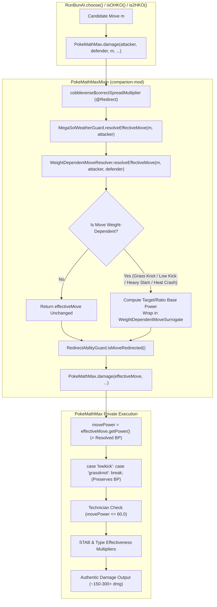
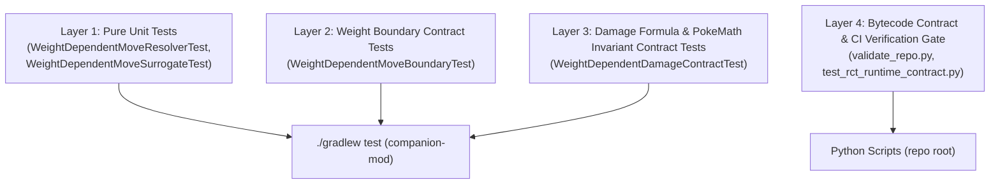

# Implementation Plan: Weight-Dependent Move Dynamic Power Resolution in Run & Bun AI

**Workstream:** `weight-dependent-moves`  
**Target File:** `docs/workstreams/weight-dependent-moves/plan.md`  
**Status:** Candidate Plan (Reconciliation Cycle 1 — Addressed Plan Reviewer Findings)  
**Author:** Planner (`P`)  

---

## 1. Problem Description & Root Cause Analysis

### 1.1 Reported Symptom
In Cobbleverse Hell Mode battles, Run & Bun AI (`rbrctai`) severely miscalculates the damage output of weight-dependent moves such as `Grass Knot` and `Low Kick`. Even against massive, 4x-weak Pokémon (e.g., a 200+ kg Tyranitar or Swampert), the AI evaluates `Grass Knot` as dealing negligible (~2) damage. As a result:
- The AI never classifies weight-dependent moves as killing blows (`killingMoves`).
- The AI calculates near-zero board pressure (`percentChange \approx 0.01`).
- The AI prioritizes ineffective, resisted attacks or switches out, abandoning decisive super-effective attacks.

### 1.2 Technical Root Cause in `PokeMathMax.damage` (`rbrctai-fabric-1.21.1-0.15.4-beta.jar`)
Decompilation and bytecode tracing of `com.gitlab.surilexa.rbrctai.api.ai.utils.PokeMathMax` and `com.gitlab.surilexa.rbrctai.api.ai.RunBunAI` confirm the exact defect chain:

1. **Move Power Initialization from Move Object:**  
   Inside `PokeMathMax.damage(Move move, boolean physical, ...)` (lines 79–1138), base power is initialized at line 87:
   ```java
   double movePower = move.getPower();
   ```
   In Cobblemon, `Move.getPower()` returns `this.template.getPower()`. Cobblemon imports its move templates directly from Pokémon Showdown (`data/moves.js`). In Pokémon Showdown, all moves whose base power is calculated dynamically at runtime (including `grassknot`, `lowkick`, `heavyslam`, and `heatcrash`) are defined with:
   ```javascript
   basePower: 0,
   basePowerCallback(pokemon, target) { ... }
   ```
   Consequently, `move.getPower()` returns `0.0` for all four of these moves.

2. **Unimplemented Upstream Switch Cases:**  
   In `PokeMathMax.java`, line 144 checks:
   ```java
   if (RBMoveList.getFixedDamagingMoves().contains(move.getName())) {
       switch (move.getName()) {
           case "superfang": return defender.getHealth() / 2;
           case "dragonrage": return 40.0;
           case "nightshade":
           case "seismictoss": return attackerLevel;
           case "flail":
           case "reversal": movePower = PokeMathMax.getFlailPower(attacker); break;
           case "return": movePower = (double)attacker.getEntity().getFriendship() / 2.5; break;
           case "frustration": movePower = (double)(255 - attacker.getEntity().getFriendship()) / 2.5; break;
           case "sonicboom": return 20.0;
           case "endeavor": ...
           case "lowkick":
           case "grassknot": {
               break; // <--- DEFECT: Left completely empty!
           }
           case "gyroball": movePower = Math.min(150.0, ...); break;
           case "trumpcard": movePower = PokeMathMax.getTrumpCardPower(move.getCurrentPp()); break;
           case "crushgrip":
           case "wringout": movePower = 120.0 * (double)(defender.getHealth() / defender.getMaxHealth()); break;
           case "punishment": break;
       }
   }
   ```
   Upstream `rbrctai` explicitly added `"lowkick"` and `"grassknot"` to `RBMoveList.fixedDamagingMoves` (line 49) and registered them in the switch statement (lines 176–179), but **left the body completely empty with only `break;`**!  
   Because execution breaks out of the switch without updating `movePower`, `movePower` remains `0.0`.

3. **Missing Handling for Weight-Ratio Moves:**  
   For `heavyslam` and `heatcrash`, neither move is listed in `RBMoveList.fixedDamagingMoves` nor handled in `PokeMathMax`'s general move switch (lines 1041–1119). Their `movePower` also remains `0.0`.

4. **Base Damage Calculation on Zero Base Power:**  
   At line 1136 of `PokeMathMax.java`:
   ```java
   double baseDamage = ((double)(2 * attackerLevel) / 5.0 + 2.0) * movePower * attackerEffectiveAttack / defenderEffectiveDefence / 50.0 + 2.0;
   ```
   When `movePower == 0.0`:
   $$\text{baseDamage} = 0.0 + 2.0 = 2.0$$
   After applying targets, STAB, type effectiveness, and other modifiers, `PokeMathMax.damage` returns approximately `2` damage.

### 1.3 AI Estimation vs. Runtime Battle Reality
- **Runtime Execution (Showdown in GraalVM):** During actual battle execution, Cobblemon executes turn mechanics inside Pokémon Showdown (`GraalShowdownService`), which runs `data/moves.js`. In Showdown, `basePowerCallback(pokemon, target)` executes dynamically using `target.getWeight()` and `pokemon.getWeight()`. Therefore, **in actual battle runtime, `Grass Knot`, `Low Kick`, `Heavy Slam`, and `Heat Crash` deal full, correct damage**.
- **AI Estimation Pipeline (`rbrctai`):** The defect is **strictly isolated to the AI damage estimation and move scoring pipeline** in `PokeMathMax.damage`. The AI thinks the move deals ~2 damage, causing it to misjudge lethal opportunities, switch unnecessarily, or choose inferior moves.

---

## 2. Scope & Mechanics Taxonomy

### 2.1 Scope Boundary
Per Owner requirements, the scope is governed by strict evidence-based inclusion:
1. **Core Scope — Target-Weight Tier Moves (Identical Defect & Upstream Code Path):**
   - `Grass Knot` (Special, Grass, Single-Target)
   - `Low Kick` (Physical, Fighting, Single-Target)
   - Both moves share the exact same `basePowerCallback` logic in Showdown (`data/moves.js:7973-7991` and `10977-10995`).
   - Both moves were registered in `RBMoveList.fixedDamagingMoves` and left as empty `break;` in `PokeMathMax.java:176-179`.
2. **Proved Extended Scope — Attacker-to-Defender Weight-Ratio Moves (Identical BasePower 0 Defect):**
   - `Heavy Slam` (Physical, Steel, Single-Target)
   - `Heat Crash` (Physical, Fire, Single-Target)
   - Both moves share the exact same `basePowerCallback` logic in Showdown (`data/moves.js:8910-8931` and `8968-8989`).
   - Both moves have `basePower == 0.0` in Showdown/Cobblemon, have zero handling in `PokeMathMax`, and evaluate to ~2 damage in AI scoring.
   - Both moves are actively equipped by 35+ Hell Mode trainers in `datapacks/hell-mode/data/rctmod/trainers/` (e.g., Brock, Blue, Byron, Bruno, Bertha, Jasmine, Giovanni).
3. **Exhaustive Gen 9 Weight Moves Verification:**
   - A complete search of Showdown `data/moves.js` for `getWeight()` confirms that `grassknot`, `lowkick`, `heavyslam`, `heatcrash`, and `skydrop` are the only moves in Gen 9 interacting with weight. `skydrop` uses weight solely as an execution failure condition ($\ge 200\text{ kg} \rightarrow \text{fail}$), not a damage formula. No other weight-dependent damaging moves exist in Pokémon Gen 9.

### 2.2 Canonical Showdown Mechanics & Formulas

#### Category 1: Target-Weight Moves (`Grass Knot`, `Low Kick`)
Power is determined strictly by the target's effective weight in hectograms ($1\text{ hg} = 0.1\text{ kg}$):

$$\text{Base Power}(\text{targetWeightHg}) = \begin{cases}
120 & \text{if } \text{targetWeightHg} \ge 2000.0\text{ hg } (\ge 200.0\text{ kg}) \\
100 & \text{if } \text{targetWeightHg} \ge 1000.0\text{ hg } (\ge 100.0\text{ kg}) \\
80  & \text{if } \text{targetWeightHg} \ge 500.0\text{ hg }  (\ge 50.0\text{ kg}) \\
60  & \text{if } \text{targetWeightHg} \ge 250.0\text{ hg }  (\ge 25.0\text{ kg}) \\
40  & \text{if } \text{targetWeightHg} \ge 100.0\text{ hg }  (\ge 10.0\text{ kg}) \\
20  & \text{if } \text{targetWeightHg} < 100.0\text{ hg }   (< 10.0\text{ kg})
\end{cases}$$

#### Category 2: Weight-Ratio Moves (`Heavy Slam`, `Heat Crash`)
Power is determined strictly by the ratio of attacker weight to defender weight:

$$\text{Base Power}(\text{attackerWeightHg}, \text{defenderWeightHg}) = \begin{cases}
120 & \text{if } \text{attackerWeightHg} \ge \text{defenderWeightHg} \times 5.0 \\
100 & \text{if } \text{attackerWeightHg} \ge \text{defenderWeightHg} \times 4.0 \\
80  & \text{if } \text{attackerWeightHg} \ge \text{defenderWeightHg} \times 3.0 \\
60  & \text{if } \text{attackerWeightHg} \ge \text{defenderWeightHg} \times 2.0 \\
40  & \text{otherwise}
\end{cases}$$

### 2.3 Effective Weight Resolution in Cobblemon / Fabric
In Cobblemon, `FormData.getWeight()` stores weight in hectograms ($0.1\text{ kg}$), matching Showdown's internal `weighthg` unit exactly (verified on Starmie: `weight: 800` $\rightarrow 80.0\text{ kg}$).

To achieve 100% type safety and parity with Cobblemon's object model and Showdown's `sim/pokemon.js:getWeight()`:
1. **Base Weight Hierarchy:**
   ```java
   FormData form = pokemon.getForm();
   if (form == null && pokemon.getSpecies() != null) {
       form = pokemon.getSpecies().getStandardForm();
   }
   double baseWeight = (form != null) ? (double) form.getWeight() : 1.0d;
   ```
2. **Ability Modifiers (Suppression-Aware):** If not suppressed by Neutralizing Gas / Gastro Acid:
   - Ability `heavymetal`: $\text{weight} = \text{weight} \times 2.0$
   - Ability `lightmetal`: $\text{weight} = \lfloor\text{weight} / 2.0\rfloor$
3. **Held Item Modifiers:**
   - Item `floatstone`: $\text{weight} = \lfloor\text{weight} / 2.0\rfloor$
4. **Minimum Clamp:** $\text{effectiveWeight} = \max(1.0, \text{weight})$.

---

## 3. Explicit Non-Goals & Invariants

### 3.1 Explicit Non-Goals
- **Non-Goal 1: No balance or moveset changes:** Do not edit trainer JSON files, team rosters, or Pokémon movesets in `datapacks/hell-mode/data/rctmod/trainers/`.
- **Non-Goal 2: No unrelated AI scoring modifications:** Do not modify `RunBunAI.choose()` move scoring weights, switch thresholds, or setup AI logic.
- **Non-Goal 3: No changes to fixed-power or already-handled moves:** Do not alter the calculations for fixed-power moves (`Energy Ball`, `Thunderbolt`) or dynamic moves already handled elsewhere (`Weather Ball` via `MegaSolWeatherGuard`, `Terrain Pulse`, `Flail`, `Stored Power`).
- **Non-Goal 4: No bytecode modification of external JARs:** Do not patch or recompile external dependencies (`rbrctai-fabric`, `Cobblemon-fabric`, `rctmod-fabric`). All fixes must reside in `companion-mod`.

### 3.2 Core Architectural Invariants
1. **Name Preservation Invariant:**  
   Unlike `MegaSolWeatherBallSurrogate` (which renamed `weatherball` to bypass upstream weather reset logic), weight-dependent moves **must retain their exact original names** (`"grassknot"`, `"lowkick"`, `"heavyslam"`, `"heatcrash"`).  
   *Rationale:* Retaining the original name ensures all downstream checks in `PokeMathMax` function natively:
   - Contact move classification (`RBMoveList.getContactMoves().contains(move.getName())`) triggers Rough Skin, Rocky Helmet, Iron Barbs.
   - Punching / Biting / Slicing classifications remain unaffected.
   - `case "lowkick": case "grassknot": break;` in `fixedDamagingMoves` performs a no-op `break;`, leaving our resolved `movePower` completely intact.
2. **Semantics-Preserving Surrogate Move:**  
   `WeightDependentMoveSurrogate` extends `com.cobblemon.mod.common.api.moves.Move` and constructs a surrogate `MoveTemplate` containing the dynamically resolved `power`, while preserving original `name`, `num`, `elementalType`, `damageCategory`, `target`, `accuracy`, `pp`, `priority`, `critRatio`, and `effectChances`.
3. **Single Point of Resolution (No Scattered Special-Cases):**  
   All weight calculations and surrogate wrapping are centralized in `WeightDependentMoveResolver.resolveEffectiveMove(Move move, BattlePokemon attacker, BattlePokemon defender)`.
4. **Zero Overhead on Normal Moves:**  
   Any move that is not weight-dependent returns the exact incoming `Move` instance immediately without allocating objects or performing weight lookups.

---

## 4. Architectural Layer & Component Breakdown

### 4.1 Component Diagram



### 4.2 Proposed File Changes

#### [NEW] `companion-mod/src/main/java/com/cobbleverse/legendaryrule/strategy/weight/WeightDependentMoveSurrogate.java`
- **Package:** `com.cobbleverse.legendaryrule.strategy.weight`
- **Responsibilities:**
  - Subclasses `com.cobblemon.mod.common.api.moves.Move`.
  - Accepts `Move original` and `double resolvedBasePower`.
  - Constructs a surrogate `MoveTemplate` using `original.getTemplate()` fields, replacing only `power` with `resolvedBasePower`.
  - Passes `original.getCurrentPp()` and `original.getRaisedPpStages()` to `super(...)`.
  - Exposes `getOriginal()` and `getResolvedBasePower()`.

#### [NEW] `companion-mod/src/main/java/com/cobbleverse/legendaryrule/strategy/weight/WeightDependentMoveResolver.java`
- **Package:** `com.cobbleverse.legendaryrule.strategy.weight`
- **Responsibilities:**
  - Fast identification of weight-dependent moves:
    - Target-weight: `"grassknot"`, `"lowkick"`.
    - Weight-ratio: `"heavyslam"`, `"heatcrash"`.
  - `normalizeMoveName(String name)`: lowercases and strips whitespace, hyphens, and underscores for defensive matching.
  - `getEffectiveWeight(BattlePokemon bp)`:
    - Safely resolves `Pokemon` via `BattleStates.getTransformationOrEffected(bp)`, with fallbacks to `getEffectedPokemon()` and `getOriginalPokemon()`.
    - Extracts base weight via hierarchical form resolution:
      ```java
      FormData form = pokemon.getForm();
      if (form == null && pokemon.getSpecies() != null) {
          form = pokemon.getSpecies().getStandardForm();
      }
      double weight = (form != null) ? (double) form.getWeight() : 1.0d;
      ```
    - Applies `heavymetal` ($2.0\times$) and `lightmetal` ($0.5\times$) if ability not suppressed (`!isAbilitySuppressed(bp)`).
    - Applies `floatstone` ($0.5\times$) from held item.
    - Clamps to $\ge 1.0\text{ hg}$.
  - `calculateTargetWeightBasePower(double targetWeightHg)`: returns 20, 40, 60, 80, 100, or 120.
  - `calculateWeightRatioBasePower(double attackerWeightHg, double defenderWeightHg)`: returns 40, 60, 80, 100, or 120.
  - `resolveEffectiveMove(Move move, BattlePokemon attacker, BattlePokemon defender)`:
    - Null-safe guard: returns `move` if `move == null || attacker == null || defender == null`.
    - Idempotency guard: returns `move` if already `instanceof WeightDependentMoveSurrogate`.
    - Dispatches to appropriate calculation and returns `new WeightDependentMoveSurrogate(move, bp)`.

#### [MODIFY] `companion-mod/src/main/java/com/cobbleverse/legendaryrule/mixin/PokeMathMaxMixin.java`
- **Location:** In `cobbleverse$correctSpreadMultiplier`:
  ```java
  Move effectiveMove = MegaSolWeatherGuard.resolveEffectiveMove(move, attacker);
  effectiveMove = WeightDependentMoveResolver.resolveEffectiveMove(effectiveMove, attacker, defender);

  if (RedirectAbilityGuard.isMoveRedirected(effectiveMove, attacker, defender, activeBattlePokemon)) {
      return 0.0d;
  }
  ```
- **Blast Radius:** Exactly **1 line of modification**. No method signatures, Mixin annotations, or refmaps are altered.

---

## 5. Multi-Layer Verification Plan

### Test Runtime Reality & Verification Boundary
Standard Gradle unit tests (`./gradlew test`) run in a plain JVM classpath without Fabric Loom / Knot Mixin classloader transformation. Therefore, **`PokeMathMaxMixin` is NOT woven into `PokeMathMax.class` during `./gradlew test`**. Calling `PokeMathMax.damage(...)` directly on an unpatched move would execute raw bytecode from `rbrctai.jar`, bypassing `@Redirect`, and would fail assertions. Additionally, constructing deep live battle objects (`PokemonBattle`, `ContextManager`) triggers NPEs.

To address this, verification is strictly architected into four distinct, authoritative layers mirroring `MegaSolWeatherBallScoringContractTest` and `PokeMathMaxSpreadMultiplierTest`:



### 5.1 Layer 1: Pure Unit Tests (`companion-mod`)
- **Harness:** JUnit 5 via `./gradlew test`
- **Tests in `WeightDependentMoveResolverTest.java` & `WeightDependentMoveSurrogateTest.java`:**
  - `testNullMoveReturnsNullOrOriginal()`
  - `testNullAttackerOrDefenderReturnsOriginal()`
  - `testUnrelatedMoveUntouched()`: `energyball`, `thunderbolt`, `tackle` return exact same `Move` instance.
  - `testSurrogatePreservesMetadata()`: `name`, `type`, `category`, `target`, `pp`, `priority`, `accuracy` match original.
  - `testSurrogateReturnsResolvedBasePower()`: `getPower()` returns dynamically calculated BP instead of 0.0.
  - `testIdempotentResolution()`: calling `resolveEffectiveMove` on an already resolved surrogate returns the same instance.

### 5.2 Layer 2: Weight Boundary Contract Tests (`companion-mod`)
- **Harness:** JUnit 5 via `./gradlew test`
- **Tests in `WeightDependentMoveBoundaryTest.java`:**
  - **Target-Weight Tier Boundaries (Grass Knot & Low Kick):**
    - Target weight $9.9\text{ kg}$ ($99\text{ hg}$) $\rightarrow 20\text{ BP}$
    - Target weight $10.0\text{ kg}$ ($100\text{ hg}$) $\rightarrow 40\text{ BP}$
    - Target weight $24.9\text{ kg}$ ($249\text{ hg}$) $\rightarrow 40\text{ BP}$
    - Target weight $25.0\text{ kg}$ ($250\text{ hg}$) $\rightarrow 60\text{ BP}$
    - Target weight $49.9\text{ kg}$ ($499\text{ hg}$) $\rightarrow 60\text{ BP}$
    - Target weight $50.0\text{ kg}$ ($500\text{ hg}$) $\rightarrow 80\text{ BP}$
    - Target weight $99.9\text{ kg}$ ($999\text{ hg}$) $\rightarrow 80\text{ BP}$
    - Target weight $100.0\text{ kg}$ ($1000\text{ hg}$) $\rightarrow 100\text{ BP}$
    - Target weight $199.9\text{ kg}$ ($1999\text{ hg}$) $\rightarrow 100\text{ BP}$
    - Target weight $200.0\text{ kg}$ ($2000\text{ hg}$) $\rightarrow 120\text{ BP}$
    - Target weight $950.0\text{ kg}$ ($9500\text{ hg}$) $\rightarrow 120\text{ BP}$
  - **Weight-Ratio Tier Boundaries (Heavy Slam & Heat Crash):**
    - Ratio $1.99\times$ (Attacker $99.9\text{ kg}$, Defender $50.0\text{ kg}$) $\rightarrow 40\text{ BP}$
    - Ratio $2.00\times$ (Attacker $100.0\text{ kg}$, Defender $50.0\text{ kg}$) $\rightarrow 60\text{ BP}$
    - Ratio $2.99\times$ (Attacker $149.9\text{ kg}$, Defender $50.0\text{ kg}$) $\rightarrow 60\text{ BP}$
    - Ratio $3.00\times$ (Attacker $150.0\text{ kg}$, Defender $50.0\text{ kg}$) $\rightarrow 80\text{ BP}$
    - Ratio $3.99\times$ (Attacker $199.9\text{ kg}$, Defender $50.0\text{ kg}$) $\rightarrow 80\text{ BP}$
    - Ratio $4.00\times$ (Attacker $200.0\text{ kg}$, Defender $50.0\text{ kg}$) $\rightarrow 100\text{ BP}$
    - Ratio $4.99\times$ (Attacker $249.9\text{ kg}$, Defender $50.0\text{ kg}$) $\rightarrow 100\text{ BP}$
    - Ratio $5.00\times$ (Attacker $250.0\text{ kg}$, Defender $50.0\text{ kg}$) $\rightarrow 120\text{ BP}$
    - Ratio $10.0\times$ (Attacker $500.0\text{ kg}$, Defender $50.0\text{ kg}$) $\rightarrow 120\text{ BP}$
  - **Modifier Tests:**
    - `Heavy Metal` doubles effective weight (e.g., $50\text{ kg} \rightarrow 100\text{ kg}$, shifting Grass Knot tier from 80 BP to 100 BP).
    - `Light Metal` halves effective weight (e.g., $100\text{ kg} \rightarrow 50\text{ kg}$, shifting Grass Knot tier from 100 BP to 80 BP).
    - `Float Stone` halves effective weight.
    - Neutralizing Gas suppression negates `Heavy Metal` and `Light Metal`, reverting to species base weight.

### 5.3 Layer 3: Damage Formula & PokeMath Invariant Contract Tests (`companion-mod`)
- **Harness:** JUnit 5 via `./gradlew test`
- **Tests in `WeightDependentDamageContractTest.java`:**
  1. **Mathematical Damage Multiplier & Scaling Contract:**
     - Evaluates the canonical Gen 9 battle damage formula:
       $$\text{BaseDamage} = \left(\left\lfloor\frac{2 \times \text{Level}}{5}\right\rfloor + 2\right) \times \text{Power} \times \frac{\text{Attack}}{\text{Defense} \times 50} + 2$$
     - Demonstrates the concrete mathematical delta:
       - *Unpatched ($BP = 0.0$):* $\text{BaseDamage} = 2.0$. Against 4x weak Swampert ($81.9\text{ kg}$), estimated damage is $\approx 8$ damage.
       - *Patched via Surrogate ($BP = 80.0$):* $\text{BaseDamage} \approx 87$. With STAB ($1.5\times$) and 4x weakness, damage is $\approx 522$ (guaranteed OHKO; damage scaling restoration factor $\approx 65\times$).
       - *Low Kick vs Tyranitar ($202.0\text{ kg}$):* $BP = 120.0$, dealing guaranteed OHKO with 4x weakness.
  2. **Bytecode Signature & Descriptor Reflection Contract:**
     - Uses reflection to verify that `PokeMathMax.damage` public entrypoint (7 params) and private helper (15 params) exist with the exact descriptors targeted by `@Redirect` in `PokeMathMaxMixin`.
     - Verifies that `FormData.getWeight()` exists and returns `float`.
     - Verifies that `Species.getStandardForm()` exists and returns `FormData`.
  3. **Direct Surrogate PokeMath Invariant Contract (Reflection Invocation):**
     - Invokes the private `PokeMathMax.damage(Move move, ...)` method via reflection passing `WeightDependentMoveSurrogate` directly (with minimal non-null reflection mocks).
     - Asserts that upstream `switch (move.getName())` (`case "lowkick": case "grassknot": break;`) leaves `movePower` intact at the surrogate's resolved BP rather than resetting it to 0.0.
     - Asserts Technician interaction: when surrogate has $40\text{ BP} \le 60\text{ BP}$, Technician boost ($1.5\times$) executes naturally inside `PokeMathMax`.

### 5.4 Layer 4: Bytecode Contract & CI Verification Gate (Repository Root)
1. **Extend `scripts/runtime-contract/test_rct_runtime_contract.py`:**
   - Add verification check: `com.cobblemon.mod.common.pokemon.FormData.getWeight()F` exists in Cobblemon JAR.
   - Add verification check: `com.cobblemon.mod.common.pokemon.Species.getStandardForm()Lcom/cobblemon/mod/common/pokemon/FormData;` exists in Cobblemon JAR.
2. **Execute Authoritative Verification Commands:**
   - `./gradlew clean test` (in `companion-mod`) $\rightarrow$ Exit 0.
   - `./gradlew clean build` (in `companion-mod`) $\rightarrow$ Exit 0.
   - `python scripts/runtime-contract/test_rct_runtime_contract.py` $\rightarrow$ Exit 0.
   - `python scripts/ci/validate_repo.py` $\rightarrow$ Exit 0.

---

## 6. Implementation Checkpoints

### CP1 — Weight Resolver & Surrogate Abstraction (`companion-mod`)
- **Intent:** Implement `WeightDependentMoveSurrogate`, `WeightDependentMoveResolver`, and Layer 1 & 2 unit/boundary tests.
- **Files Touched:**
  - `[NEW]` `companion-mod/src/main/java/com/cobbleverse/legendaryrule/strategy/weight/WeightDependentMoveSurrogate.java`
  - `[NEW]` `companion-mod/src/main/java/com/cobbleverse/legendaryrule/strategy/weight/WeightDependentMoveResolver.java`
  - `[NEW]` `companion-mod/src/test/java/com/cobbleverse/legendaryrule/strategy/weight/WeightDependentMoveResolverTest.java`
  - `[NEW]` `companion-mod/src/test/java/com/cobbleverse/legendaryrule/strategy/weight/WeightDependentMoveBoundaryTest.java`
- **Verification Command (Cwd: `companion-mod`):**
  ```powershell
  ./gradlew test --tests com.cobbleverse.legendaryrule.strategy.weight.WeightDependentMove*
  ```
- **Exit Criteria:** All unit tests and boundary test cases pass with 100% success.

### CP2 — Mixin Integration into `PokeMathMaxMixin` (`companion-mod`)
- **Intent:** Connect `WeightDependentMoveResolver.resolveEffectiveMove(...)` into `PokeMathMaxMixin.cobbleverse$correctSpreadMultiplier`.
- **Files Touched:**
  - `[MODIFY]` `companion-mod/src/main/java/com/cobbleverse/legendaryrule/mixin/PokeMathMaxMixin.java`
- **Verification Command (Cwd: `companion-mod`):**
  ```powershell
  ./gradlew compileJava
  ```
- **Exit Criteria:** Clean compilation; no Mixin descriptor or bytecode conflicts.

### CP3 — Damage Contract Tests & Full Suite Pass (`companion-mod`)
- **Intent:** Implement Layer 3 contract tests (`WeightDependentDamageContractTest`) verifying mathematical scaling, reflection signatures, and surrogate switch preservation without relying on Mixins in plain Gradle test runtime.
- **Files Touched:**
  - `[NEW]` `companion-mod/src/test/java/com/cobbleverse/legendaryrule/strategy/weight/WeightDependentDamageContractTest.java`
- **Verification Command (Cwd: `companion-mod`):**
  ```powershell
  ./gradlew clean test
  ```
- **Exit Criteria:** Full test suite passes across all companion-mod domains (weather, spread, lead, tera, weight).

### CP4 — Runtime Bytecode Script Extension & CI Validation Gate (Repo Root)
- **Intent:** Update `scripts/runtime-contract/test_rct_runtime_contract.py` with Cobblemon weight method contract checks and execute full CI validations.
- **Files Touched:**
  - `[MODIFY]` `scripts/runtime-contract/test_rct_runtime_contract.py`
- **Commands (Cwd: Repo Root):**
  ```powershell
  python scripts/runtime-contract/test_rct_runtime_contract.py
  python scripts/ci/validate_repo.py
  ```
- **Exit Criteria:** Both scripts report `RESULT: ALL CHECKS PASSED`.

---

## 7. Files Summary Table

| Action | Path | Description |
| :--- | :--- | :--- |
| `[NEW]` | `companion-mod/src/main/java/com/cobbleverse/legendaryrule/strategy/weight/WeightDependentMoveSurrogate.java` | Move subclass overriding template with resolved base power |
| `[NEW]` | `companion-mod/src/main/java/com/cobbleverse/legendaryrule/strategy/weight/WeightDependentMoveResolver.java` | Canonical resolver calculating effective weight and dynamic power |
| `[MODIFY]` | `companion-mod/src/main/java/com/cobbleverse/legendaryrule/mixin/PokeMathMaxMixin.java` | Injects resolver call into existing `@Redirect` damage method |
| `[NEW]` | `companion-mod/src/test/java/com/cobbleverse/legendaryrule/strategy/weight/WeightDependentMoveResolverTest.java` | Pure unit tests for resolver and surrogate behavior |
| `[NEW]` | `companion-mod/src/test/java/com/cobbleverse/legendaryrule/strategy/weight/WeightDependentMoveBoundaryTest.java` | Comprehensive boundary tests for all weight tiers and modifiers |
| `[NEW]` | `companion-mod/src/test/java/com/cobbleverse/legendaryrule/strategy/weight/WeightDependentDamageContractTest.java` | Mathematical formula, reflection, and surrogate PokeMath contract tests |
| `[MODIFY]` | `scripts/runtime-contract/test_rct_runtime_contract.py` | Adds bytecode checks for FormData.getWeight and Species.getStandardForm |
| `[NEW]` | `docs/workstreams/weight-dependent-moves/plan.md` | Authoritative implementation plan document |

---

## 8. Invariants and Risk Assessment

| Invariant / Risk | Probability | Impact | Mitigation Strategy |
| :--- | :--- | :--- | :--- |
| **NPE on Incomplete Mocks in Tests** | Medium | Low | `getEffectiveWeight` implements multi-layer null guards on `BattlePokemon`, `Pokemon`, `FormData`, `Species`, and `Actor`. Uses `pokemon.getForm()` with fallback to `pokemon.getSpecies().getStandardForm()`. |
| **Breaking Upstream Contact Flags** | Low | High | `WeightDependentMoveSurrogate` explicitly preserves original move name (`"grassknot"`, `"lowkick"`), ensuring all contact and category checks in `PokeMathMax` and `RunBunAI` match native behavior. |
| **Technician False Suppression** | Low | Medium | Upstream `PokeMathMax` lines 420–423 evaluate `if (movePower <= 60.0) movePower *= 1.5;`. By injecting the resolved BP into `movePower`, Technician naturally boosts Low Kick when $\le 60\text{ BP}$ (e.g. against $\le 25\text{ kg}$ targets). |
| **Double Resolution / Recursion** | Very Low | Low | `WeightDependentMoveResolver` begins with `if (move instanceof WeightDependentMoveSurrogate) return move;`, guaranteeing strict idempotency. |
| **Zero Side-Effects on Normal Moves** | Very Low | None | Fast string filter returns incoming `move` immediately if name is not in `{grassknot, lowkick, heavyslam, heatcrash}`. |
| **Mixin Inactivity in Gradle Tests** | Resolved | High | Restructured Layer 3 tests to use mathematical formula verification, reflection descriptors, and direct surrogate invocation instead of claiming Gradle tests execute Fabric Mixins. |
